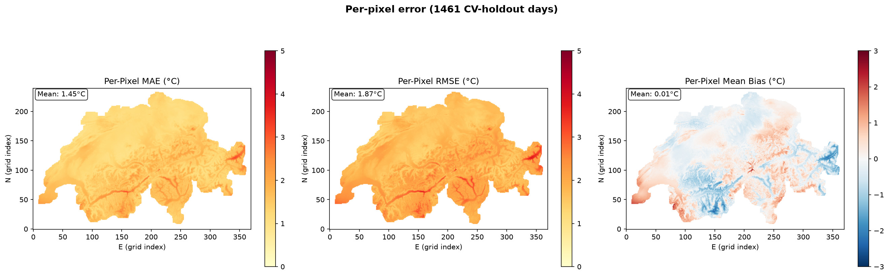
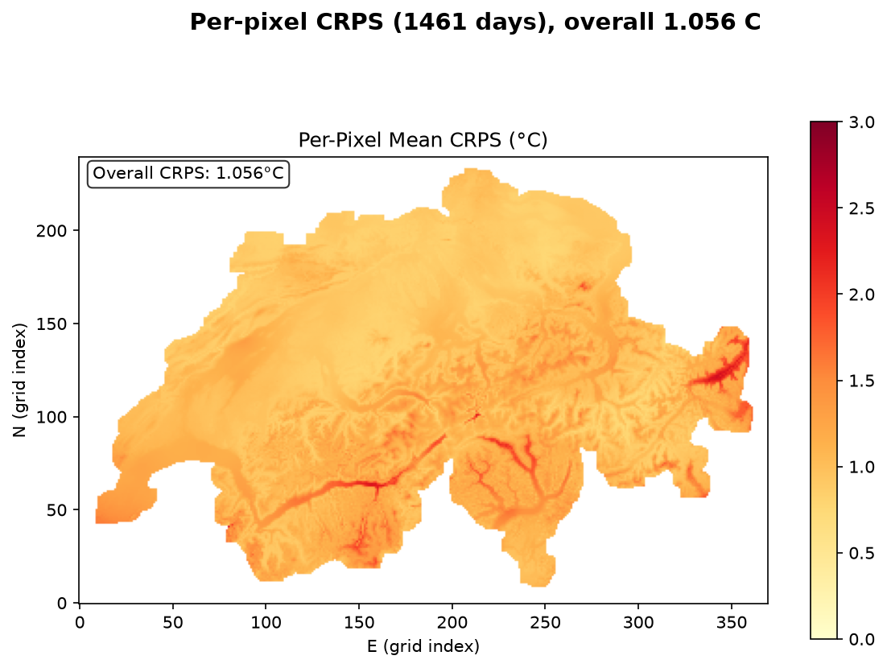
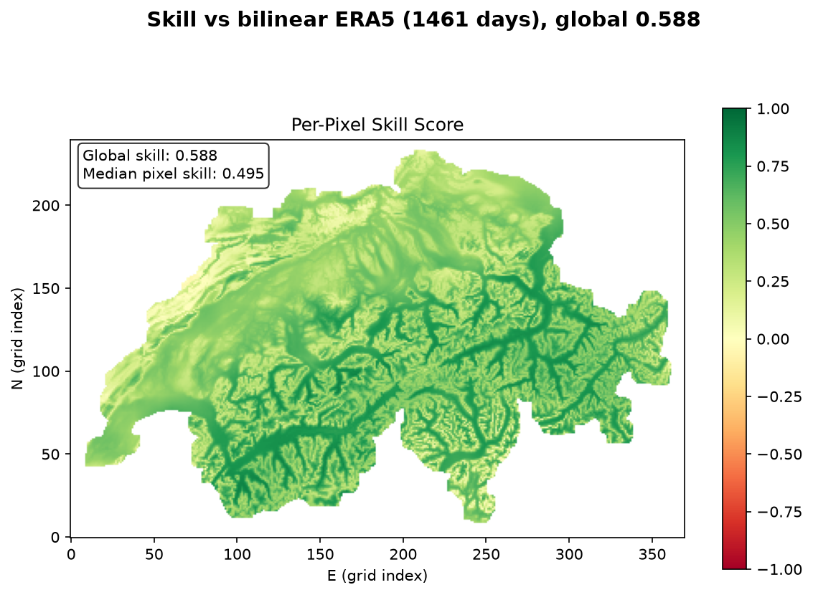
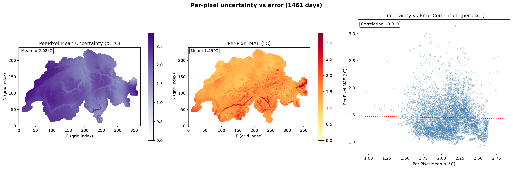
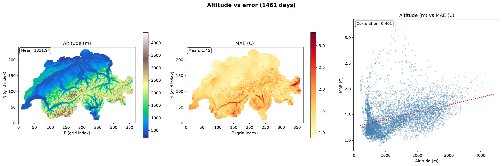
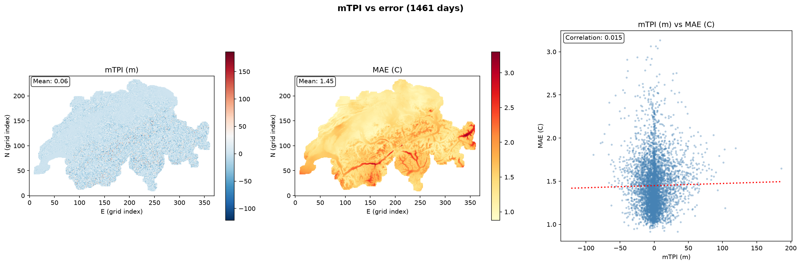
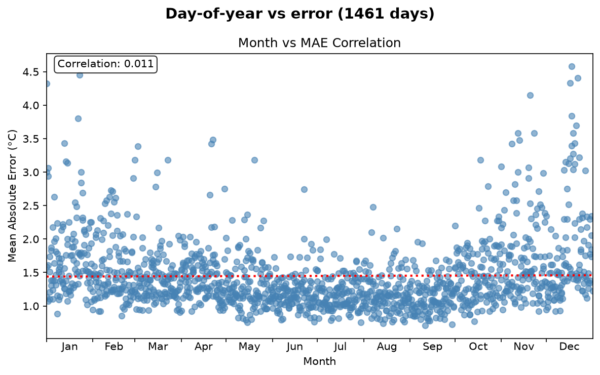
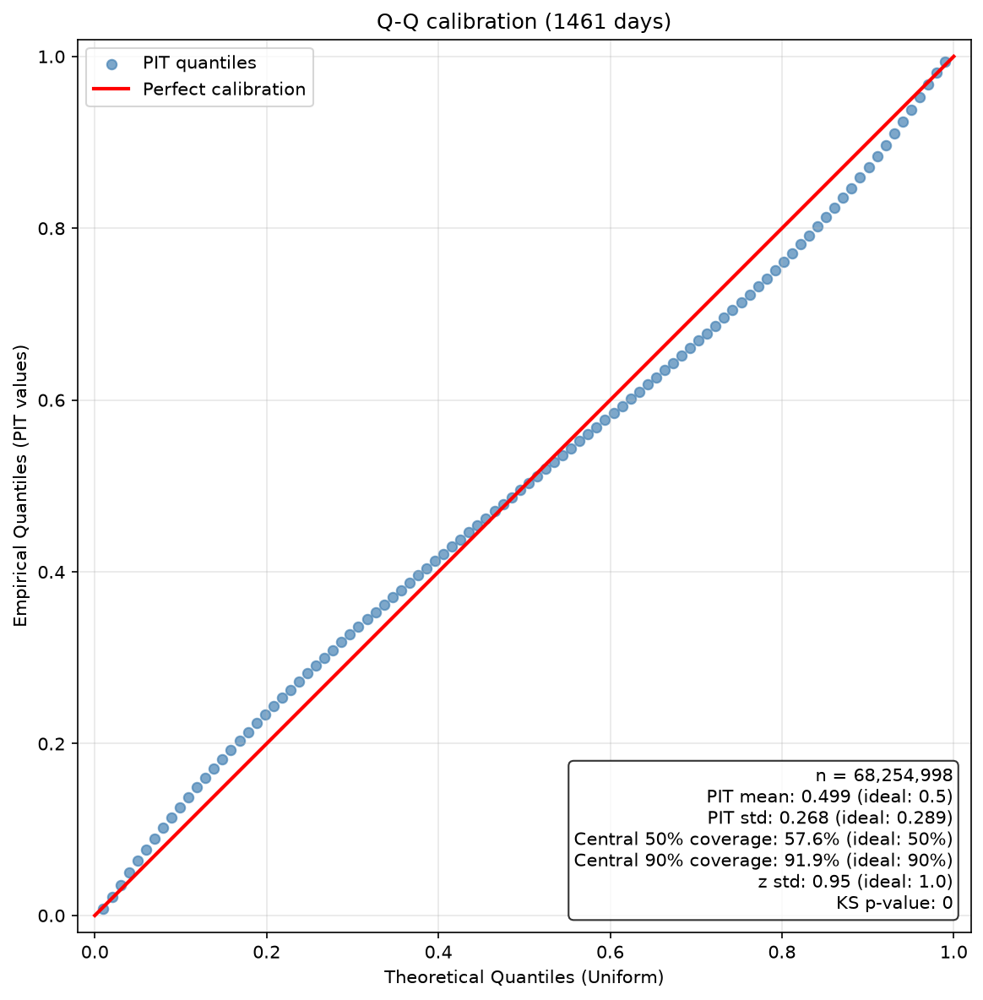
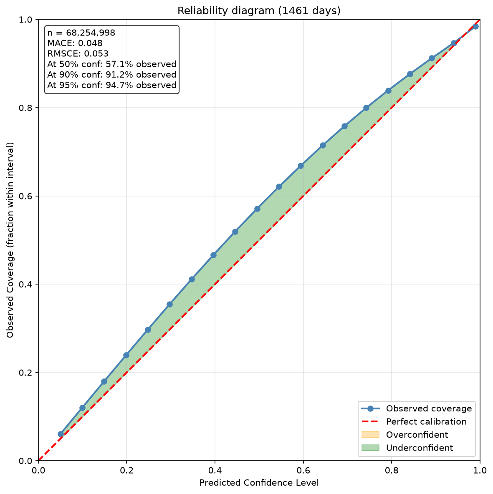

# Evaluation report — tmax (fine surface)

> Cross-validation holdout over the **training span 2020-2023**. Each of the 5 folds predicts **only** the contiguous block it was held out from during training; the blocks tile the 1461-day axis, so **every day is predicted exactly once, by the one model that never saw it**. This is not a fold ensemble — per-fold numbers are in `per_fold`. These are training-span days scored out-of-sample, *not* an unseen year.

- Model: `CLEAN_trained_models/baseline_no_geo__tmax_sfc_flat_y2020-2023_e30f5_b8_nogeo/tmax`
- Encoder: `flat` | folds evaluated: 5 | target points: 88,800 | holdout days: 1461
- Regime: `cv_holdout` | prediction mode: `fold_holdout` | valid points: 46,718

## Headline metrics

| Metric | Value |
|---|---|
| MAE (°C) | 1.449 |
| RMSE (°C) | 1.869 |
| Bias (°C) | 0.010 |
| CRPS (°C) | 1.056 |
| Skill vs bilinear ERA5 | 0.588 |

## Error diagnostics (correlation of MAE with …)

| Driver | Pearson r |
|---|---|
| predicted σ (calibration in space) | -0.019 |
| altitude | 0.401 |
| mTPI (ridge/valley) | 0.015 |
| day of year (seasonality) | 0.011 |

## Uncertainty calibration

| Metric | Value | Ideal |
|---|---|---|
| PIT mean | 0.499 | 0.5 |
| PIT std | 0.268 | 0.289 |
| z std | 0.947 | 1.0 |
| coverage @50% | 57.6% | 50% |
| coverage @90% | 91.9% | 90% |
| KS p-value | 0 | >0.05 |
| MACE (reliability) | 0.048 | 0 |
| reliability @90% | 91.2% | 90% |
| reliability @95% | 94.7% | 95% |

## Per-fold holdout blocks

Each fold scores only the days it was held out from, so these are disjoint sub-periods, not repeated measurements of the same days.

| Fold | Days | Period | Epoch | MAE (°C) | RMSE (°C) | CRPS (°C) | Skill |
|---|---|---|---|---|---|---|---|
| 0 | 292 | 2020-01-01 … 2020-10-18 | 29 | 1.376 | 1.775 | 1.000 | 0.624 |
| 1 | 292 | 2020-10-19 … 2021-08-06 | 20 | 1.521 | 1.931 | 1.101 | 0.565 |
| 2 | 292 | 2021-08-07 … 2022-05-25 | 29 | 1.470 | 1.926 | 1.081 | 0.589 |
| 3 | 292 | 2022-05-26 … 2023-03-13 | 29 | 1.417 | 1.824 | 1.026 | 0.580 |
| 4 | 293 | 2023-03-14 … 2023-12-31 | 13 | 1.461 | 1.852 | 1.069 | 0.579 |

## Figures

### Per-pixel MAE / RMSE / bias

### Per-pixel CRPS

### Skill vs bilinear-ERA5 baseline

### Per-pixel uncertainty vs error

### Altitude vs error

### mTPI vs error

### Day-of-year vs error

### Q-Q / PIT calibration

### Reliability diagram

