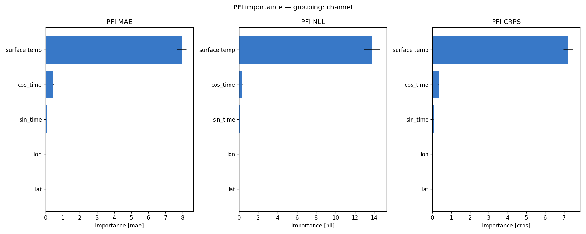
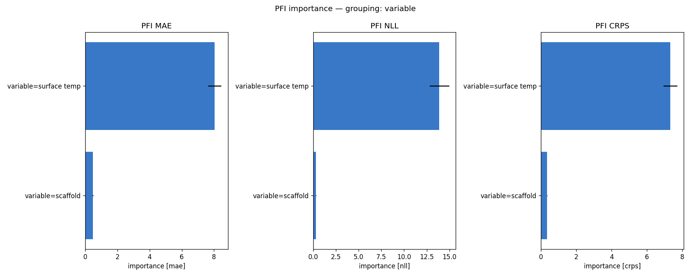
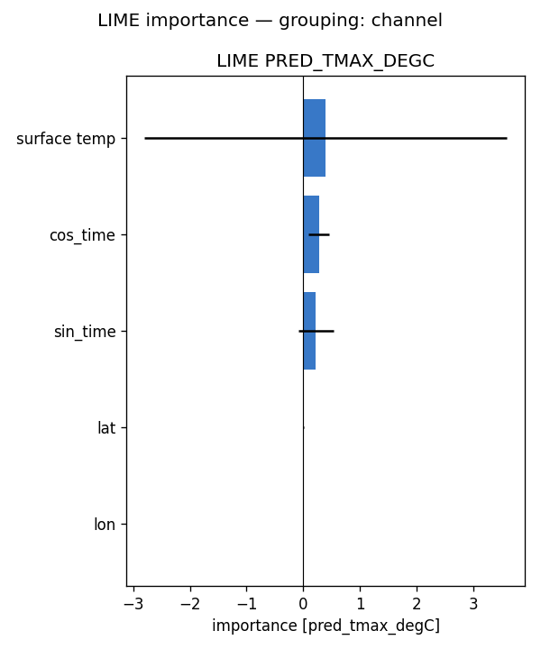
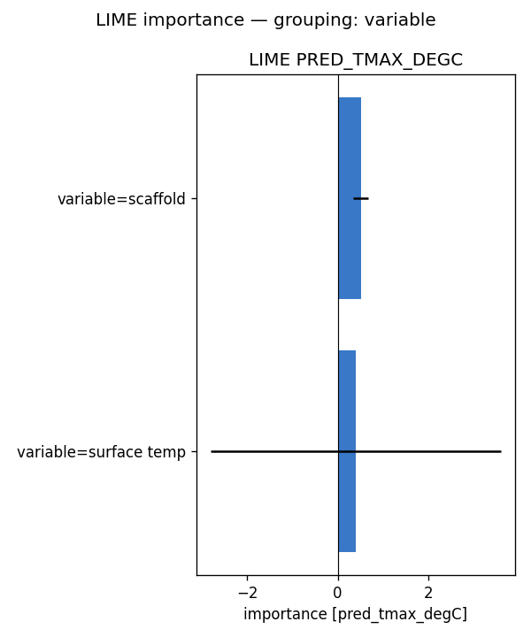

# Feature importance — full-run analysis report — tmax (2022)

**Model:** `baseline_no_geo__tmax_sfc_flat_y2020-2023_e30f5_b8_nogeo/tmax` (surface ERA5 input (no pressure levels); standalone tmax; 5 channels: data + 4 scaffold).
**Methods:** PFI, LIME — self-implemented, no external deps. **SHAP not available for this run** (no `shap.csv`), so the tables below are 2-method.
**Attribution metrics:** MAE / NLL / CRPS (degC) vs MeteoSwiss TmaxD truth.

## Run configuration

| | value |
|---|---|
| Data span | 2022 |
| Days scored | **365** |
| Folds | **5** of 5 (ensemble) |
| Target points | 88,800 |

## Baseline (all channels present)

MAE **1.356** · NLL **2.012** · CRPS **0.995**  [degC]. Importance = how much removing/scrambling a feature degrades these metrics (higher = more important).

## Bottom line

- **By variable** — PFI: data (+8.039), scaffold (+0.489); LIME: scaffold (+0.508), data (+0.397)

Consensus across methods: this is a surface run — the single ERA5 input channel carries the signal, with the scaffold (lat/lon/elevation/season) as the secondary cue; there are no pressure levels or hours to attribute across.

## Cross-method tables

*(machine-generated; see `summary.md`)*

- Target points: 88800  |  days scored: 365  |  folds: 5
- Baseline (all channels): MAE 1.356 | NLL 2.012 | CRPS 0.995  [degC]

## Top channels (|importance|)

| rank | PFI (mae) | LIME (pred) |
|---|---|---|
| 1 | data (+7.945) | data (+0.397) |
| 2 | cos_time (+0.456) | cos_time (+0.279) |
| 3 | sin_time (+0.087) | sin_time (+0.227) |
| 4 | lon (+0.000) | lat (+0.007) |
| 5 | lat (+0.000) | lon (-0.005) |
| 6 |  |  |
| 7 |  |  |
| 8 |  |  |

## By variable

- **PFI** (mae): data (+8.039), scaffold (+0.489)
- **LIME** (pred_tmax_degC): scaffold (+0.508), data (+0.397)

## By hour

- **PFI** (mae): 
- **LIME** (pred_tmax_degC): 

## By level

- **PFI** (mae): 
- **LIME** (pred_tmax_degC): 

## Figures

- `pfi_channel.png`
- `pfi_variable.png`
- `pfi_level.png`
- `pfi_hour.png`
- `pfi_heatmap_*.png` (level × hour)
- `lime_channel.png`
- `lime_variable.png`
- `lime_level.png`
- `lime_hour.png`
- `lime_heatmap_*.png` (level × hour)

## Figure gallery

### PFI

### LIME

*Generated by `scripts/fi_evaluate.sh` from `pfi.csv`, `lime.csv` and the regenerated `summary.md` in this directory.*