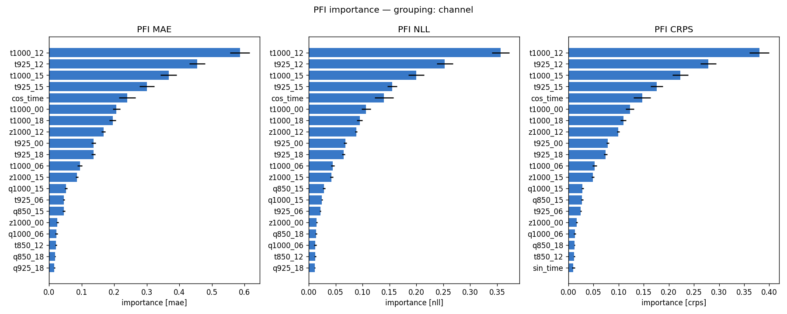
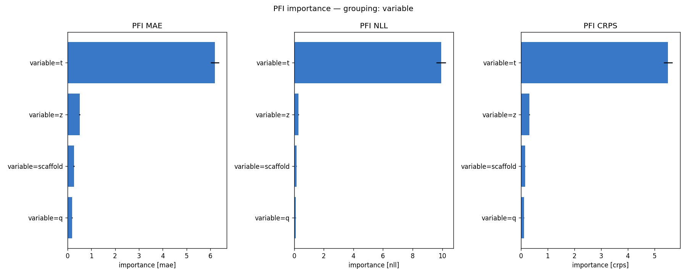
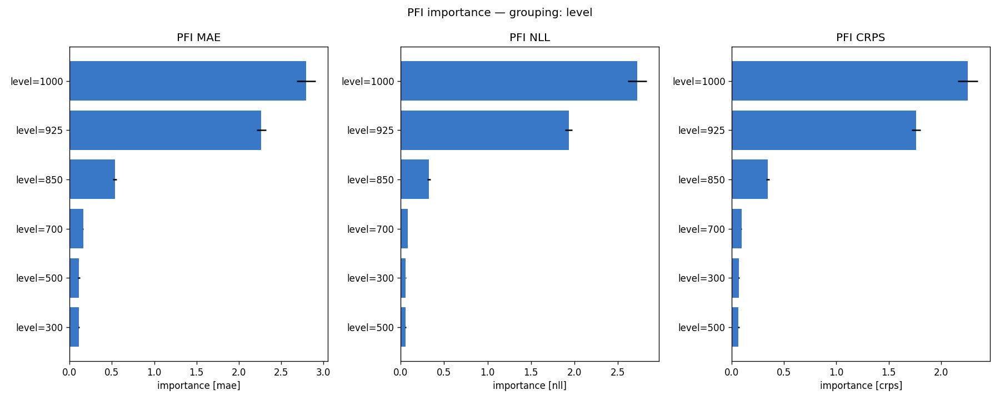
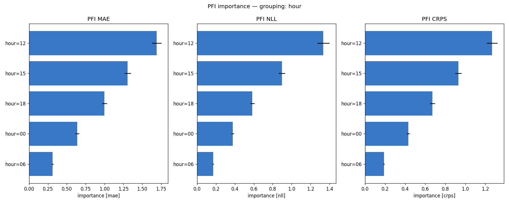
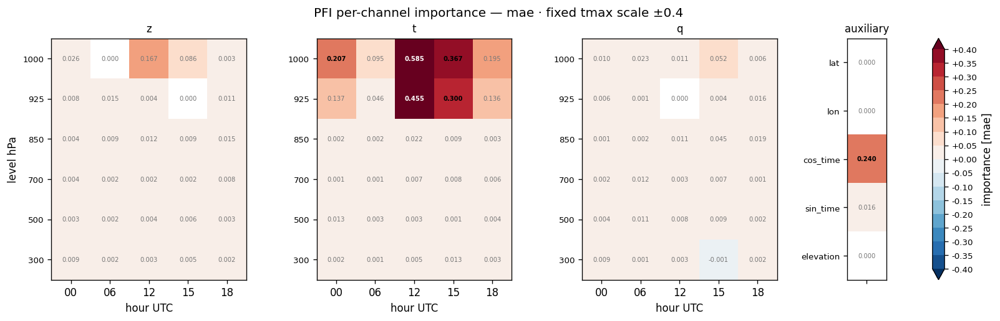
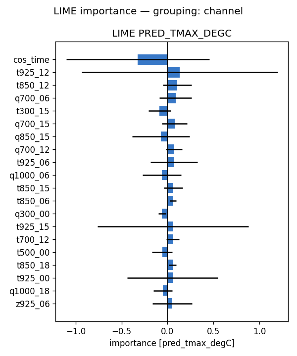
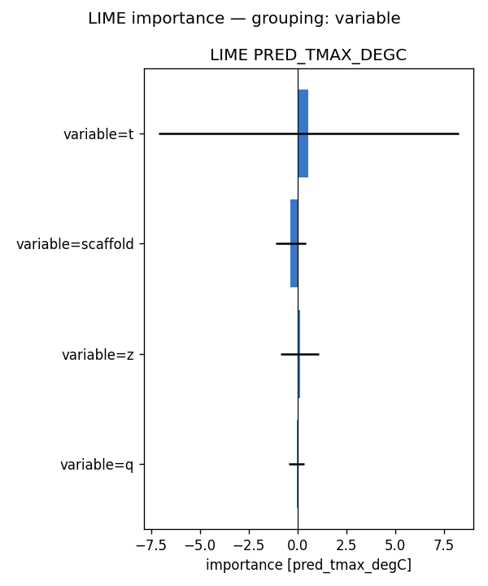
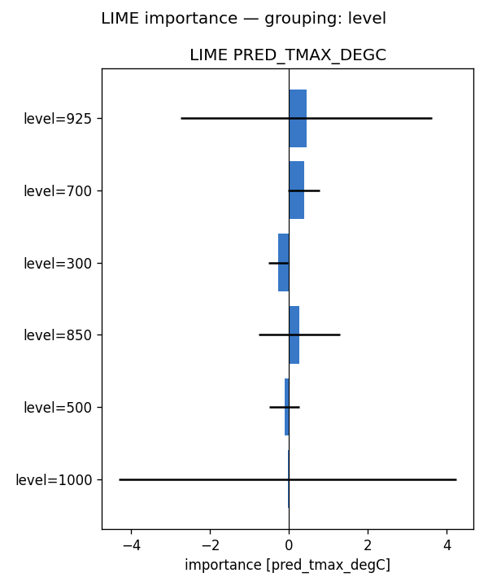
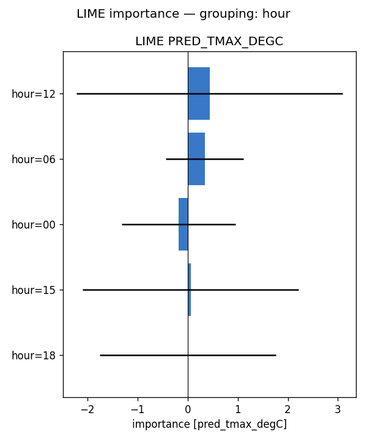
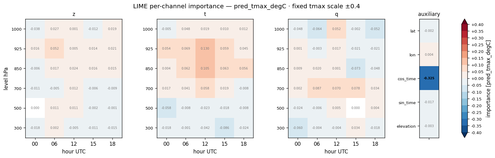

# Feature importance — full-run analysis report — tmax (2024)

**Model:** `clean_solo__tmax_atm_natg_flat_y2020-2023_e30f5_b8/tmax` (atmospheric, native coarse grid; standalone tmax; 95 channels: z/t/q x 6 levels {1000,925,850,700,500,300 hPa} x 5 hours {00,06,12,15,18 UTC} + 5 scaffold).
**Methods:** PFI, LIME — self-implemented, no external deps. **SHAP not available for this run** (no `shap.csv`), so the tables below are 2-method.
**Attribution metrics:** MAE / NLL / CRPS (degC) vs MeteoSwiss TmaxD truth.

## Run configuration

| | value |
|---|---|
| Data span | 2024 |
| Days scored | **366** |
| Folds | **5** of 5 (ensemble) |
| Target points | 88,800 |

## Baseline (all channels present)

MAE **1.206** · NLL **1.943** · CRPS **0.909**  [degC]. Importance = how much removing/scrambling a feature degrades these metrics (higher = more important).

## Bottom line

- **By variable** — PFI: t (+6.197), z (+0.511), scaffold (+0.269); LIME: t (+0.572), scaffold (-0.343), z (+0.124)
- **By pressure level** — PFI: 1000 (+2.796), 925 (+2.266), 850 (+0.534); LIME: 925 (+0.438), 700 (+0.380), 300 (-0.270)
- **By hour (UTC)** — PFI: 12 (+1.691), 15 (+1.305), 18 (+0.999); LIME: 12 (+0.437), 06 (+0.344), 00 (-0.181)

Consensus across methods: near-surface (low-level) air temperature in the afternoon/evening is what the model relies on to downscale daily-max 2 m temperature, with geopotential a secondary cue and humidity minor — physically expected.

## Cross-method tables

*(machine-generated; see `summary.md`)*

- Target points: 88800  |  days scored: 366  |  folds: 5
- Baseline (all channels): MAE 1.206 | NLL 1.943 | CRPS 0.909  [degC]

## Top channels (|importance|)

| rank | PFI (mae) | LIME (pred) |
|---|---|---|
| 1 | t1000_12 (+0.585) | cos_time (-0.325) |
| 2 | t925_12 (+0.455) | t925_12 (+0.130) |
| 3 | t1000_15 (+0.367) | t850_12 (+0.105) |
| 4 | t925_15 (+0.300) | q700_06 (+0.087) |
| 5 | cos_time (+0.240) | t300_15 (-0.086) |
| 6 | t1000_00 (+0.207) | q700_15 (+0.078) |
| 7 | t1000_18 (+0.195) | q850_15 (-0.073) |
| 8 | z1000_12 (+0.167) | q700_12 (+0.070) |

## By variable

- **PFI** (mae): t (+6.197), z (+0.511), scaffold (+0.269), q (+0.197)
- **LIME** (pred_tmax_degC): t (+0.572), scaffold (-0.343), z (+0.124), q (-0.033)

## By hour

- **PFI** (mae): 12 (+1.691), 15 (+1.305), 18 (+0.999), 00 (+0.638), 06 (+0.311)
- **LIME** (pred_tmax_degC): 12 (+0.437), 06 (+0.344), 00 (-0.181), 15 (+0.059), 18 (+0.003)

## By level

- **PFI** (mae): 1000 (+2.796), 925 (+2.266), 850 (+0.534), 700 (+0.160), 500 (+0.111), 300 (+0.110)
- **LIME** (pred_tmax_degC): 925 (+0.438), 700 (+0.380), 300 (-0.270), 850 (+0.266), 500 (-0.118), 1000 (-0.033)

## Figures

- `pfi_channel.png`
- `pfi_variable.png`
- `pfi_level.png`
- `pfi_hour.png`
- `pfi_heatmap_*.png` (level × hour)
- `lime_channel.png`
- `lime_variable.png`
- `lime_level.png`
- `lime_hour.png`
- `lime_heatmap_*.png` (level × hour)

## Figure gallery

### PFI

### LIME

*Generated by `scripts/fi_evaluate.sh` from `pfi.csv`, `lime.csv` and the regenerated `summary.md` in this directory.*