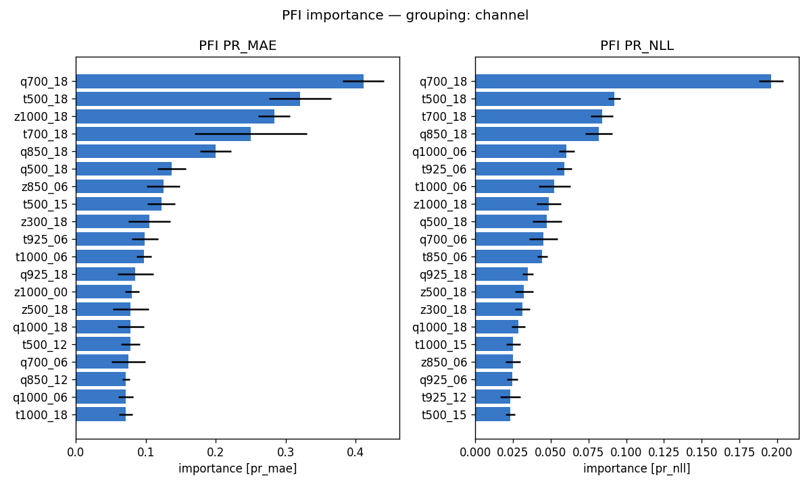
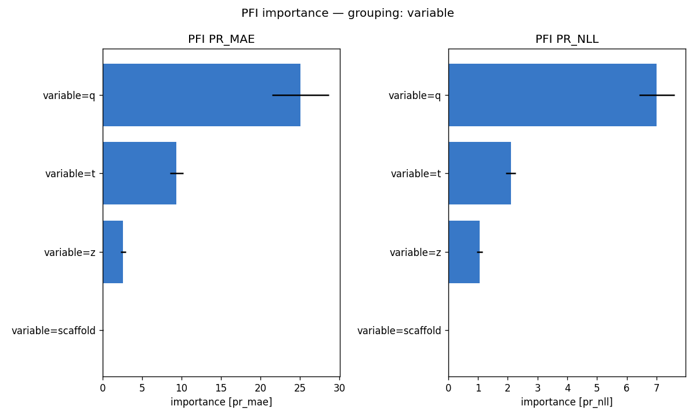
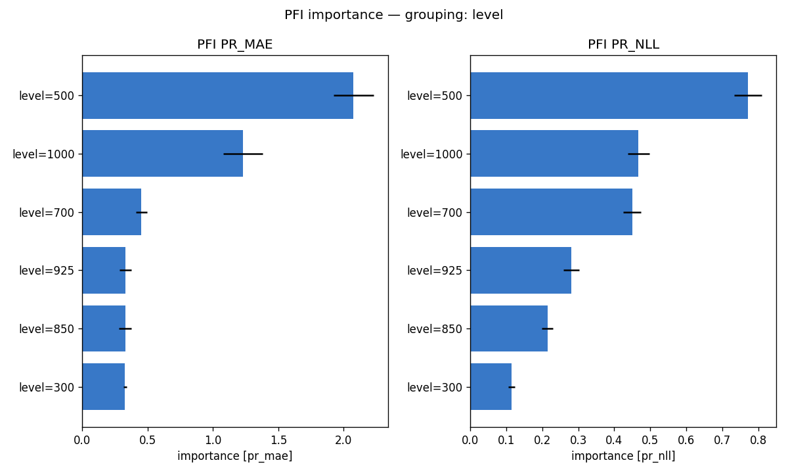
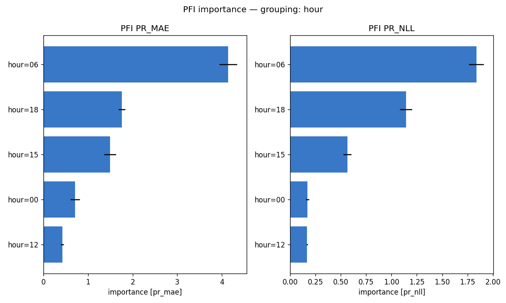
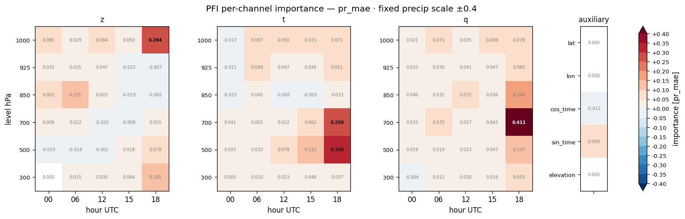
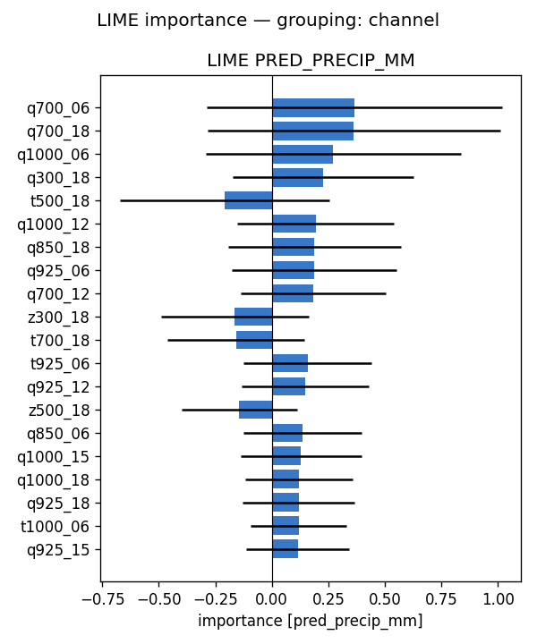
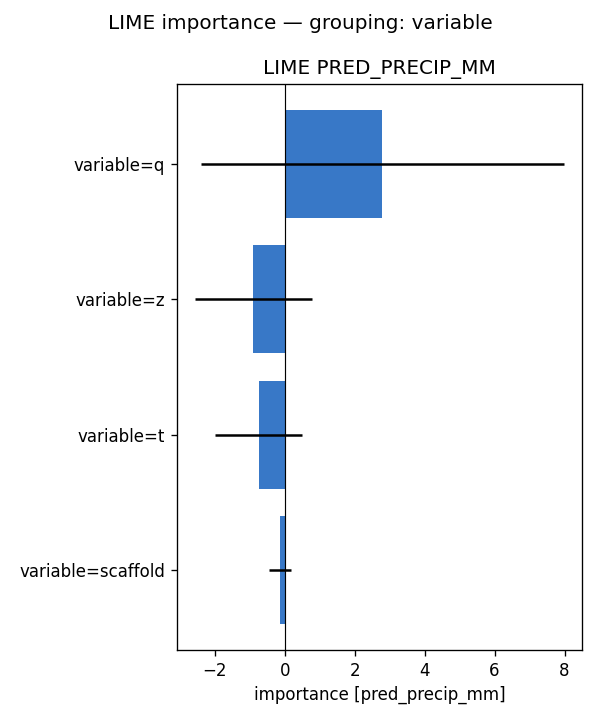
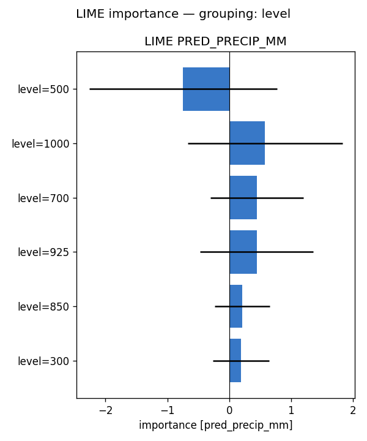
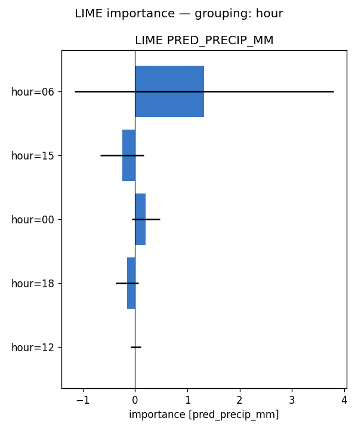
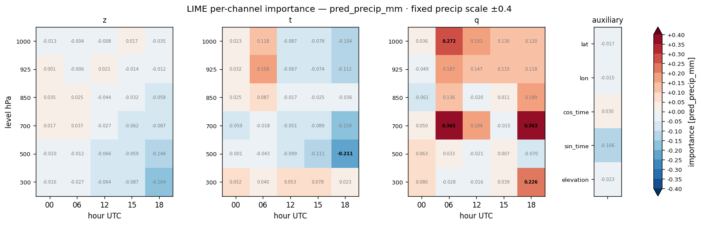

# Feature importance — full-run analysis report — precip (2022)

**Model:** `clean_solo_precip__precip_atm_natg_flat_y2020-2023_e30f5_b8__ft-crps/precip` (atmospheric, native coarse grid; standalone precip; 95 channels: z/t/q x 6 levels {1000,925,850,700,500,300 hPa} x 5 hours {00,06,12,15,18 UTC} + 5 scaffold).
**Methods:** PFI, LIME — self-implemented, no external deps. **SHAP not available for this run** (no `shap.csv`), so the tables below are 2-method.
**Attribution metrics:** MAE (mm) + Bernoulli-Gamma NLL vs MeteoSwiss RhiresD truth.

## Run configuration

| | value |
|---|---|
| Data span | 2022 |
| Days scored | **365** |
| Folds | **5** of 5 (ensemble) |
| Target points | 98,050 |

## Baseline (all channels present)

PR_MAE **2.160** · PR_NLL **1.474**  [mm]. Importance = how much removing/scrambling a feature degrades these metrics (higher = more important).

## Bottom line

- **By variable** — PFI: q (+25.014), t (+9.371), z (+2.610); LIME: q (+2.781), z (-0.898), t (-0.751)
- **By pressure level** — PFI: 500 (+2.075), 1000 (+1.229), 700 (+0.453); LIME: 500 (-0.746), 1000 (+0.580), 700 (+0.449)
- **By hour (UTC)** — PFI: 06 (+4.140), 18 (+1.762), 15 (+1.494); LIME: 06 (+1.320), 15 (-0.250), 00 (+0.203)

Consensus across methods: moisture (q) and low-level dynamics (geopotential z / temperature) drive where and how much precipitation the model downscales — physically expected for daily accumulation.

## Cross-method tables

*(machine-generated; see `summary.md`)*

- Target points: 98050  |  days scored: 365  |  folds: 5
- Baseline (all channels): PR_MAE 2.160 | PR_NLL 1.474  [mm]

## Top channels (|importance|)

| rank | PFI (pr_mae) | LIME (pred) |
|---|---|---|
| 1 | q700_18 (+0.411) | q700_06 (+0.365) |
| 2 | t500_18 (+0.320) | q700_18 (+0.363) |
| 3 | z1000_18 (+0.284) | q1000_06 (+0.272) |
| 4 | t700_18 (+0.250) | q300_18 (+0.226) |
| 5 | q850_18 (+0.200) | t500_18 (-0.211) |
| 6 | q500_18 (+0.137) | q1000_12 (+0.193) |
| 7 | z850_06 (+0.125) | q850_18 (+0.189) |
| 8 | t500_15 (+0.122) | q925_06 (+0.187) |

## By variable

- **PFI** (pr_mae): q (+25.014), t (+9.371), z (+2.610), scaffold (+0.046)
- **LIME** (pred_precip_mm): q (+2.781), z (-0.898), t (-0.751), scaffold (-0.130)

## By hour

- **PFI** (pr_mae): 06 (+4.140), 18 (+1.762), 15 (+1.494), 00 (+0.707), 12 (+0.422)
- **LIME** (pred_precip_mm): 06 (+1.320), 15 (-0.250), 00 (+0.203), 18 (-0.152), 12 (+0.010)

## By level

- **PFI** (pr_mae): 500 (+2.075), 1000 (+1.229), 700 (+0.453), 925 (+0.329), 850 (+0.328), 300 (+0.327)
- **LIME** (pred_precip_mm): 500 (-0.746), 1000 (+0.580), 700 (+0.449), 925 (+0.445), 850 (+0.213), 300 (+0.190)

## Figures

- `pfi_channel.png`
- `pfi_variable.png`
- `pfi_level.png`
- `pfi_hour.png`
- `pfi_heatmap_*.png` (level × hour)
- `lime_channel.png`
- `lime_variable.png`
- `lime_level.png`
- `lime_hour.png`
- `lime_heatmap_*.png` (level × hour)

## Figure gallery

### PFI

### LIME

*Generated by `scripts/fi_evaluate.sh` from `pfi.csv`, `lime.csv` and the regenerated `summary.md` in this directory.*