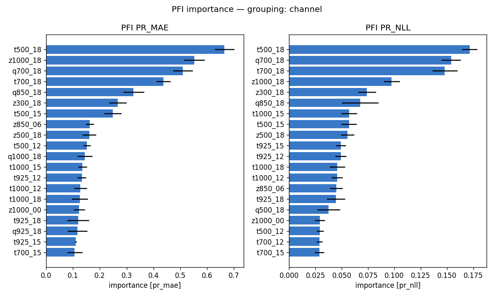
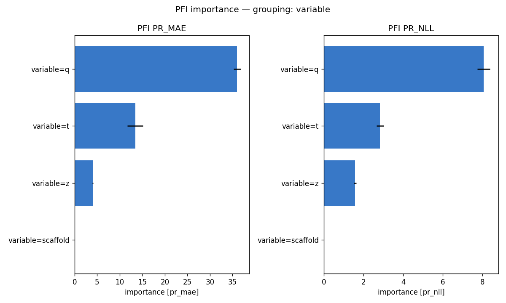
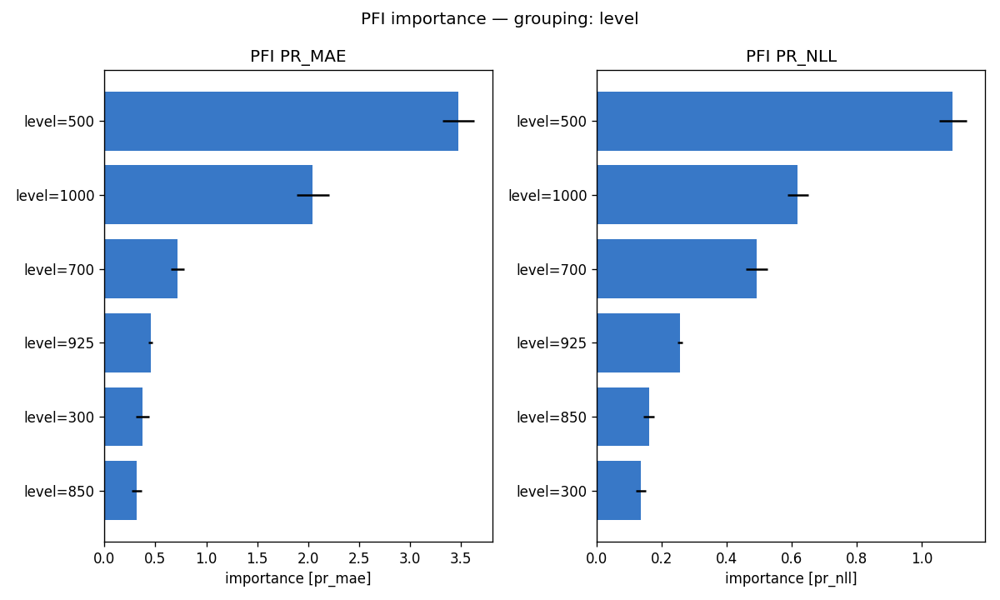
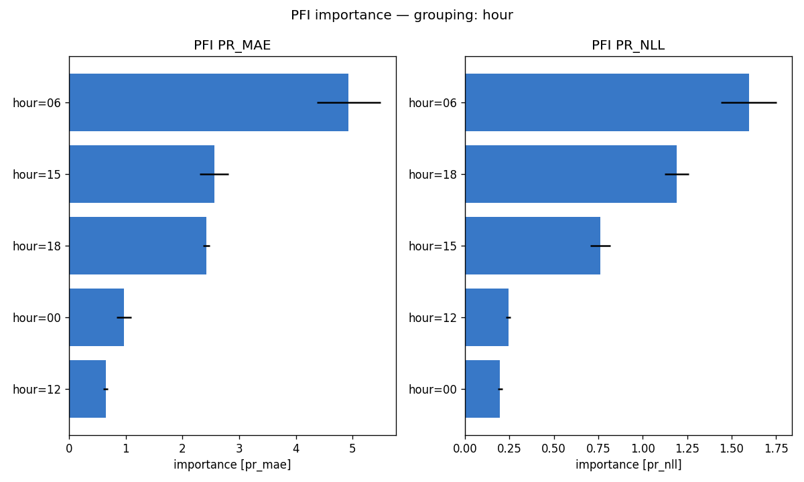
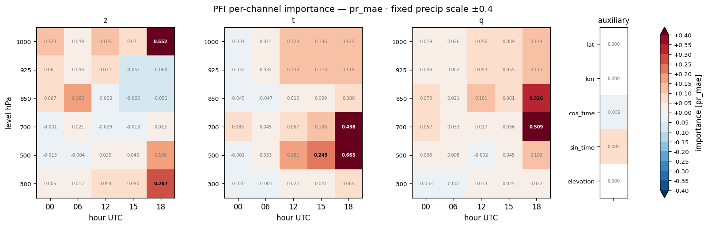
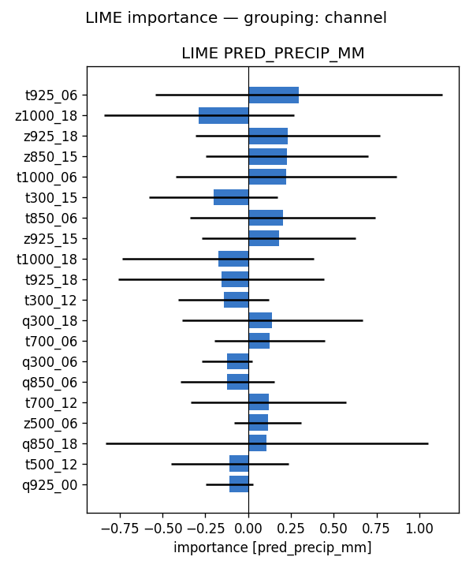
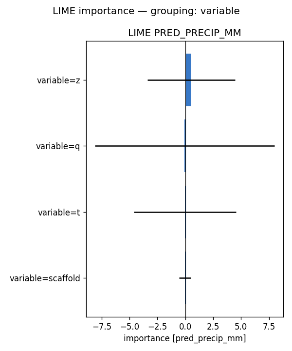
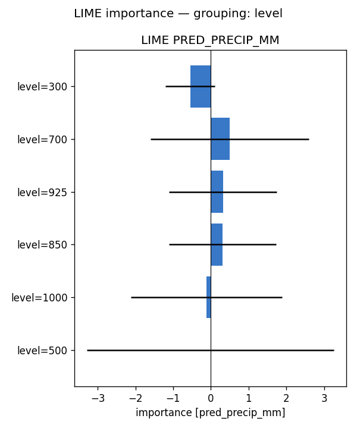
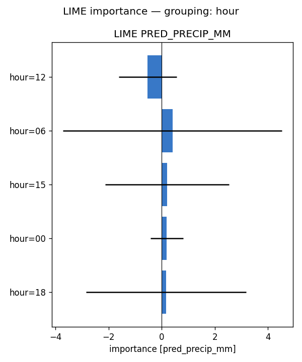
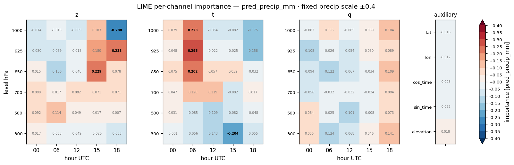

# Feature importance — full-run analysis report — precip (2024)

**Model:** `clean_solo_precip__precip_atm_natg_flat_y2020-2023_e30f5_b8__ft-crps/precip` (atmospheric, native coarse grid; standalone precip; 95 channels: z/t/q x 6 levels {1000,925,850,700,500,300 hPa} x 5 hours {00,06,12,15,18 UTC} + 5 scaffold).
**Methods:** PFI, LIME — self-implemented, no external deps. **SHAP not available for this run** (no `shap.csv`), so the tables below are 2-method.
**Attribution metrics:** MAE (mm) + Bernoulli-Gamma NLL vs MeteoSwiss RhiresD truth.

## Run configuration

| | value |
|---|---|
| Data span | 2024 |
| Days scored | **366** |
| Folds | **5** of 5 (ensemble) |
| Target points | 98,050 |

## Baseline (all channels present)

PR_MAE **3.110** · PR_NLL **1.866**  [mm]. Importance = how much removing/scrambling a feature degrades these metrics (higher = more important).

## Bottom line

- **By variable** — PFI: q (+36.037), t (+13.432), z (+4.017); LIME: z (+0.541), q (-0.057), t (-0.043)
- **By pressure level** — PFI: 500 (+3.473), 1000 (+2.044), 700 (+0.716); LIME: 300 (-0.551), 700 (+0.496), 925 (+0.319)
- **By hour (UTC)** — PFI: 06 (+4.932), 15 (+2.560), 18 (+2.424); LIME: 12 (-0.530), 06 (+0.405), 15 (+0.204)

Consensus across methods: moisture (q) and low-level dynamics (geopotential z / temperature) drive where and how much precipitation the model downscales — physically expected for daily accumulation.

## Cross-method tables

*(machine-generated; see `summary.md`)*

- Target points: 98050  |  days scored: 366  |  folds: 5
- Baseline (all channels): PR_MAE 3.110 | PR_NLL 1.866  [mm]

## Top channels (|importance|)

| rank | PFI (pr_mae) | LIME (pred) |
|---|---|---|
| 1 | t500_18 (+0.665) | t925_06 (+0.295) |
| 2 | z1000_18 (+0.552) | z1000_18 (-0.288) |
| 3 | q700_18 (+0.509) | z925_18 (+0.233) |
| 4 | t700_18 (+0.438) | z850_15 (+0.229) |
| 5 | q850_18 (+0.326) | t1000_06 (+0.223) |
| 6 | z300_18 (+0.267) | t300_15 (-0.204) |
| 7 | t500_15 (+0.249) | t850_06 (+0.202) |
| 8 | z850_06 (+0.163) | z925_15 (+0.180) |

## By variable

- **PFI** (pr_mae): q (+36.037), t (+13.432), z (+4.017), scaffold (+0.022)
- **LIME** (pred_precip_mm): z (+0.541), q (-0.057), t (-0.043), scaffold (-0.041)

## By hour

- **PFI** (pr_mae): 06 (+4.932), 15 (+2.560), 18 (+2.424), 00 (+0.973), 12 (+0.647)
- **LIME** (pred_precip_mm): 12 (-0.530), 06 (+0.405), 15 (+0.204), 00 (+0.195), 18 (+0.167)

## By level

- **PFI** (pr_mae): 500 (+3.473), 1000 (+2.044), 700 (+0.716), 925 (+0.454), 300 (+0.375), 850 (+0.318)
- **LIME** (pred_precip_mm): 300 (-0.551), 700 (+0.496), 925 (+0.319), 850 (+0.311), 1000 (-0.121), 500 (-0.012)

## Figures

- `pfi_channel.png`
- `pfi_variable.png`
- `pfi_level.png`
- `pfi_hour.png`
- `pfi_heatmap_*.png` (level × hour)
- `lime_channel.png`
- `lime_variable.png`
- `lime_level.png`
- `lime_hour.png`
- `lime_heatmap_*.png` (level × hour)

## Figure gallery

### PFI

### LIME

*Generated by `scripts/fi_evaluate.sh` from `pfi.csv`, `lime.csv` and the regenerated `summary.md` in this directory.*