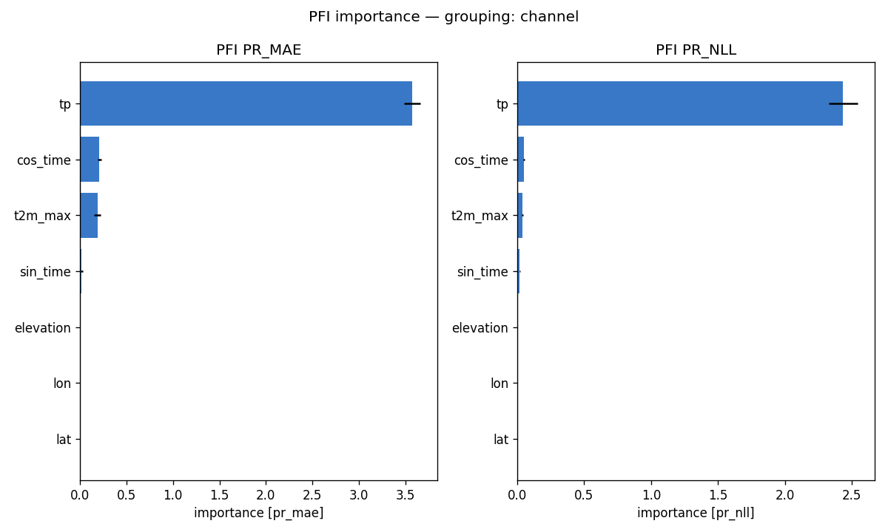
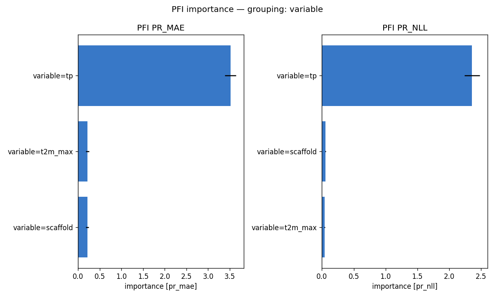
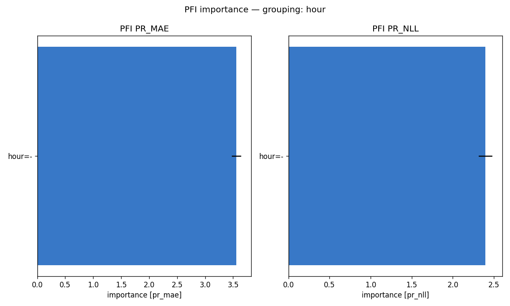
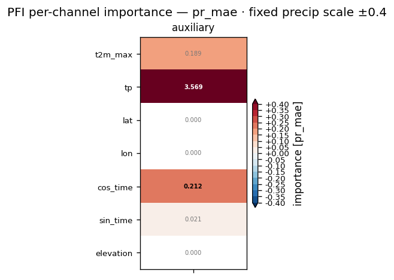
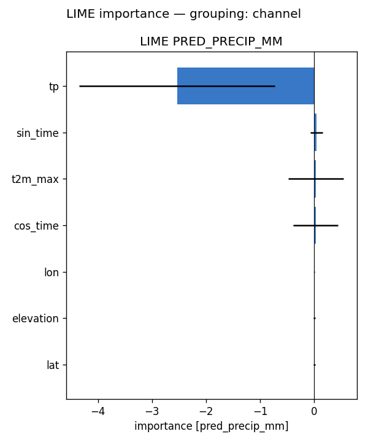
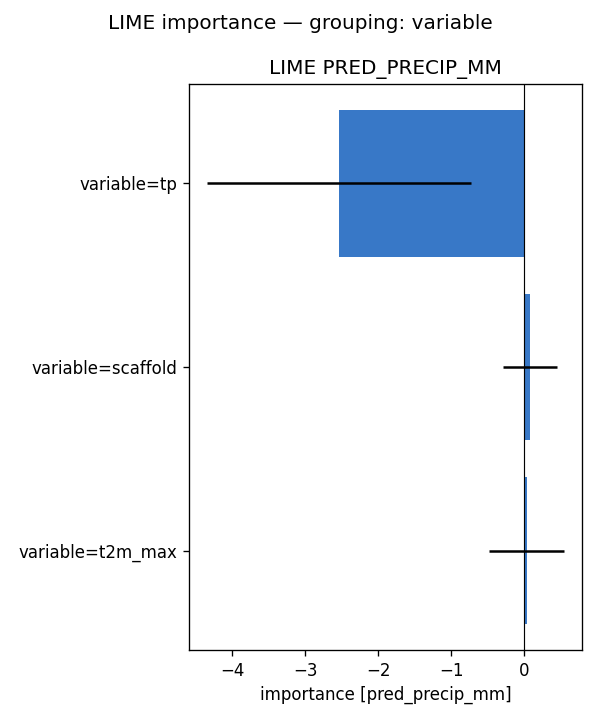
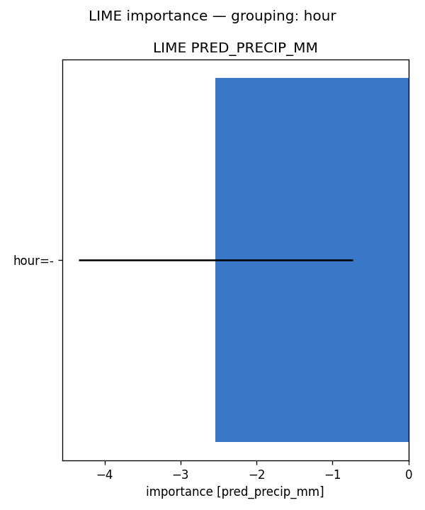
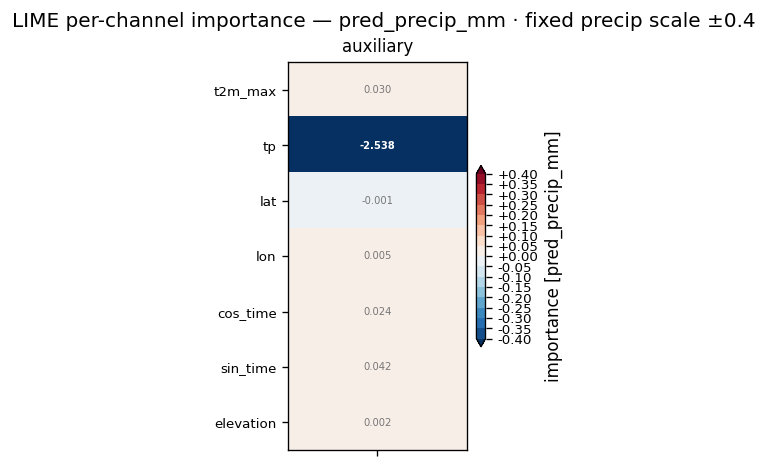

# Feature importance — full-run analysis report — precip (2024)

**Model:** `feature_importance_2024/..` (surface ERA5 input (no pressure levels); standalone precip; 7 channels: data/tp + 5 scaffold).
**Methods:** PFI, LIME — self-implemented, no external deps. **SHAP not available for this run** (no `shap.csv`), so the tables below are 2-method.
**Attribution metrics:** MAE (mm) + Bernoulli-Gamma NLL vs MeteoSwiss RhiresD truth.

## Run configuration

| | value |
|---|---|
| Data span | 2024 |
| Days scored | **366** |
| Folds | **5** of 5 (ensemble) |
| Target points | 98,050 |

## Baseline (all channels present)

PR_MAE **2.707** · PR_NLL **1.760**  [mm]. Importance = how much removing/scrambling a feature degrades these metrics (higher = more important).

## Bottom line

- **By variable** — PFI: tp (+3.516), data (+0.216), scaffold (+0.215); LIME: tp (-2.538), scaffold (+0.072), data (+0.030)
- **By hour (UTC)** — PFI: - (+3.558); LIME: - (-2.538)

Consensus across methods: this is a surface run — the single ERA5 input channel carries the signal, with the scaffold (lat/lon/elevation/season) as the secondary cue; there are no pressure levels or hours to attribute across.

## Cross-method tables

*(machine-generated; see `summary.md`)*

- Target points: 98050  |  days scored: 366  |  folds: 5
- Baseline (all channels): PR_MAE 2.707 | PR_NLL 1.760  [mm]

## Top channels (|importance|)

| rank | PFI (pr_mae) | LIME (pred) |
|---|---|---|
| 1 | tp (+3.569) | tp (-2.538) |
| 2 | cos_time (+0.212) | sin_time (+0.042) |
| 3 | data (+0.189) | data (+0.030) |
| 4 | sin_time (+0.021) | cos_time (+0.024) |
| 5 | lat (+0.000) | lon (+0.005) |
| 6 | lon (+0.000) | elevation (+0.002) |
| 7 | elevation (+0.000) | lat (-0.001) |
| 8 |  |  |

## By variable

- **PFI** (pr_mae): tp (+3.516), data (+0.216), scaffold (+0.215)
- **LIME** (pred_precip_mm): tp (-2.538), scaffold (+0.072), data (+0.030)

## By hour

- **PFI** (pr_mae): - (+3.558)
- **LIME** (pred_precip_mm): - (-2.538)

## By level

- **PFI** (pr_mae): 
- **LIME** (pred_precip_mm): 

## Figures

- `pfi_channel.png`
- `pfi_variable.png`
- `pfi_level.png`
- `pfi_hour.png`
- `pfi_heatmap_*.png` (level × hour)
- `lime_channel.png`
- `lime_variable.png`
- `lime_level.png`
- `lime_hour.png`
- `lime_heatmap_*.png` (level × hour)

## Figure gallery

### PFI

### LIME

*Generated by `scripts/fi_evaluate.sh` from `pfi.csv`, `lime.csv` and the regenerated `summary.md` in this directory.*