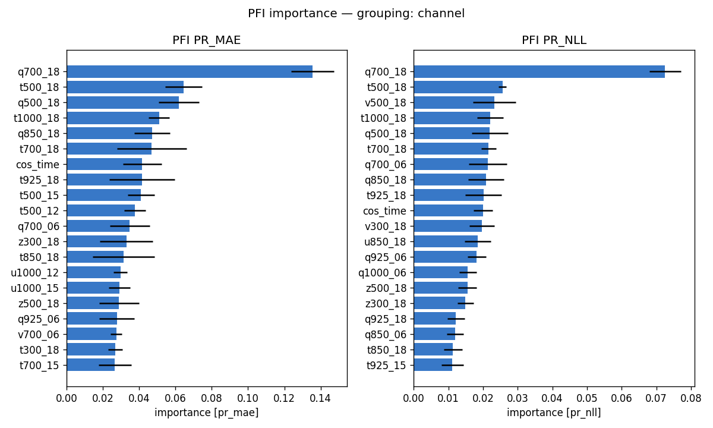
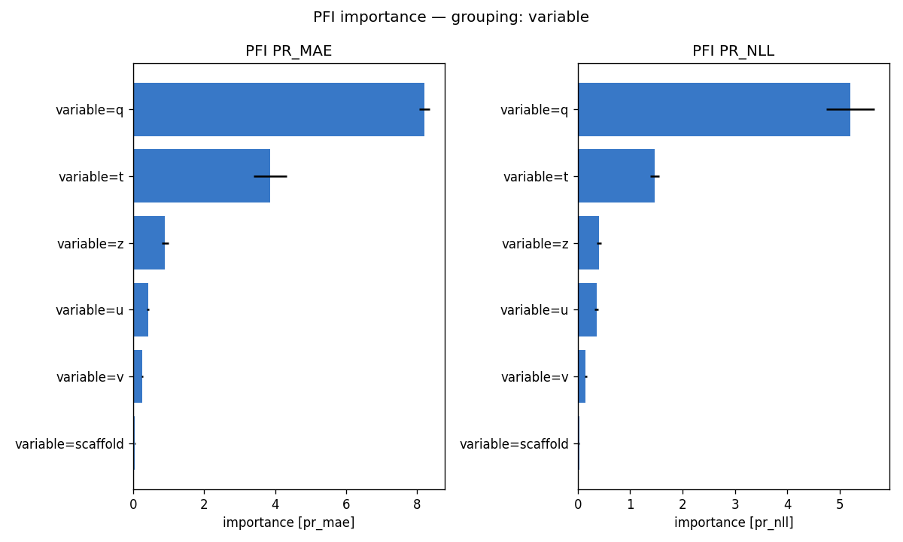
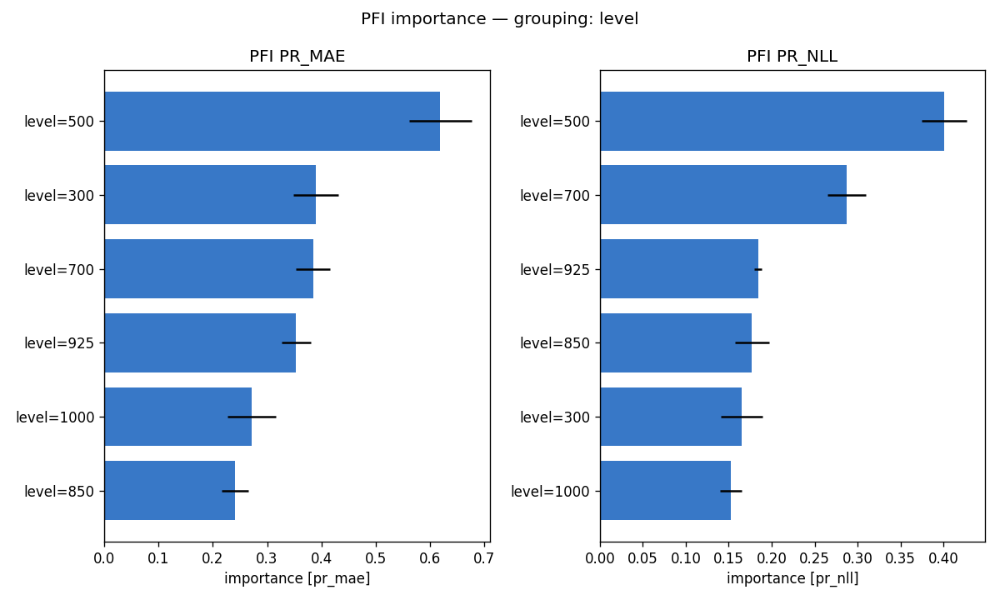
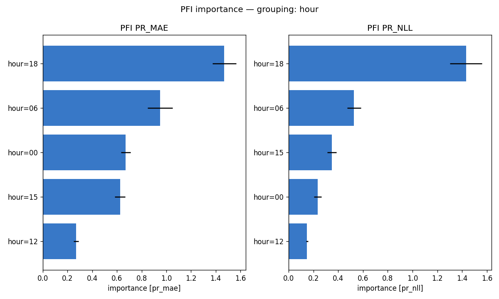
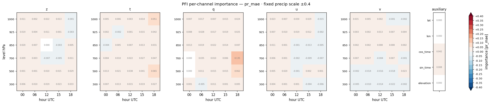
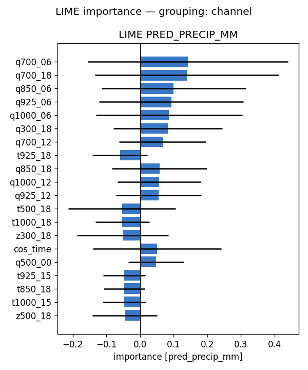
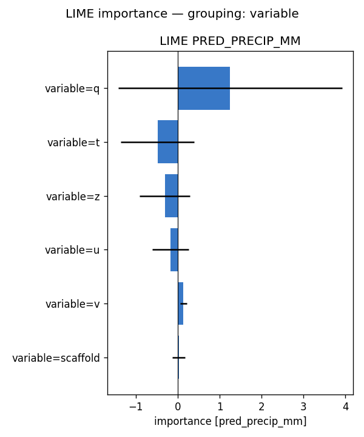
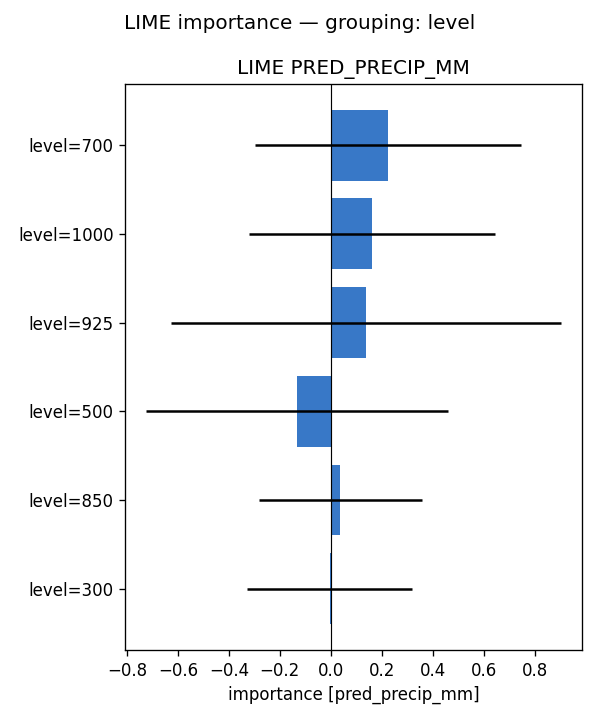
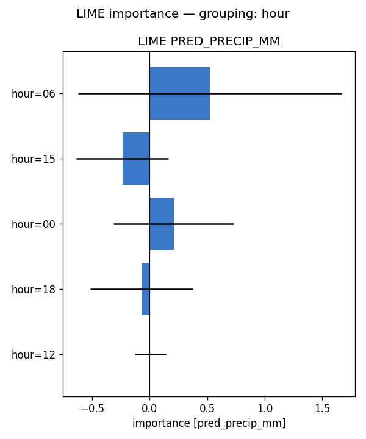
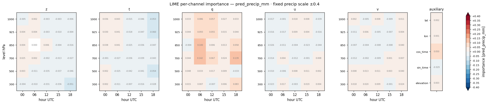

# Feature importance — full-run analysis report — precip (2022)

**Model:** `clean_solo_precip_wind__precip_atm_natg_av-ztquv_flat_y2020-2023_e30f5_b8/precip` (atmospheric, native coarse grid; standalone precip; 155 channels: z/t/q/u/v x 6 levels {1000,925,850,700,500,300 hPa} x 5 hours {00,06,12,15,18 UTC} + 5 scaffold).
**Methods:** PFI, LIME — self-implemented, no external deps. **SHAP not available for this run** (no `shap.csv`), so the tables below are 2-method.
**Attribution metrics:** MAE (mm) + Bernoulli-Gamma NLL vs MeteoSwiss RhiresD truth.

## Run configuration

| | value |
|---|---|
| Data span | 2022 |
| Days scored | **365** |
| Folds | **5** of 5 (ensemble) |
| Target points | 98,050 |

## Baseline (all channels present)

PR_MAE **2.018** · PR_NLL **1.422**  [mm]. Importance = how much removing/scrambling a feature degrades these metrics (higher = more important).

## Bottom line

- **By variable** — PFI: q (+8.206), t (+3.859), z (+0.901); LIME: q (+1.252), t (-0.483), z (-0.307)
- **By pressure level** — PFI: 500 (+0.619), 300 (+0.390), 700 (+0.385); LIME: 700 (+0.225), 1000 (+0.164), 925 (+0.138)
- **By hour (UTC)** — PFI: 18 (+1.470), 06 (+0.951), 00 (+0.672); LIME: 06 (+0.523), 15 (-0.238), 00 (+0.208)

Consensus across methods: see the per-variable rankings below for how each atmospheric field (z/t/q/u/v) contributes.

## Cross-method tables

*(machine-generated; see `summary.md`)*

- Target points: 98050  |  days scored: 365  |  folds: 5
- Baseline (all channels): PR_MAE 2.018 | PR_NLL 1.422  [mm]

## Top channels (|importance|)

| rank | PFI (pr_mae) | LIME (pred) |
|---|---|---|
| 1 | q700_18 (+0.135) | q700_06 (+0.142) |
| 2 | t500_18 (+0.065) | q700_18 (+0.139) |
| 3 | q500_18 (+0.062) | q850_06 (+0.100) |
| 4 | t1000_18 (+0.051) | q925_06 (+0.093) |
| 5 | q850_18 (+0.047) | q1000_06 (+0.086) |
| 6 | t700_18 (+0.047) | q300_18 (+0.083) |
| 7 | cos_time (+0.042) | q700_12 (+0.067) |
| 8 | t925_18 (+0.042) | t925_18 (-0.060) |

## By variable

- **PFI** (pr_mae): q (+8.206), t (+3.859), z (+0.901), u (+0.421), v (+0.253), scaffold (+0.053)
- **LIME** (pred_precip_mm): q (+1.252), t (-0.483), z (-0.307), u (-0.170), v (+0.135), scaffold (+0.028)

## By hour

- **PFI** (pr_mae): 18 (+1.470), 06 (+0.951), 00 (+0.672), 15 (+0.626), 12 (+0.268)
- **LIME** (pred_precip_mm): 06 (+0.523), 15 (-0.238), 00 (+0.208), 18 (-0.071), 12 (+0.005)

## By level

- **PFI** (pr_mae): 500 (+0.619), 300 (+0.390), 700 (+0.385), 925 (+0.354), 1000 (+0.271), 850 (+0.241)
- **LIME** (pred_precip_mm): 700 (+0.225), 1000 (+0.164), 925 (+0.138), 500 (-0.133), 850 (+0.037), 300 (-0.004)

## Figures

- `pfi_channel.png`
- `pfi_variable.png`
- `pfi_level.png`
- `pfi_hour.png`
- `pfi_heatmap_*.png` (level × hour)
- `lime_channel.png`
- `lime_variable.png`
- `lime_level.png`
- `lime_hour.png`
- `lime_heatmap_*.png` (level × hour)

## Figure gallery

### PFI

### LIME

*Generated by `scripts/fi_evaluate.sh` from `pfi.csv`, `lime.csv` and the regenerated `summary.md` in this directory.*