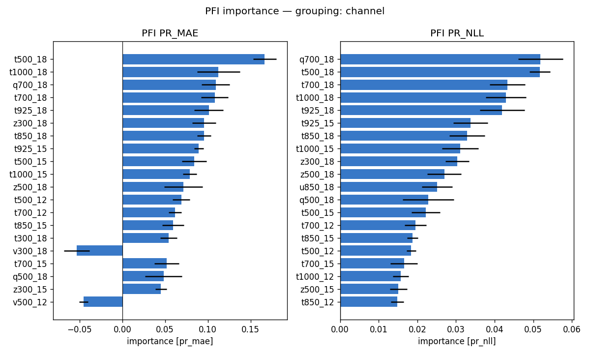
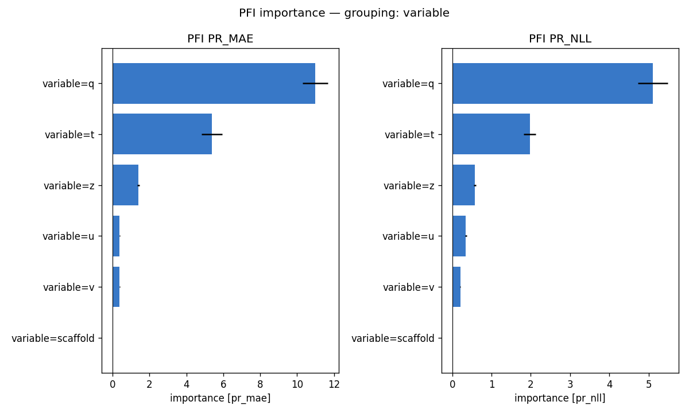
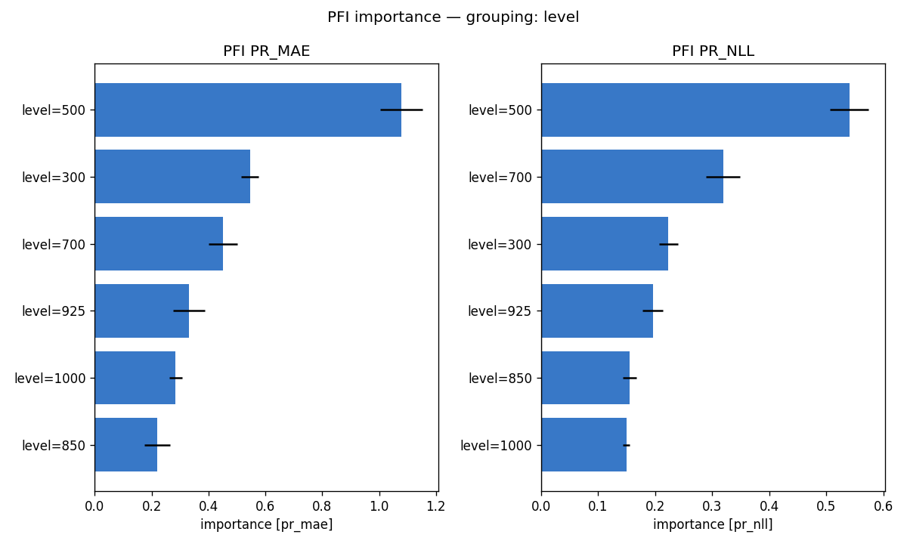
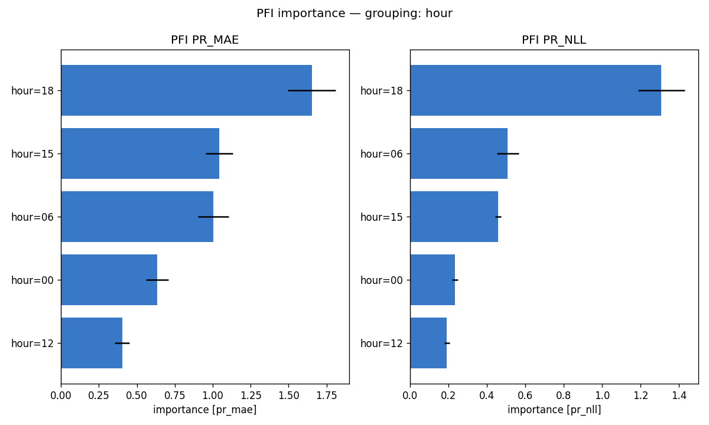
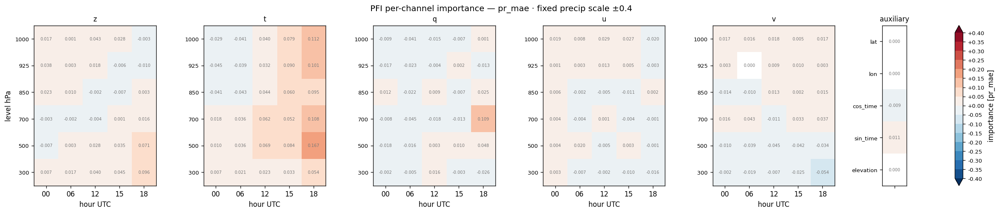
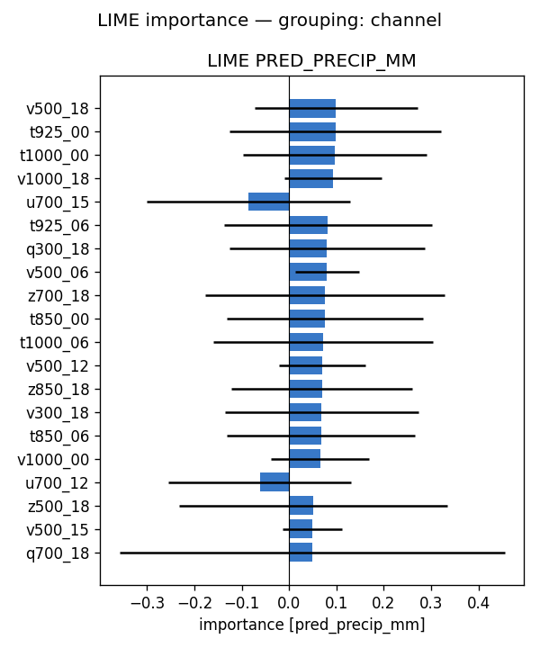
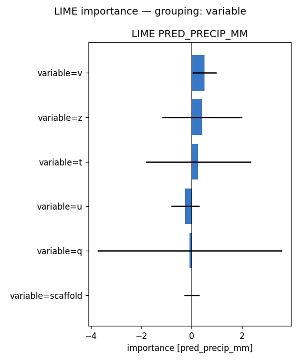
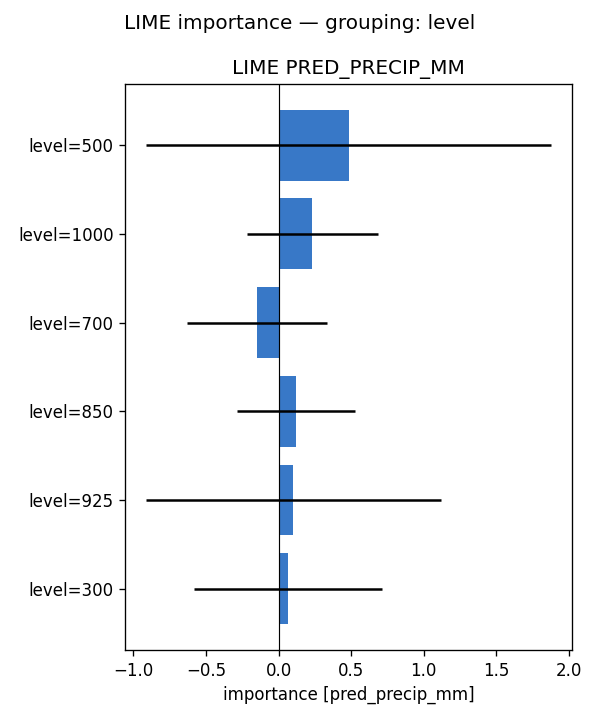
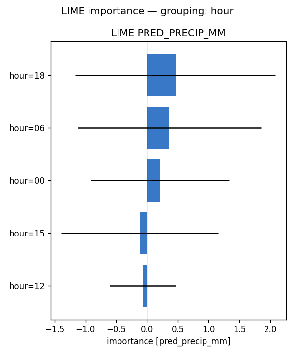
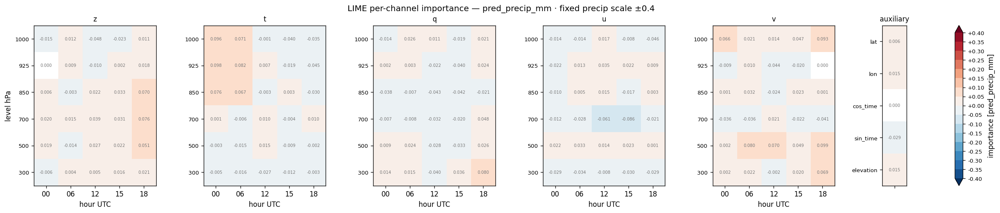

# Feature importance — full-run analysis report — precip (2024)

**Model:** `clean_solo_precip_wind__precip_atm_natg_av-ztquv_flat_y2020-2023_e30f5_b8/precip` (atmospheric, native coarse grid; standalone precip; 155 channels: z/t/q/u/v x 6 levels {1000,925,850,700,500,300 hPa} x 5 hours {00,06,12,15,18 UTC} + 5 scaffold).
**Methods:** PFI, LIME — self-implemented, no external deps. **SHAP not available for this run** (no `shap.csv`), so the tables below are 2-method.
**Attribution metrics:** MAE (mm) + Bernoulli-Gamma NLL vs MeteoSwiss RhiresD truth.

## Run configuration

| | value |
|---|---|
| Data span | 2024 |
| Days scored | **366** |
| Folds | **5** of 5 (ensemble) |
| Target points | 98,050 |

## Baseline (all channels present)

PR_MAE **2.873** · PR_NLL **1.806**  [mm]. Importance = how much removing/scrambling a feature degrades these metrics (higher = more important).

## Bottom line

- **By variable** — PFI: q (+10.982), t (+5.381), z (+1.398); LIME: v (+0.508), z (+0.410), t (+0.262)
- **By pressure level** — PFI: 500 (+1.077), 300 (+0.545), 700 (+0.451); LIME: 500 (+0.482), 1000 (+0.231), 700 (-0.149)
- **By hour (UTC)** — PFI: 18 (+1.652), 15 (+1.043), 06 (+1.003); LIME: 18 (+0.460), 06 (+0.363), 00 (+0.213)

Consensus across methods: see the per-variable rankings below for how each atmospheric field (z/t/q/u/v) contributes.

## Cross-method tables

*(machine-generated; see `summary.md`)*

- Target points: 98050  |  days scored: 366  |  folds: 5
- Baseline (all channels): PR_MAE 2.873 | PR_NLL 1.806  [mm]

## Top channels (|importance|)

| rank | PFI (pr_mae) | LIME (pred) |
|---|---|---|
| 1 | t500_18 (+0.167) | v500_18 (+0.099) |
| 2 | t1000_18 (+0.112) | t925_00 (+0.098) |
| 3 | q700_18 (+0.109) | t1000_00 (+0.096) |
| 4 | t700_18 (+0.108) | v1000_18 (+0.093) |
| 5 | t925_18 (+0.101) | u700_15 (-0.086) |
| 6 | z300_18 (+0.096) | t925_06 (+0.082) |
| 7 | t850_18 (+0.095) | q300_18 (+0.080) |
| 8 | t925_15 (+0.090) | v500_06 (+0.080) |

## By variable

- **PFI** (pr_mae): q (+10.982), t (+5.381), z (+1.398), u (+0.387), v (+0.378), scaffold (-0.002)
- **LIME** (pred_precip_mm): v (+0.508), z (+0.410), t (+0.262), u (-0.257), q (-0.075), scaffold (+0.007)

## By hour

- **PFI** (pr_mae): 18 (+1.652), 15 (+1.043), 06 (+1.003), 00 (+0.635), 12 (+0.403)
- **LIME** (pred_precip_mm): 18 (+0.460), 06 (+0.363), 00 (+0.213), 15 (-0.117), 12 (-0.071)

## By level

- **PFI** (pr_mae): 500 (+1.077), 300 (+0.545), 700 (+0.451), 925 (+0.331), 1000 (+0.285), 850 (+0.220)
- **LIME** (pred_precip_mm): 500 (+0.482), 1000 (+0.231), 700 (-0.149), 850 (+0.120), 925 (+0.102), 300 (+0.063)

## Figures

- `pfi_channel.png`
- `pfi_variable.png`
- `pfi_level.png`
- `pfi_hour.png`
- `pfi_heatmap_*.png` (level × hour)
- `lime_channel.png`
- `lime_variable.png`
- `lime_level.png`
- `lime_hour.png`
- `lime_heatmap_*.png` (level × hour)

## Figure gallery

### PFI

### LIME

*Generated by `scripts/fi_evaluate.sh` from `pfi.csv`, `lime.csv` and the regenerated `summary.md` in this directory.*