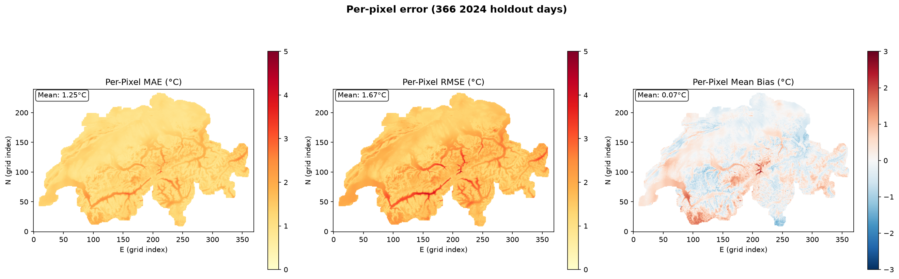
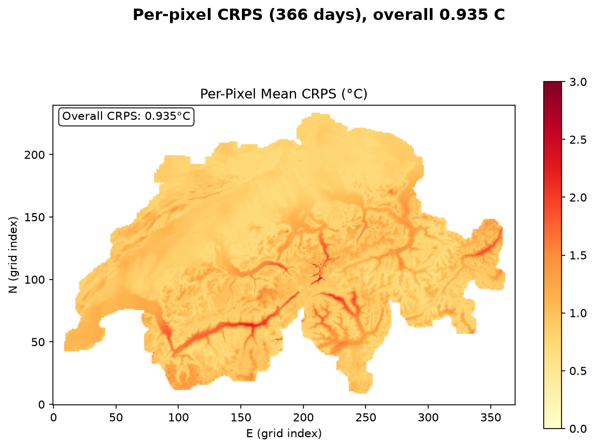
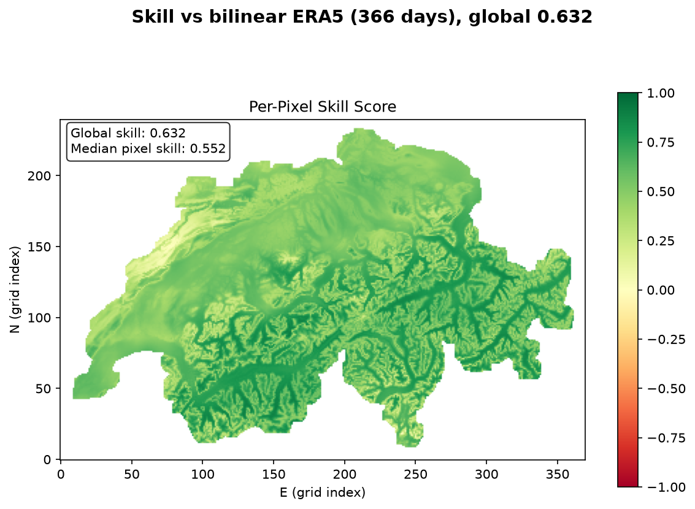
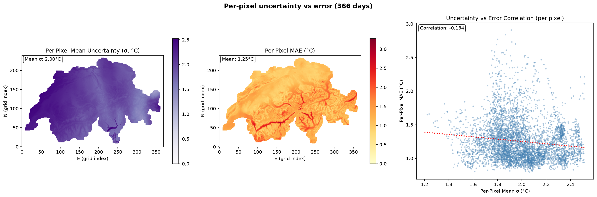
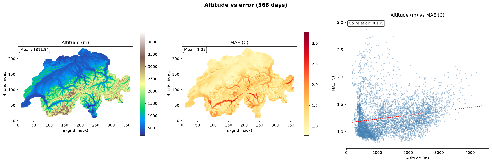
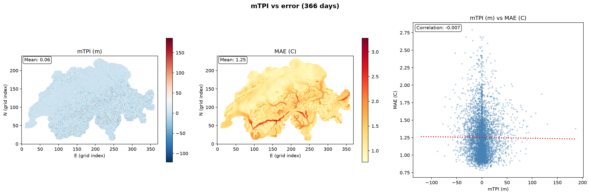
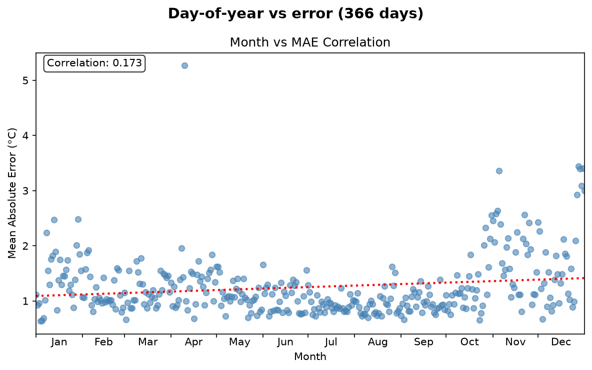
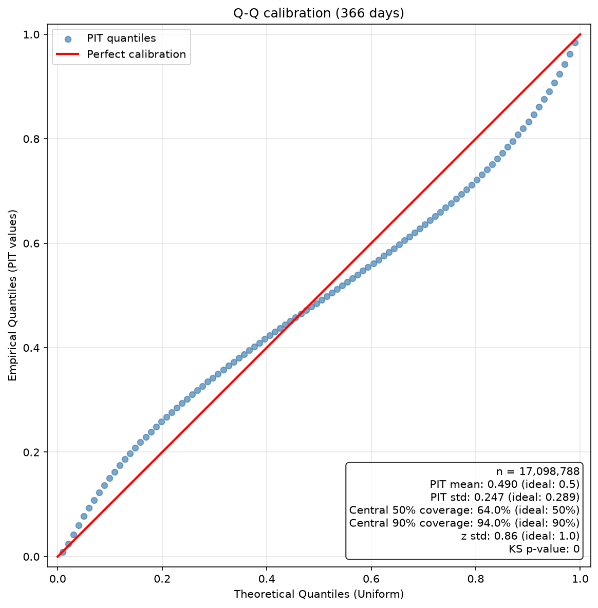
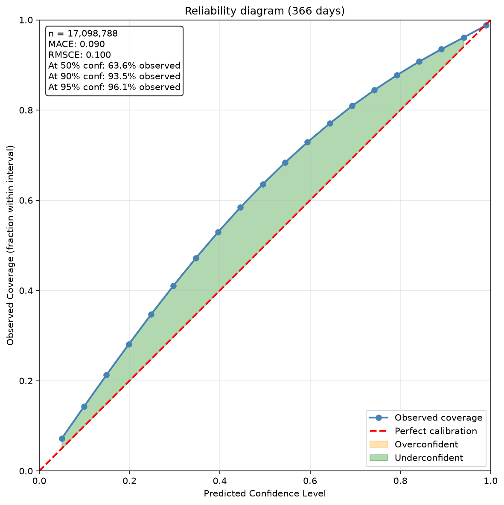

# Evaluation report — tmax (native coarse atmospheric)

> Genuine **holdout year 2024**: no fold saw any 2024 day. Inputs are normalised with the **training-frozen** statistics in `manifest.json` — never re-fit on 2024. All 5 folds predict all 366 days and are combined as a Gaussian-mixture moment match (mu = mean mu_k; sigma^2 = mean sigma_k^2 + var mu_k), so sigma carries both the within-fold and the between-fold uncertainty (see `sigma_decomposition`).

- Model: `CLEAN_trained_models/clean_solo_wind__tmax_atm_natg_av-ztquv_flat_y2020-2023_e30f5_b8/tmax`
- Encoder: `flat` | folds evaluated: 5 | target points: 88,800 | holdout days: 366
- Regime: `holdout_year_2024` | prediction mode: `fold_ensemble` | valid points: 46,718

## Headline metrics

| Metric | Value |
|---|---|
| MAE (°C) | 1.252 |
| RMSE (°C) | 1.665 |
| Bias (°C) | 0.069 |
| CRPS (°C) | 0.935 |
| Skill vs bilinear ERA5 | 0.632 |

## Error diagnostics (correlation of MAE with …)

| Driver | Pearson r |
|---|---|
| predicted σ (calibration in space) | -0.134 |
| altitude | 0.195 |
| mTPI (ridge/valley) | -0.007 |
| day of year (seasonality) | 0.173 |

## Uncertainty calibration

| Metric | Value | Ideal |
|---|---|---|
| PIT mean | 0.490 | 0.5 |
| PIT std | 0.247 | 0.289 |
| z std | 0.860 | 1.0 |
| coverage @50% | 64.0% | 50% |
| coverage @90% | 94.0% | 90% |
| KS p-value | 0 | >0.05 |
| MACE (reliability) | 0.090 | 0 |
| reliability @90% | 93.5% | 90% |
| reliability @95% | 96.1% | 95% |

## Ensemble spread decomposition

| Component | °C |
|---|---|
| within-fold (mean σₖ) | 1.906 |
| between-fold (spread of μₖ) | 0.626 |
| total (moment-matched) | 2.037 |

## Figures

### Per-pixel MAE / RMSE / bias

### Per-pixel CRPS

### Skill vs bilinear-ERA5 baseline

### Per-pixel uncertainty vs error

### Altitude vs error

### mTPI vs error

### Day-of-year vs error

### Q-Q / PIT calibration

### Reliability diagram

