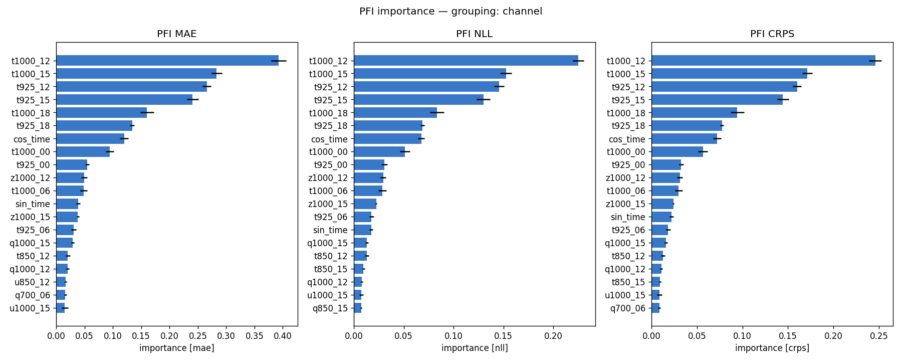
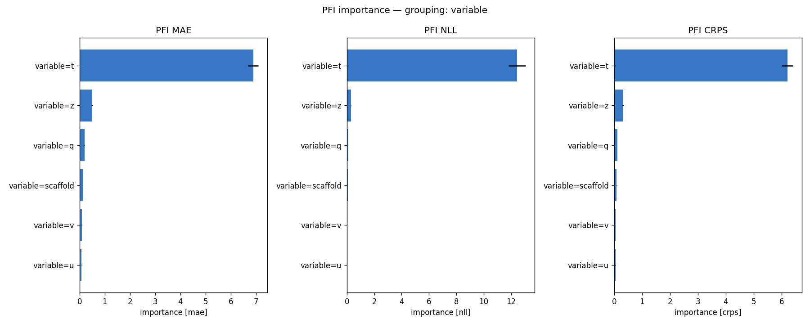
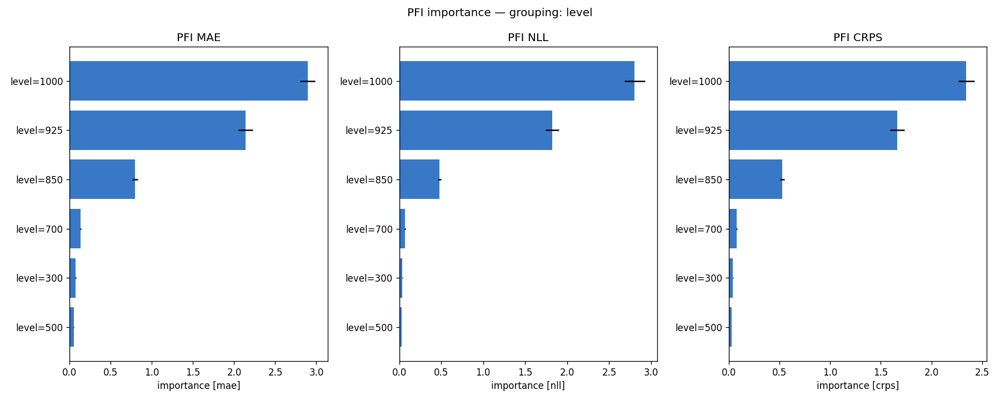
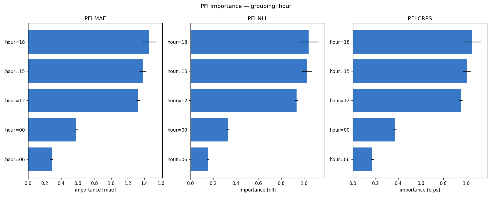
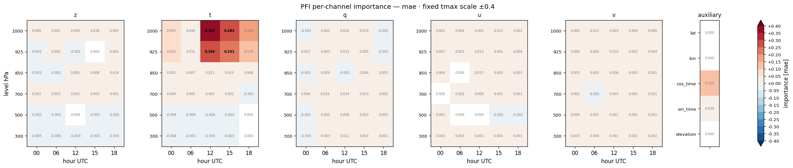
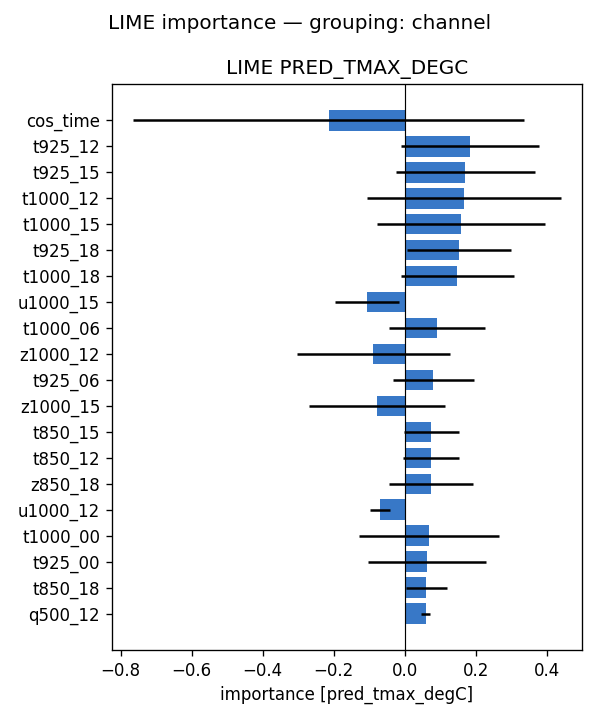
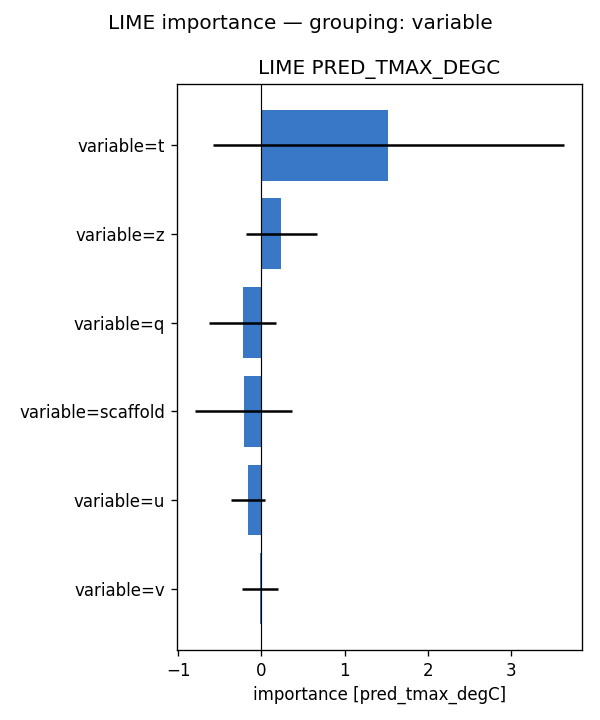
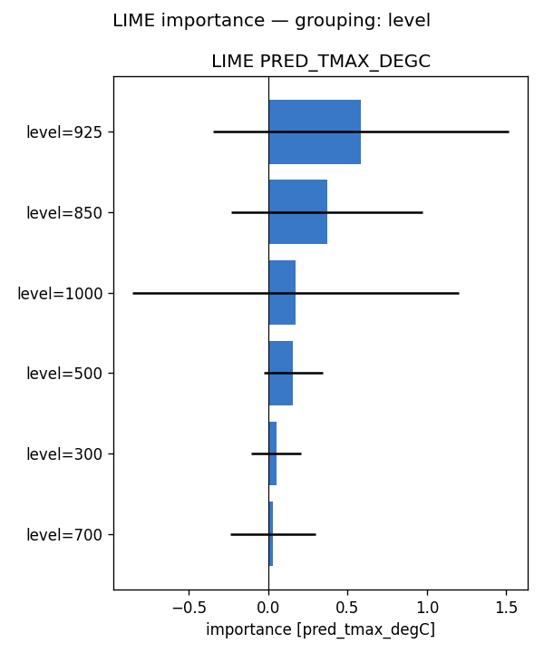
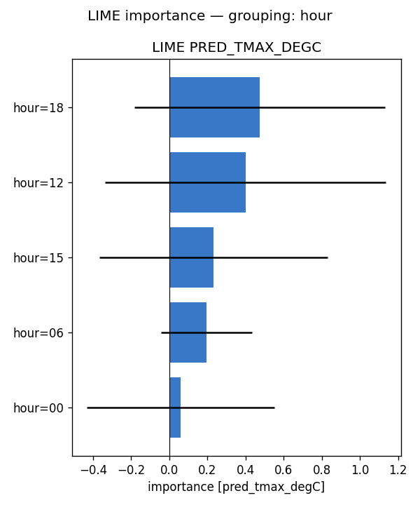
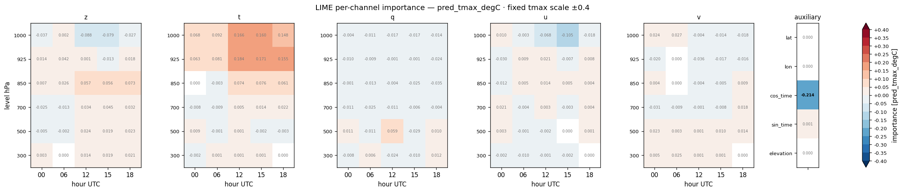

# Feature importance — full-run analysis report — tmax (2022)

**Model:** `clean_solo_wind__tmax_atm_natg_av-ztquv_flat_y2020-2023_e30f5_b8/tmax` (atmospheric, native coarse grid; standalone tmax; 155 channels: z/t/q/u/v x 6 levels {1000,925,850,700,500,300 hPa} x 5 hours {00,06,12,15,18 UTC} + 5 scaffold).
**Methods:** PFI, LIME — self-implemented, no external deps. **SHAP not available for this run** (no `shap.csv`), so the tables below are 2-method.
**Attribution metrics:** MAE / NLL / CRPS (degC) vs MeteoSwiss TmaxD truth.

## Run configuration

| | value |
|---|---|
| Data span | 2022 |
| Days scored | **365** |
| Folds | **5** of 5 (ensemble) |
| Target points | 88,800 |

## Baseline (all channels present)

MAE **1.165** · NLL **1.905** · CRPS **0.871**  [degC]. Importance = how much removing/scrambling a feature degrades these metrics (higher = more important).

## Bottom line

- **By variable** — PFI: t (+6.888), z (+0.495), q (+0.192); LIME: t (+1.524), z (+0.241), q (-0.226)
- **By pressure level** — PFI: 1000 (+2.895), 925 (+2.138), 850 (+0.794); LIME: 925 (+0.584), 850 (+0.370), 1000 (+0.173)
- **By hour (UTC)** — PFI: 18 (+1.453), 15 (+1.382), 12 (+1.325); LIME: 18 (+0.474), 12 (+0.399), 15 (+0.233)

Consensus across methods: see the per-variable rankings below for how each atmospheric field (z/t/q/u/v) contributes.

## Cross-method tables

*(machine-generated; see `summary.md`)*

- Target points: 88800  |  days scored: 365  |  folds: 5
- Baseline (all channels): MAE 1.165 | NLL 1.905 | CRPS 0.871  [degC]

## Top channels (|importance|)

| rank | PFI (mae) | LIME (pred) |
|---|---|---|
| 1 | t1000_12 (+0.392) | cos_time (-0.214) |
| 2 | t1000_15 (+0.283) | t925_12 (+0.184) |
| 3 | t925_12 (+0.266) | t925_15 (+0.171) |
| 4 | t925_15 (+0.241) | t1000_12 (+0.166) |
| 5 | t1000_18 (+0.160) | t1000_15 (+0.160) |
| 6 | t925_18 (+0.134) | t925_18 (+0.155) |
| 7 | cos_time (+0.120) | t1000_18 (+0.148) |
| 8 | t1000_00 (+0.095) | u1000_15 (-0.105) |

## By variable

- **PFI** (mae): t (+6.888), z (+0.495), q (+0.192), scaffold (+0.149), v (+0.085), u (+0.078)
- **LIME** (pred_tmax_degC): t (+1.524), z (+0.241), q (-0.226), scaffold (-0.213), u (-0.162), v (-0.015)

## By hour

- **PFI** (mae): 18 (+1.453), 15 (+1.382), 12 (+1.325), 00 (+0.578), 06 (+0.282)
- **LIME** (pred_tmax_degC): 18 (+0.474), 12 (+0.399), 15 (+0.233), 06 (+0.196), 00 (+0.061)

## By level

- **PFI** (mae): 1000 (+2.895), 925 (+2.138), 850 (+0.794), 700 (+0.134), 300 (+0.072), 500 (+0.049)
- **LIME** (pred_tmax_degC): 925 (+0.584), 850 (+0.370), 1000 (+0.173), 500 (+0.157), 300 (+0.050), 700 (+0.030)

## Figures

- `pfi_channel.png`
- `pfi_variable.png`
- `pfi_level.png`
- `pfi_hour.png`
- `pfi_heatmap_*.png` (level × hour)
- `lime_channel.png`
- `lime_variable.png`
- `lime_level.png`
- `lime_hour.png`
- `lime_heatmap_*.png` (level × hour)

## Figure gallery

### PFI

### LIME

*Generated by `scripts/fi_evaluate.sh` from `pfi.csv`, `lime.csv` and the regenerated `summary.md` in this directory.*