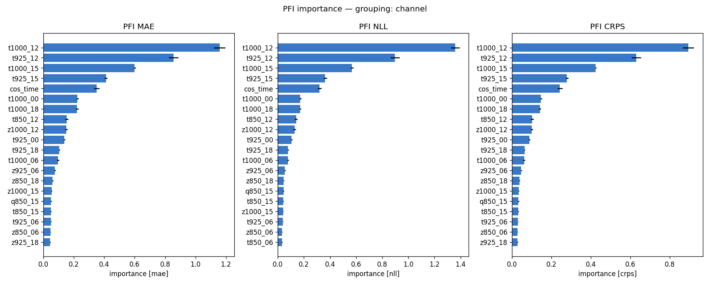
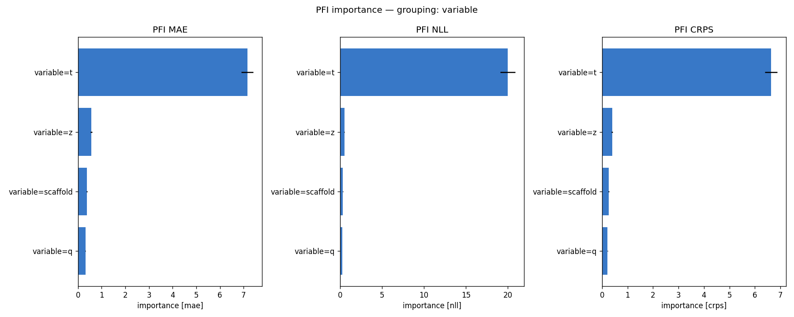
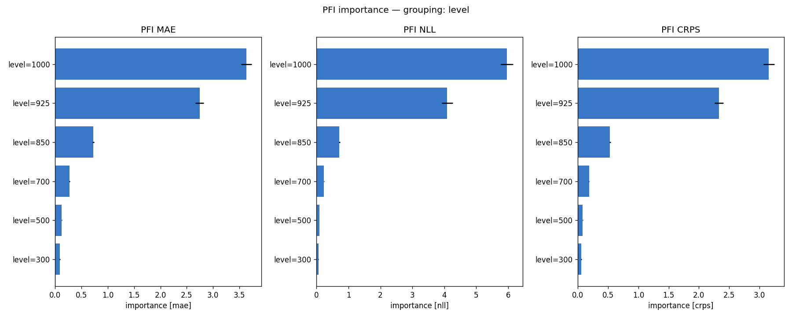
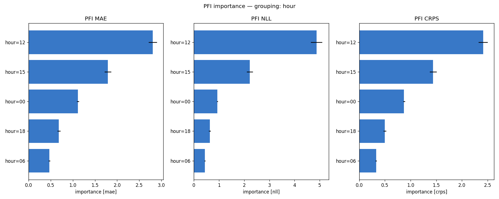
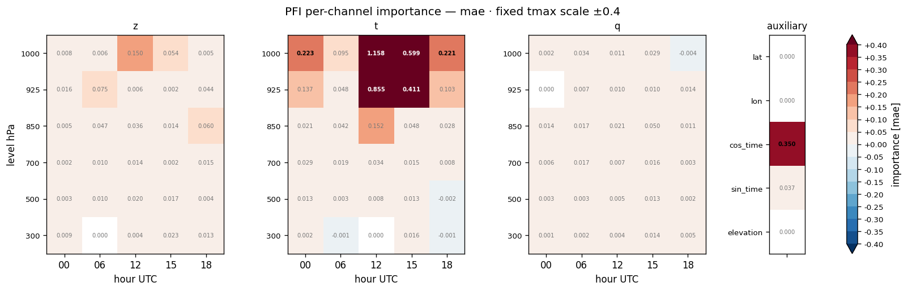
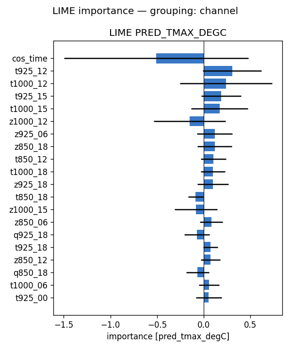
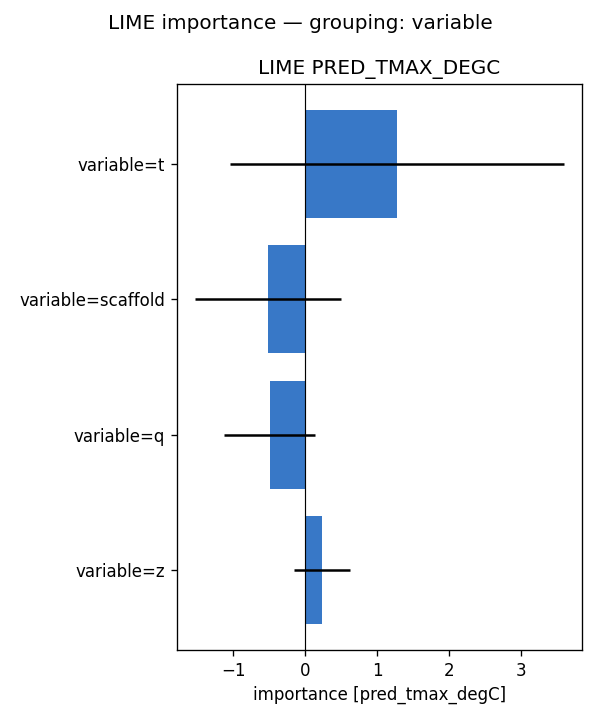
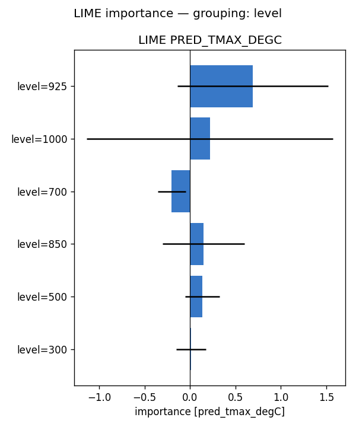
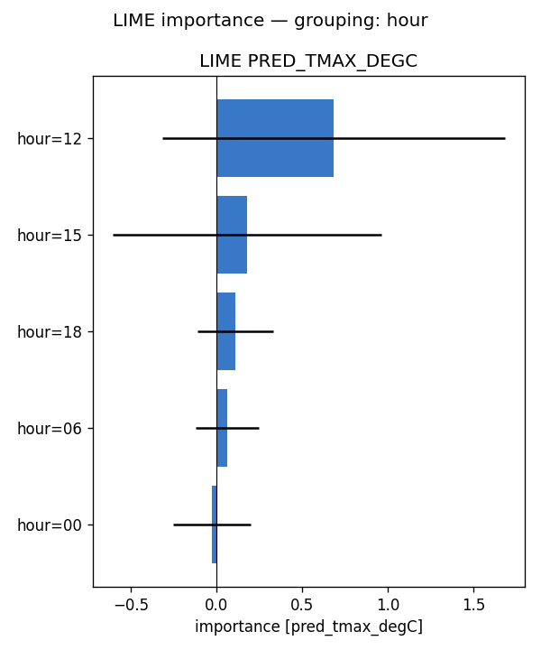
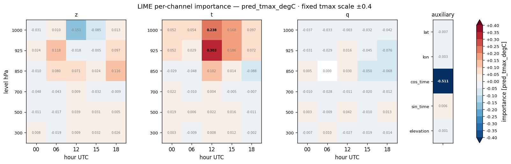

# Feature importance — full-run analysis report — tmax (2022)

**Model:** `lbclip_atm__tmax_atm_natg_flat_y2020-2023_e60f5_b8/tmax` (atmospheric, native coarse grid; standalone tmax; 95 channels: z/t/q x 6 levels {1000,925,850,700,500,300 hPa} x 5 hours {00,06,12,15,18 UTC} + 5 scaffold).
**Methods:** PFI, LIME — self-implemented, no external deps. **SHAP not available for this run** (no `shap.csv`), so the tables below are 2-method.
**Attribution metrics:** MAE / NLL / CRPS (degC) vs MeteoSwiss TmaxD truth.

## Run configuration

| | value |
|---|---|
| Data span | 2022 |
| Days scored | **365** |
| Folds | **5** of 5 (ensemble) |
| Target points | 88,800 |

## Baseline (all channels present)

MAE **0.957** · NLL **1.638** · CRPS **0.696**  [degC]. Importance = how much removing/scrambling a feature degrades these metrics (higher = more important).

## Bottom line

- **By variable** — PFI: t (+7.160), z (+0.556), scaffold (+0.373); LIME: t (+1.270), scaffold (-0.516), q (-0.496)
- **By pressure level** — PFI: 1000 (+3.635), 925 (+2.746), 850 (+0.724); LIME: 925 (+0.693), 1000 (+0.219), 700 (-0.200)
- **By hour (UTC)** — PFI: 12 (+2.805), 15 (+1.788), 00 (+1.114); LIME: 12 (+0.684), 15 (+0.179), 18 (+0.111)

Consensus across methods: near-surface (low-level) air temperature in the afternoon/evening is what the model relies on to downscale daily-max 2 m temperature, with geopotential a secondary cue and humidity minor — physically expected.

## Cross-method tables

*(machine-generated; see `summary.md`)*

- Target points: 88800  |  days scored: 365  |  folds: 5
- Baseline (all channels): MAE 0.957 | NLL 1.638 | CRPS 0.696  [degC]

## Top channels (|importance|)

| rank | PFI (mae) | LIME (pred) |
|---|---|---|
| 1 | t1000_12 (+1.158) | cos_time (-0.511) |
| 2 | t925_12 (+0.855) | t925_12 (+0.303) |
| 3 | t1000_15 (+0.599) | t1000_12 (+0.238) |
| 4 | t925_15 (+0.411) | t925_15 (+0.186) |
| 5 | cos_time (+0.350) | t1000_15 (+0.168) |
| 6 | t1000_00 (+0.223) | z1000_12 (-0.151) |
| 7 | t1000_18 (+0.221) | z925_06 (+0.118) |
| 8 | t850_12 (+0.152) | z850_18 (+0.116) |

## By variable

- **PFI** (mae): t (+7.160), z (+0.556), scaffold (+0.373), q (+0.312)
- **LIME** (pred_tmax_degC): t (+1.270), scaffold (-0.516), q (-0.496), z (+0.235)

## By hour

- **PFI** (mae): 12 (+2.805), 15 (+1.788), 00 (+1.114), 18 (+0.685), 06 (+0.467)
- **LIME** (pred_tmax_degC): 12 (+0.684), 15 (+0.179), 18 (+0.111), 06 (+0.061), 00 (-0.025)

## By level

- **PFI** (mae): 1000 (+3.635), 925 (+2.746), 850 (+0.724), 700 (+0.273), 500 (+0.126), 300 (+0.091)
- **LIME** (pred_tmax_degC): 925 (+0.693), 1000 (+0.219), 700 (-0.200), 850 (+0.149), 500 (+0.137), 300 (+0.012)

## Figures

- `pfi_channel.png`
- `pfi_variable.png`
- `pfi_level.png`
- `pfi_hour.png`
- `pfi_heatmap_*.png` (level × hour)
- `lime_channel.png`
- `lime_variable.png`
- `lime_level.png`
- `lime_hour.png`
- `lime_heatmap_*.png` (level × hour)

## Figure gallery

### PFI

### LIME

*Generated by `scripts/fi_evaluate.sh` from `pfi.csv`, `lime.csv` and the regenerated `summary.md` in this directory.*