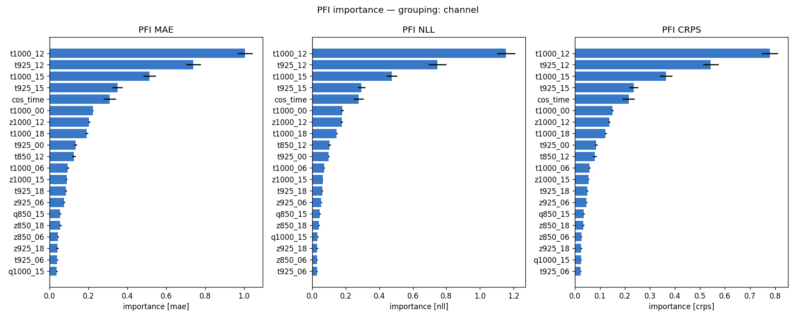
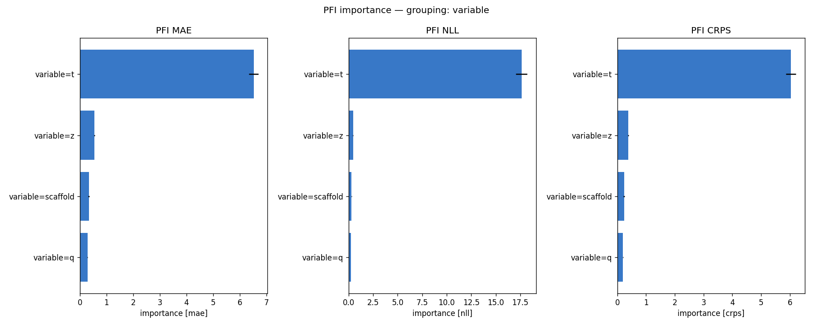
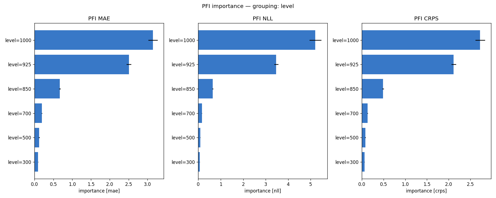
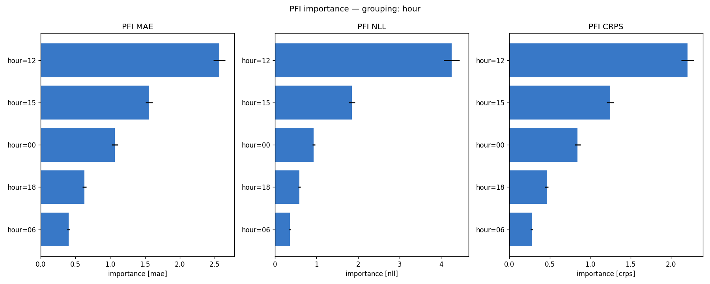
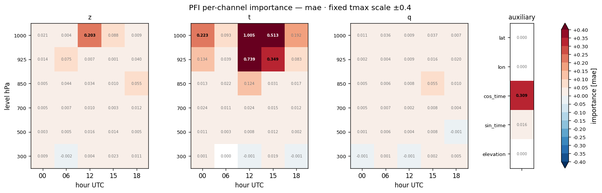
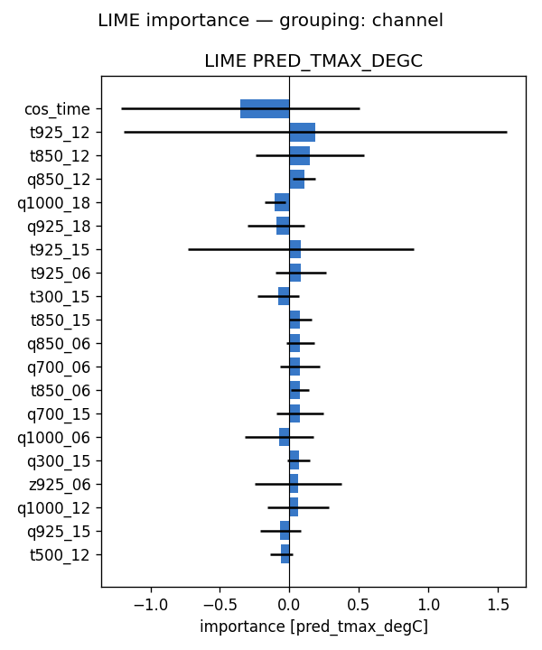
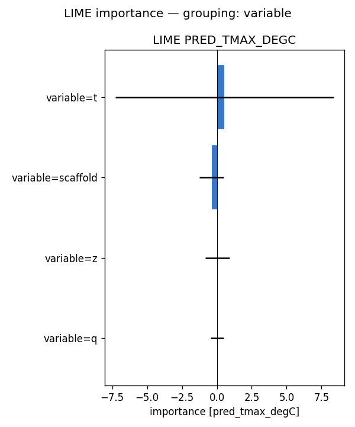
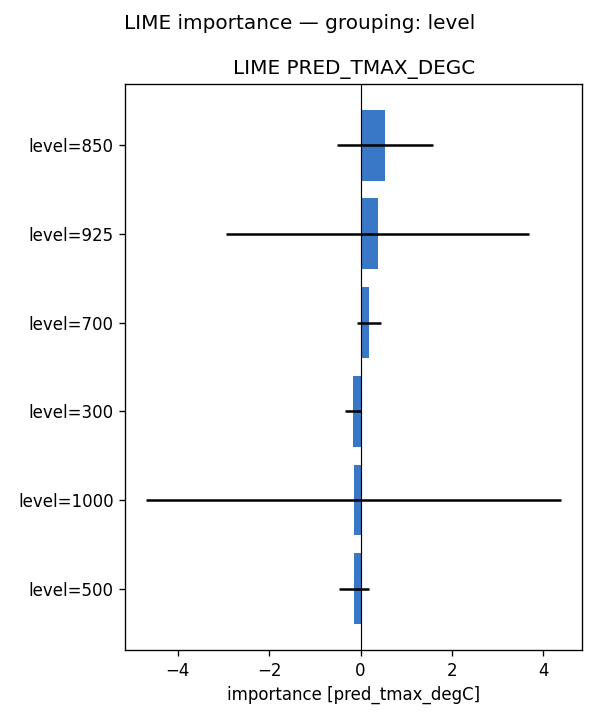
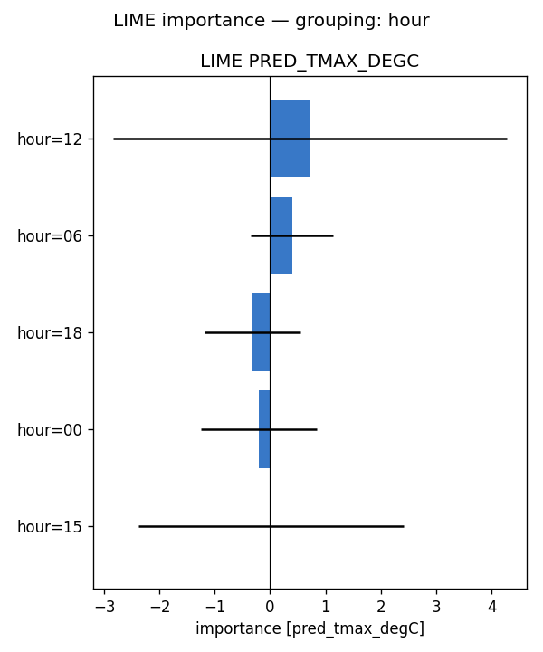
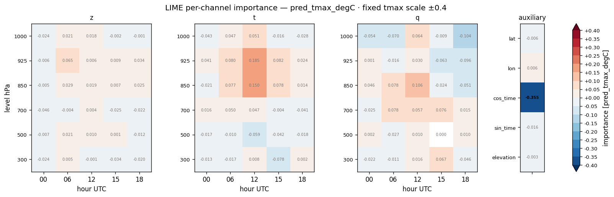

# Feature importance — full-run analysis report — tmax (2024)

**Model:** `lbclip_atm__tmax_atm_natg_flat_y2020-2023_e60f5_b8/tmax` (atmospheric, native coarse grid; standalone tmax; 95 channels: z/t/q x 6 levels {1000,925,850,700,500,300 hPa} x 5 hours {00,06,12,15,18 UTC} + 5 scaffold).
**Methods:** PFI, LIME — self-implemented, no external deps. **SHAP not available for this run** (no `shap.csv`), so the tables below are 2-method.
**Attribution metrics:** MAE / NLL / CRPS (degC) vs MeteoSwiss TmaxD truth.

## Run configuration

| | value |
|---|---|
| Data span | 2024 |
| Days scored | **366** |
| Folds | **5** of 5 (ensemble) |
| Target points | 88,800 |

## Baseline (all channels present)

MAE **1.047** · NLL **1.700** · CRPS **0.757**  [degC]. Importance = how much removing/scrambling a feature degrades these metrics (higher = more important).

## Bottom line

- **By variable** — PFI: t (+6.526), z (+0.539), scaffold (+0.336); LIME: t (+0.545), scaffold (-0.375), z (+0.040)
- **By pressure level** — PFI: 1000 (+3.148), 925 (+2.509), 850 (+0.672); LIME: 850 (+0.527), 925 (+0.377), 700 (+0.177)
- **By hour (UTC)** — PFI: 12 (+2.567), 15 (+1.557), 00 (+1.067); LIME: 12 (+0.721), 06 (+0.394), 18 (-0.316)

Consensus across methods: near-surface (low-level) air temperature in the afternoon/evening is what the model relies on to downscale daily-max 2 m temperature, with geopotential a secondary cue and humidity minor — physically expected.

## Cross-method tables

*(machine-generated; see `summary.md`)*

- Target points: 88800  |  days scored: 366  |  folds: 5
- Baseline (all channels): MAE 1.047 | NLL 1.700 | CRPS 0.757  [degC]

## Top channels (|importance|)

| rank | PFI (mae) | LIME (pred) |
|---|---|---|
| 1 | t1000_12 (+1.005) | cos_time (-0.355) |
| 2 | t925_12 (+0.739) | t925_12 (+0.185) |
| 3 | t1000_15 (+0.513) | t850_12 (+0.150) |
| 4 | t925_15 (+0.349) | q850_12 (+0.106) |
| 5 | cos_time (+0.309) | q1000_18 (-0.104) |
| 6 | t1000_00 (+0.223) | q925_18 (-0.096) |
| 7 | z1000_12 (+0.203) | t925_15 (+0.082) |
| 8 | t1000_18 (+0.192) | t925_06 (+0.080) |

## By variable

- **PFI** (mae): t (+6.526), z (+0.539), scaffold (+0.336), q (+0.283)
- **LIME** (pred_tmax_degC): t (+0.545), scaffold (-0.375), z (+0.040), q (+0.035)

## By hour

- **PFI** (mae): 12 (+2.567), 15 (+1.557), 00 (+1.067), 18 (+0.630), 06 (+0.400)
- **LIME** (pred_tmax_degC): 12 (+0.721), 06 (+0.394), 18 (-0.316), 00 (-0.200), 15 (+0.022)

## By level

- **PFI** (mae): 1000 (+3.148), 925 (+2.509), 850 (+0.672), 700 (+0.195), 500 (+0.123), 300 (+0.093)
- **LIME** (pred_tmax_degC): 850 (+0.527), 925 (+0.377), 700 (+0.177), 300 (-0.170), 1000 (-0.150), 500 (-0.140)

## Figures

- `pfi_channel.png`
- `pfi_variable.png`
- `pfi_level.png`
- `pfi_hour.png`
- `pfi_heatmap_*.png` (level × hour)
- `lime_channel.png`
- `lime_variable.png`
- `lime_level.png`
- `lime_hour.png`
- `lime_heatmap_*.png` (level × hour)

## Figure gallery

### PFI

### LIME

*Generated by `scripts/fi_evaluate.sh` from `pfi.csv`, `lime.csv` and the regenerated `summary.md` in this directory.*