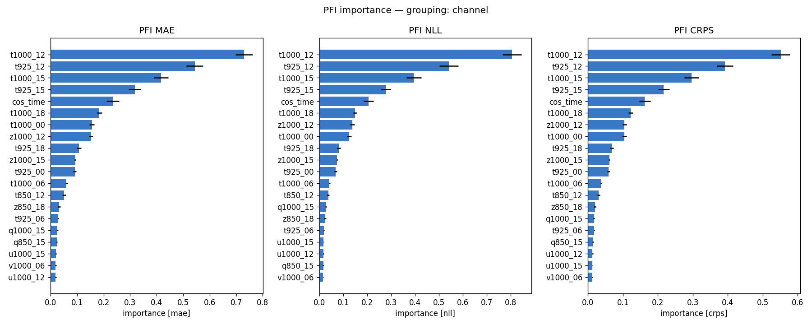
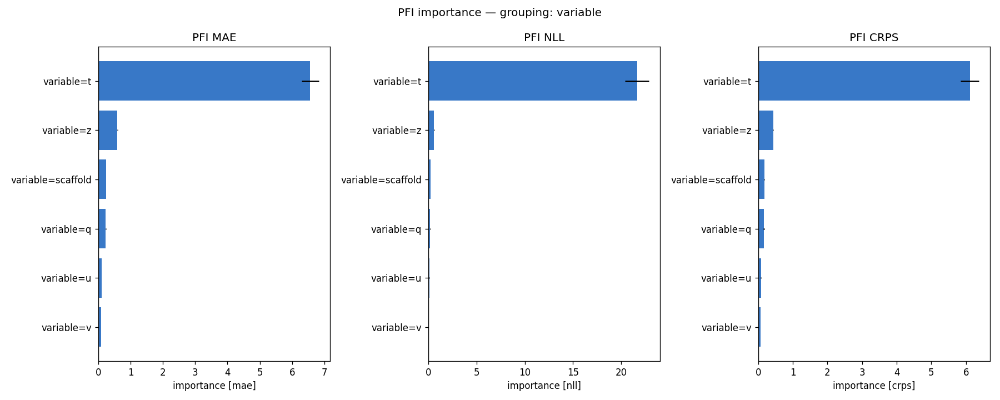
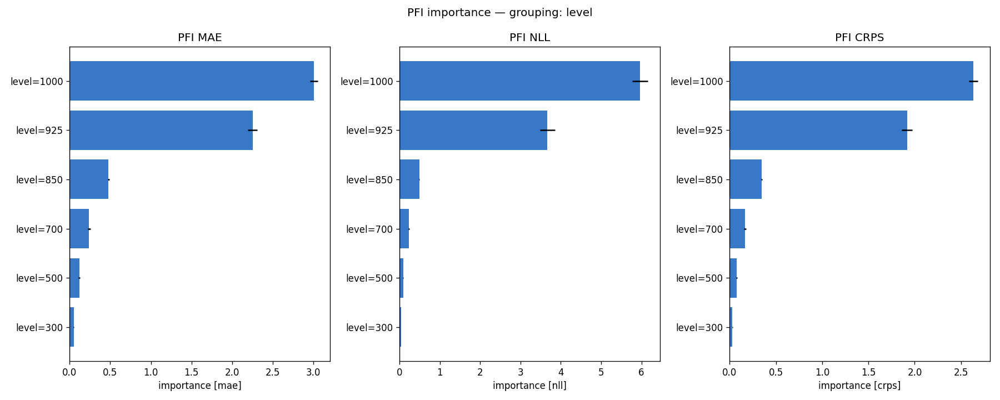
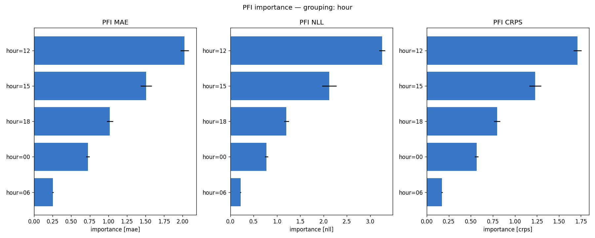
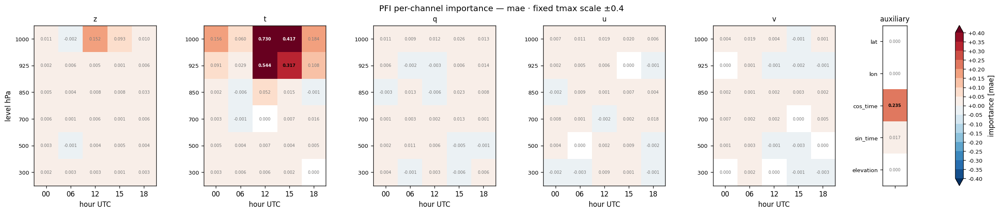
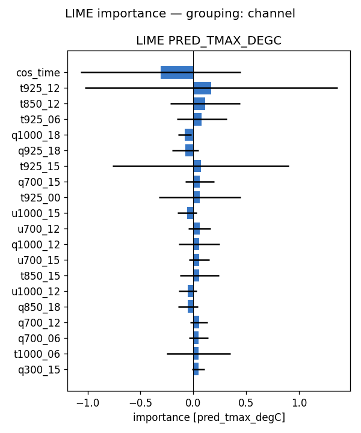
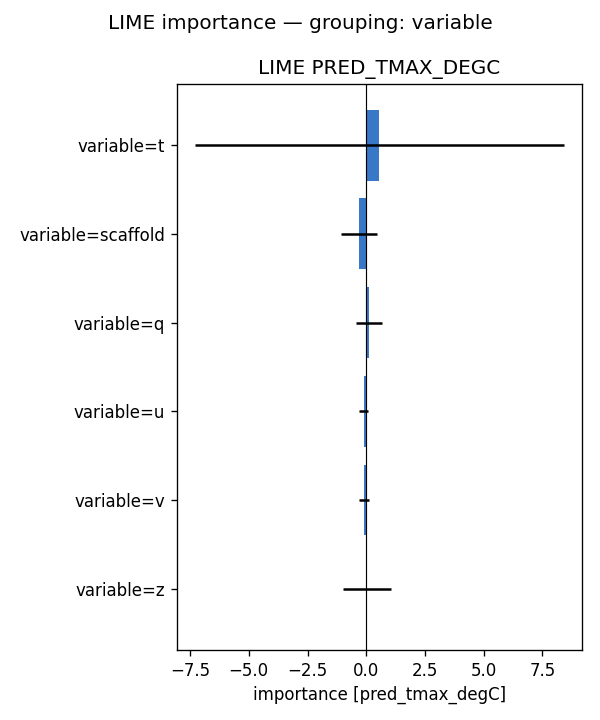
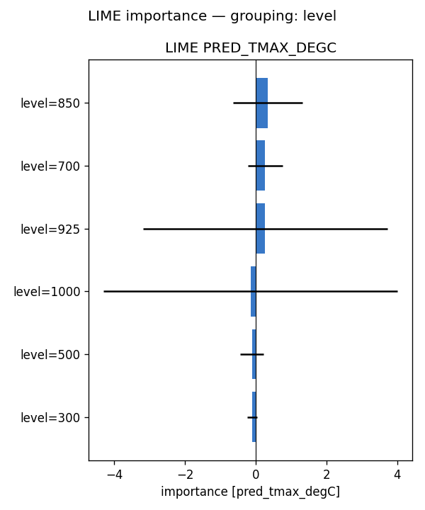
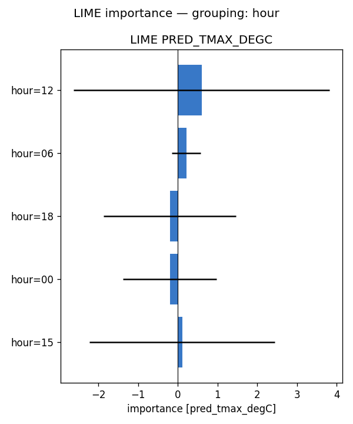
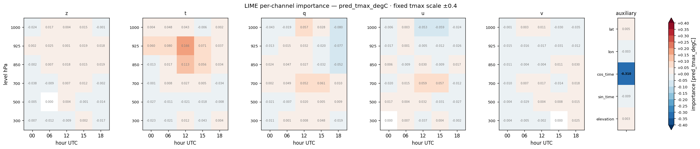

# Feature importance — full-run analysis report — tmax (2024)

**Model:** `lbclip_wind__tmax_atm_natg_av-ztquv_flat_y2020-2023_e60f5_b8/tmax` (atmospheric, native coarse grid; standalone tmax; 155 channels: z/t/q/u/v x 6 levels {1000,925,850,700,500,300 hPa} x 5 hours {00,06,12,15,18 UTC} + 5 scaffold).
**Methods:** PFI, LIME — self-implemented, no external deps. **SHAP not available for this run** (no `shap.csv`), so the tables below are 2-method.
**Attribution metrics:** MAE / NLL / CRPS (degC) vs MeteoSwiss TmaxD truth.

## Run configuration

| | value |
|---|---|
| Data span | 2024 |
| Days scored | **366** |
| Folds | **5** of 5 (ensemble) |
| Target points | 88,800 |

## Baseline (all channels present)

MAE **1.029** · NLL **1.682** · CRPS **0.741**  [degC]. Importance = how much removing/scrambling a feature degrades these metrics (higher = more important).

## Bottom line

- **By variable** — PFI: t (+6.560), z (+0.593), scaffold (+0.247); LIME: t (+0.561), scaffold (-0.315), q (+0.102)
- **By pressure level** — PFI: 1000 (+3.006), 925 (+2.254), 850 (+0.479); LIME: 850 (+0.338), 700 (+0.266), 925 (+0.265)
- **By hour (UTC)** — PFI: 12 (+2.027), 15 (+1.510), 18 (+1.021); LIME: 12 (+0.596), 06 (+0.212), 18 (-0.203)

Consensus across methods: see the per-variable rankings below for how each atmospheric field (z/t/q/u/v) contributes.

## Cross-method tables

*(machine-generated; see `summary.md`)*

- Target points: 88800  |  days scored: 366  |  folds: 5
- Baseline (all channels): MAE 1.029 | NLL 1.682 | CRPS 0.741  [degC]

## Top channels (|importance|)

| rank | PFI (mae) | LIME (pred) |
|---|---|---|
| 1 | t1000_12 (+0.730) | cos_time (-0.310) |
| 2 | t925_12 (+0.544) | t925_12 (+0.166) |
| 3 | t1000_15 (+0.417) | t850_12 (+0.113) |
| 4 | t925_15 (+0.317) | t925_06 (+0.080) |
| 5 | cos_time (+0.235) | q1000_18 (-0.080) |
| 6 | t1000_18 (+0.184) | q925_18 (-0.077) |
| 7 | t1000_00 (+0.156) | t925_15 (+0.071) |
| 8 | z1000_12 (+0.152) | q700_15 (+0.061) |

## By variable

- **PFI** (mae): t (+6.560), z (+0.593), scaffold (+0.247), q (+0.232), u (+0.106), v (+0.089)
- **LIME** (pred_tmax_degC): t (+0.561), scaffold (-0.315), q (+0.102), u (-0.098), v (-0.093), z (+0.044)

## By hour

- **PFI** (mae): 12 (+2.027), 15 (+1.510), 18 (+1.021), 00 (+0.724), 06 (+0.253)
- **LIME** (pred_tmax_degC): 12 (+0.596), 06 (+0.212), 18 (-0.203), 00 (-0.201), 15 (+0.112)

## By level

- **PFI** (mae): 1000 (+3.006), 925 (+2.254), 850 (+0.479), 700 (+0.239), 500 (+0.118), 300 (+0.050)
- **LIME** (pred_tmax_degC): 850 (+0.338), 700 (+0.266), 925 (+0.265), 1000 (-0.146), 500 (-0.106), 300 (-0.100)

## Figures

- `pfi_channel.png`
- `pfi_variable.png`
- `pfi_level.png`
- `pfi_hour.png`
- `pfi_heatmap_*.png` (level × hour)
- `lime_channel.png`
- `lime_variable.png`
- `lime_level.png`
- `lime_hour.png`
- `lime_heatmap_*.png` (level × hour)

## Figure gallery

### PFI

### LIME

*Generated by `scripts/fi_evaluate.sh` from `pfi.csv`, `lime.csv` and the regenerated `summary.md` in this directory.*