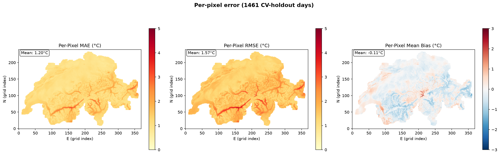
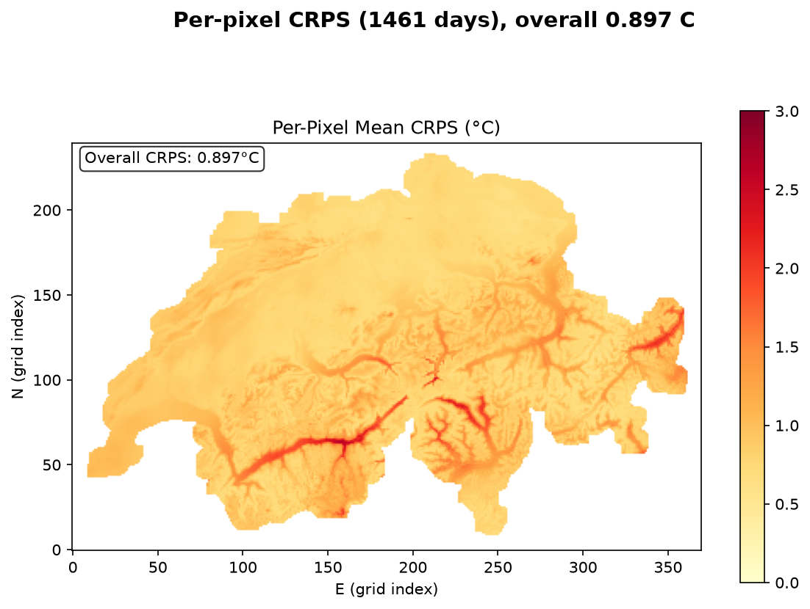
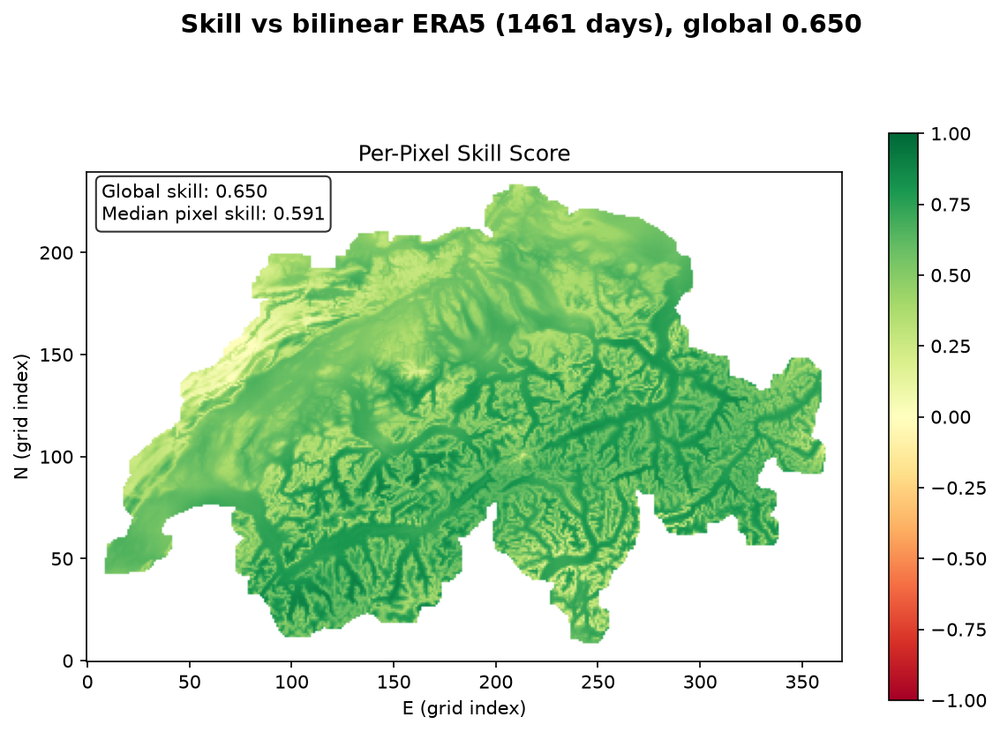
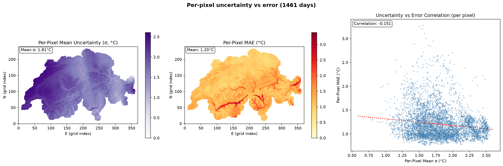
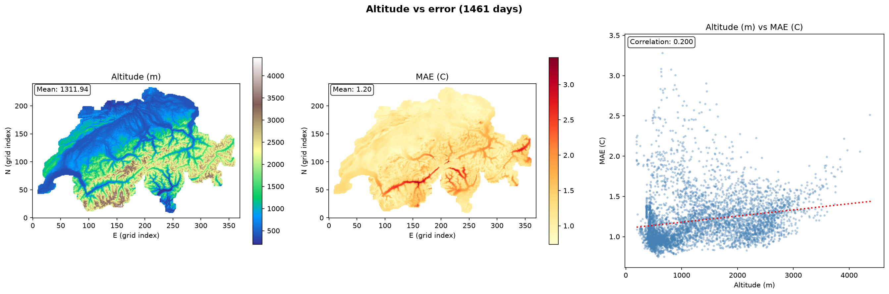
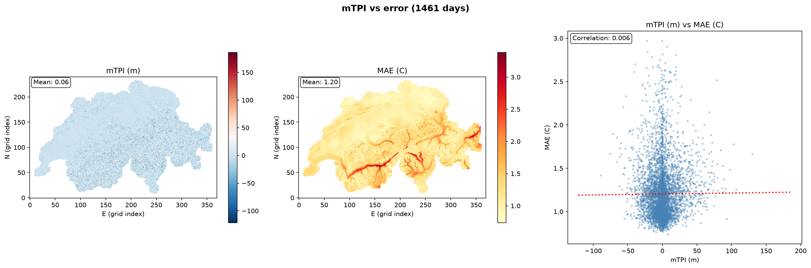
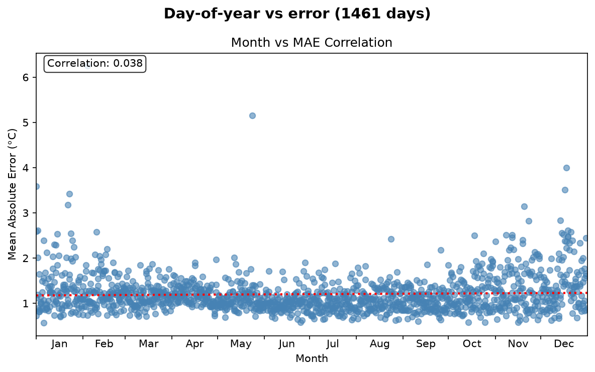
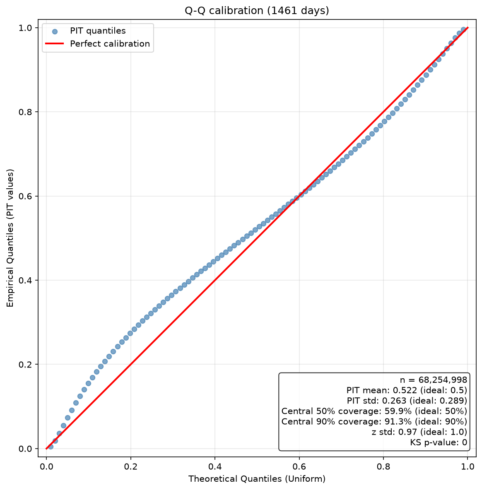
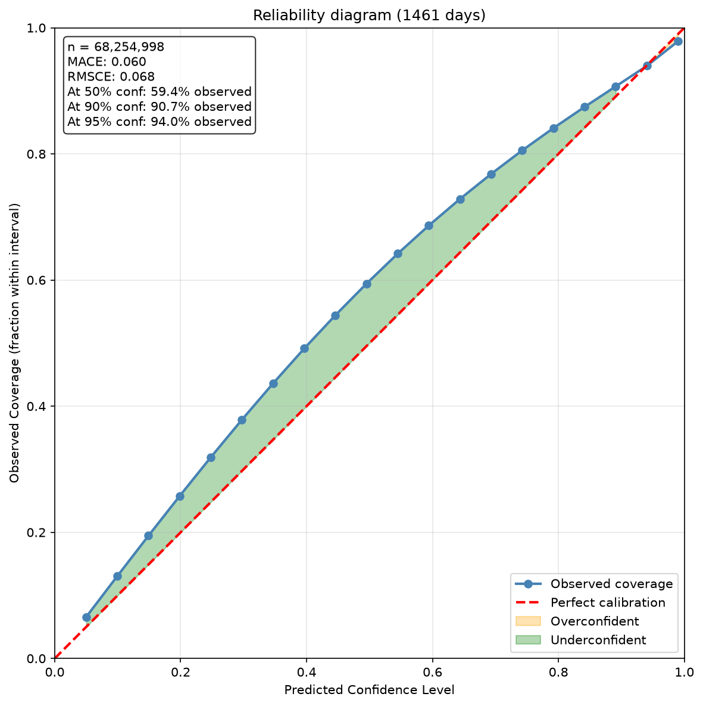

# Evaluation report — tmax (native coarse atmospheric)

> Cross-validation holdout over the **training span 2020-2023**. Each of the 5 folds predicts **only** the contiguous block it was held out from during training; the blocks tile the 1461-day axis, so **every day is predicted exactly once, by the one model that never saw it**. This is not a fold ensemble — per-fold numbers are in `per_fold`. These are training-span days scored out-of-sample, *not* an unseen year.

- Model: `CLEAN_trained_models/sfc_anchors__tmax_atm_natg_sfcanc_flat_y2020-2023_e30f5_b8/tmax`
- Encoder: `flat` | folds evaluated: 5 | target points: 88,800 | holdout days: 1461
- Regime: `cv_holdout` | prediction mode: `fold_holdout` | valid points: 46,718

## Headline metrics

| Metric | Value |
|---|---|
| MAE (°C) | 1.203 |
| RMSE (°C) | 1.566 |
| Bias (°C) | -0.107 |
| CRPS (°C) | 0.897 |
| Skill vs bilinear ERA5 | 0.650 |

## Error diagnostics (correlation of MAE with …)

| Driver | Pearson r |
|---|---|
| predicted σ (calibration in space) | -0.151 |
| altitude | 0.200 |
| mTPI (ridge/valley) | 0.006 |
| day of year (seasonality) | 0.038 |

## Uncertainty calibration

| Metric | Value | Ideal |
|---|---|---|
| PIT mean | 0.522 | 0.5 |
| PIT std | 0.263 | 0.289 |
| z std | 0.975 | 1.0 |
| coverage @50% | 59.9% | 50% |
| coverage @90% | 91.3% | 90% |
| KS p-value | 0 | >0.05 |
| MACE (reliability) | 0.060 | 0 |
| reliability @90% | 90.7% | 90% |
| reliability @95% | 94.0% | 95% |

## Per-fold holdout blocks

Each fold scores only the days it was held out from, so these are disjoint sub-periods, not repeated measurements of the same days.

| Fold | Days | Period | Epoch | MAE (°C) | RMSE (°C) | CRPS (°C) | Skill |
|---|---|---|---|---|---|---|---|
| 0 | 292 | 2020-01-01 … 2020-10-18 | 9 | 1.299 | 1.671 | 0.961 | 0.639 |
| 1 | 292 | 2020-10-19 … 2021-08-06 | 28 | 1.150 | 1.488 | 0.847 | 0.665 |
| 2 | 292 | 2021-08-07 … 2022-05-25 | 15 | 1.283 | 1.669 | 0.955 | 0.637 |
| 3 | 292 | 2022-05-26 … 2023-03-13 | 23 | 1.063 | 1.381 | 0.801 | 0.672 |
| 4 | 293 | 2023-03-14 … 2023-12-31 | 11 | 1.220 | 1.564 | 0.921 | 0.637 |

## Figures

### Per-pixel MAE / RMSE / bias

### Per-pixel CRPS

### Skill vs bilinear-ERA5 baseline

### Per-pixel uncertainty vs error

### Altitude vs error

### mTPI vs error

### Day-of-year vs error

### Q-Q / PIT calibration

### Reliability diagram

