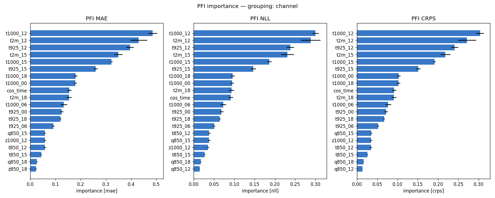
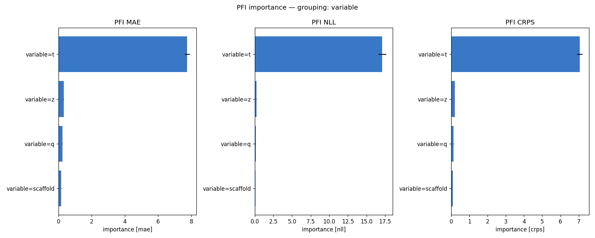
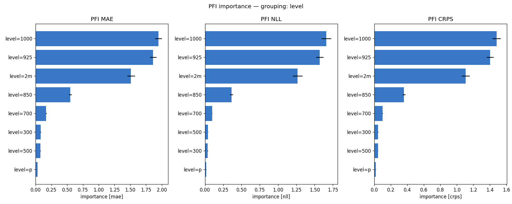
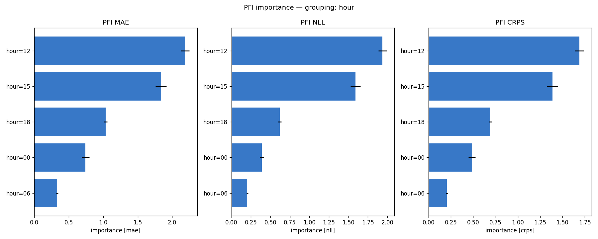
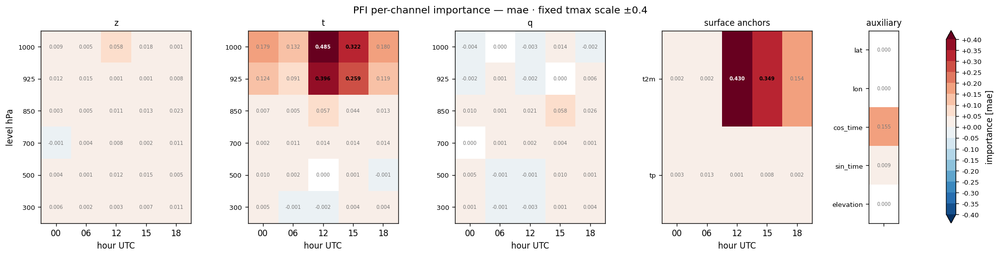
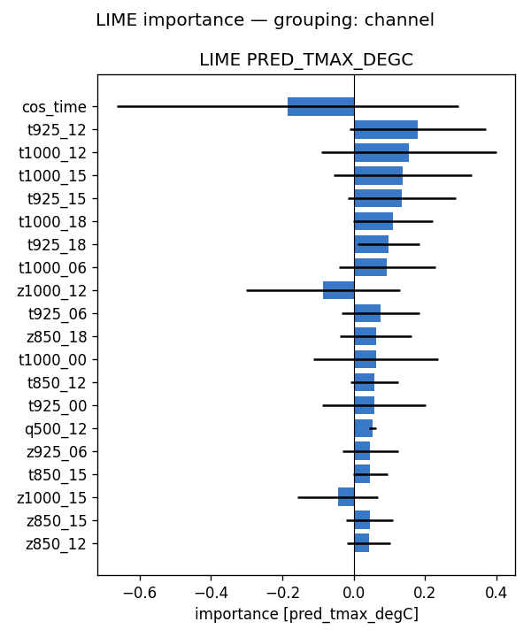
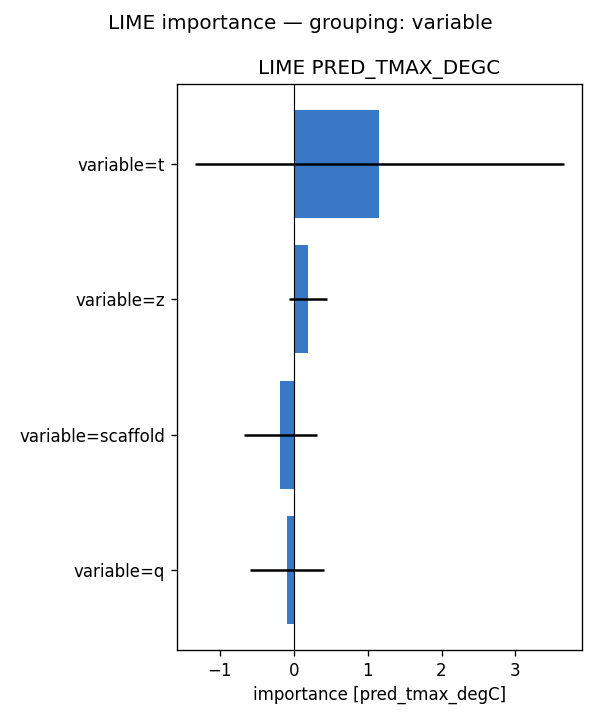
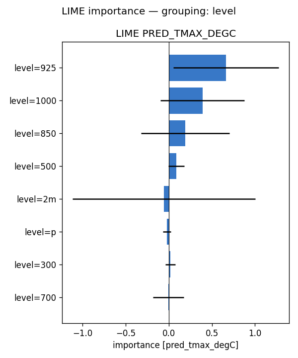
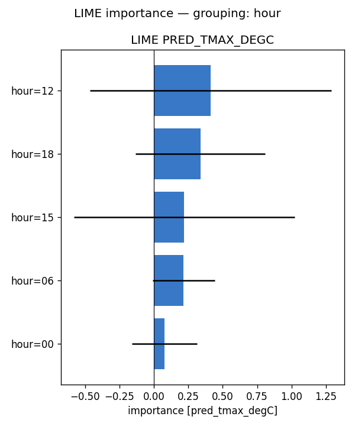
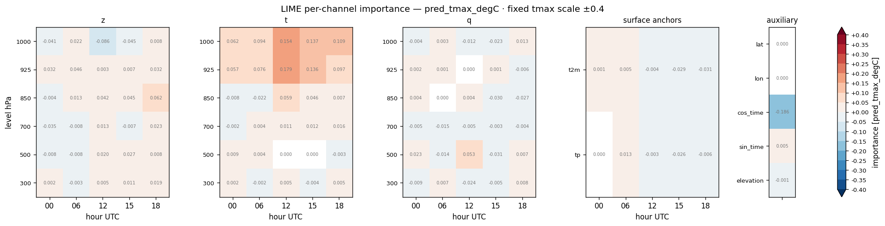

# Feature importance — full-run analysis report — tmax (2022)

**Model:** `sfc_anchors__tmax_atm_natg_sfcanc_flat_y2020-2023_e30f5_b8/tmax` (atmospheric, native coarse grid; standalone tmax; 105 channels: z/t/q x 6 levels {1000,925,850,700,500,300 hPa} x 5 hours {00,06,12,15,18 UTC} + 5 scaffold).
**Methods:** PFI, LIME — self-implemented, no external deps. **SHAP not available for this run** (no `shap.csv`), so the tables below are 2-method.
**Attribution metrics:** MAE / NLL / CRPS (degC) vs MeteoSwiss TmaxD truth.

## Run configuration

| | value |
|---|---|
| Data span | 2022 |
| Days scored | **365** |
| Folds | **5** of 5 (ensemble) |
| Target points | 88,800 |

## Baseline (all channels present)

MAE **1.102** · NLL **1.874** · CRPS **0.837**  [degC]. Importance = how much removing/scrambling a feature degrades these metrics (higher = more important).

## Bottom line

- **By variable** — PFI: t (+7.754), z (+0.318), q (+0.235); LIME: t (+1.160), z (+0.195), scaffold (-0.182)
- **By pressure level** — PFI: 1000 (+1.946), 925 (+1.862), 2m (+1.511); LIME: 925 (+0.664), 1000 (+0.391), 850 (+0.191)
- **By hour (UTC)** — PFI: 12 (+2.186), 15 (+1.838), 18 (+1.035); LIME: 12 (+0.414), 18 (+0.338), 15 (+0.221)

Consensus across methods: near-surface (low-level) air temperature in the afternoon/evening is what the model relies on to downscale daily-max 2 m temperature, with geopotential a secondary cue and humidity minor — physically expected.

## Cross-method tables

*(machine-generated; see `summary.md`)*

- Target points: 88800  |  days scored: 365  |  folds: 5
- Baseline (all channels): MAE 1.102 | NLL 1.874 | CRPS 0.837  [degC]

## Top channels (|importance|)

| rank | PFI (mae) | LIME (pred) |
|---|---|---|
| 1 | t1000_12 (+0.485) | cos_time (-0.186) |
| 2 | t2m_12 (+0.430) | t925_12 (+0.179) |
| 3 | t925_12 (+0.396) | t1000_12 (+0.154) |
| 4 | t2m_15 (+0.349) | t1000_15 (+0.137) |
| 5 | t1000_15 (+0.322) | t925_15 (+0.136) |
| 6 | t925_15 (+0.259) | t1000_18 (+0.109) |
| 7 | t1000_18 (+0.180) | t925_18 (+0.097) |
| 8 | t1000_00 (+0.179) | t1000_06 (+0.094) |

## By variable

- **PFI** (mae): t (+7.754), z (+0.318), q (+0.235), scaffold (+0.170)
- **LIME** (pred_tmax_degC): t (+1.160), z (+0.195), scaffold (-0.182), q (-0.089)

## By hour

- **PFI** (mae): 12 (+2.186), 15 (+1.838), 18 (+1.035), 00 (+0.744), 06 (+0.332)
- **LIME** (pred_tmax_degC): 12 (+0.414), 18 (+0.338), 15 (+0.221), 06 (+0.215), 00 (+0.078)

## By level

- **PFI** (mae): 1000 (+1.946), 925 (+1.862), 2m (+1.511), 850 (+0.550), 700 (+0.166), 300 (+0.077), 500 (+0.074), p (+0.028)
- **LIME** (pred_tmax_degC): 925 (+0.664), 1000 (+0.391), 850 (+0.191), 500 (+0.086), 2m (-0.058), p (-0.023), 300 (+0.018), 700 (-0.004)

## Figures

- `pfi_channel.png`
- `pfi_variable.png`
- `pfi_level.png`
- `pfi_hour.png`
- `pfi_heatmap_*.png` (level × hour)
- `lime_channel.png`
- `lime_variable.png`
- `lime_level.png`
- `lime_hour.png`
- `lime_heatmap_*.png` (level × hour)

## Figure gallery

### PFI

### LIME

*Generated by `scripts/fi_evaluate.sh` from `pfi.csv`, `lime.csv` and the regenerated `summary.md` in this directory.*