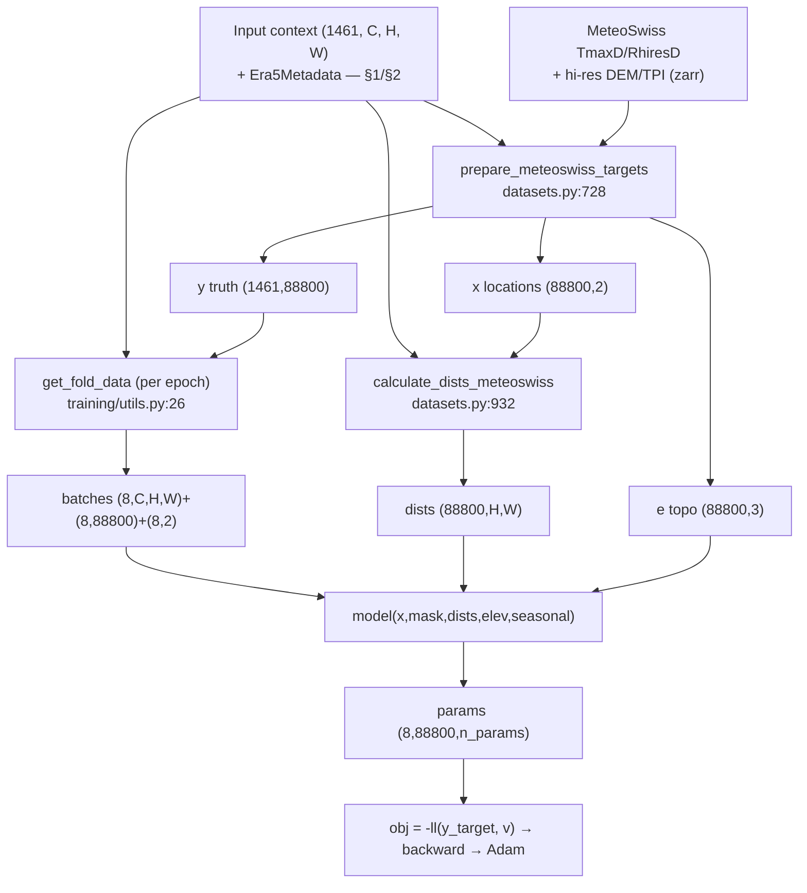
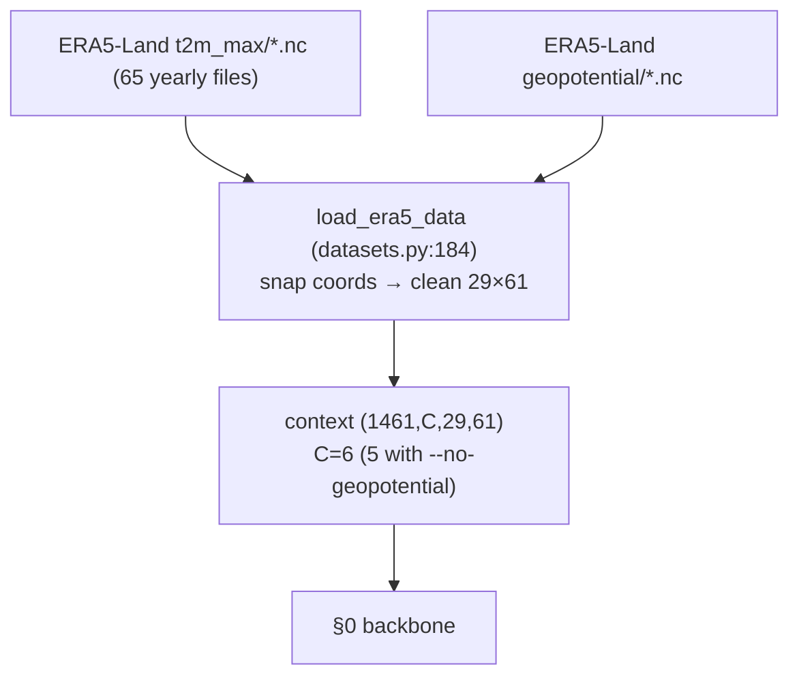
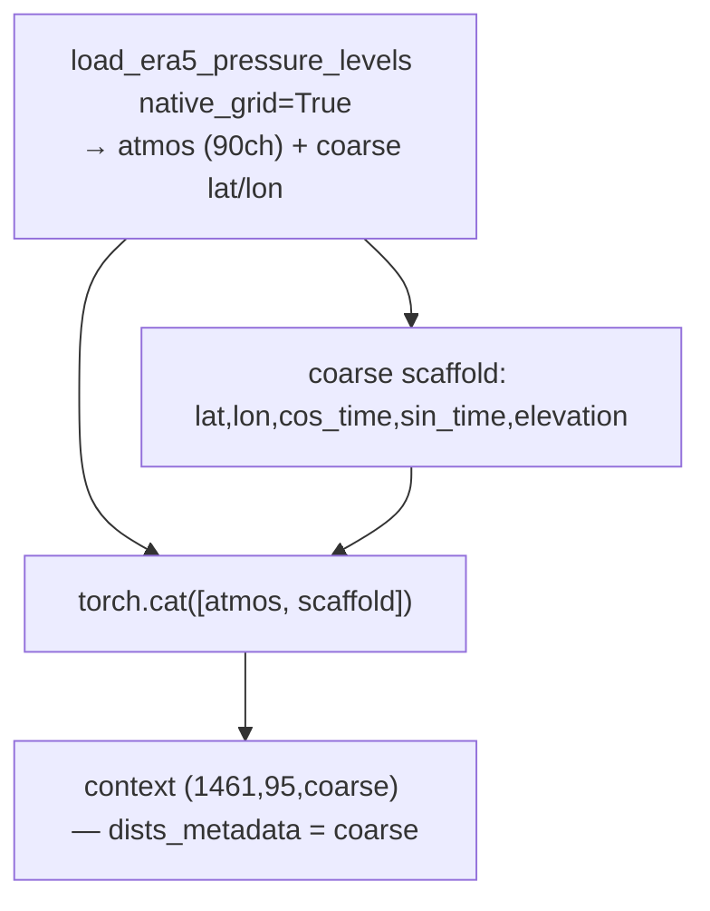
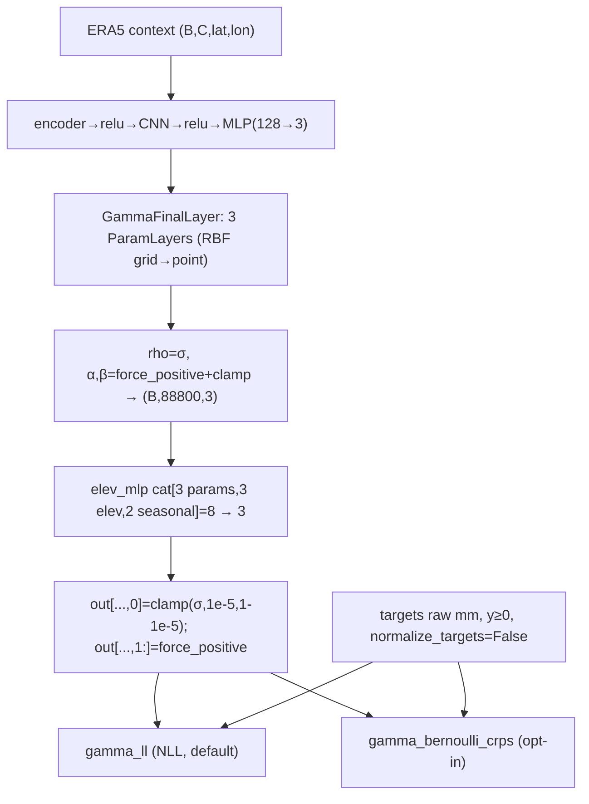
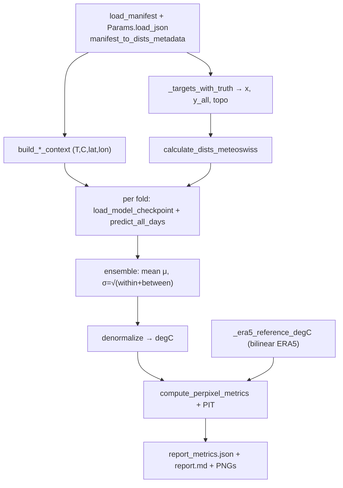
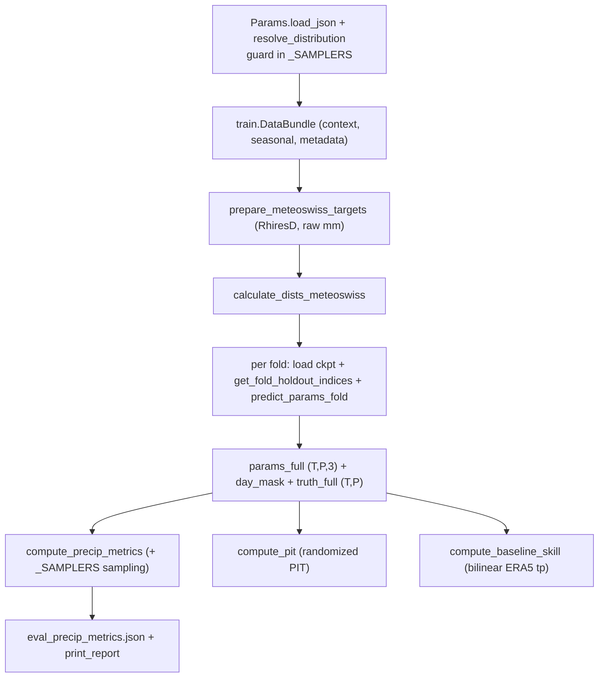
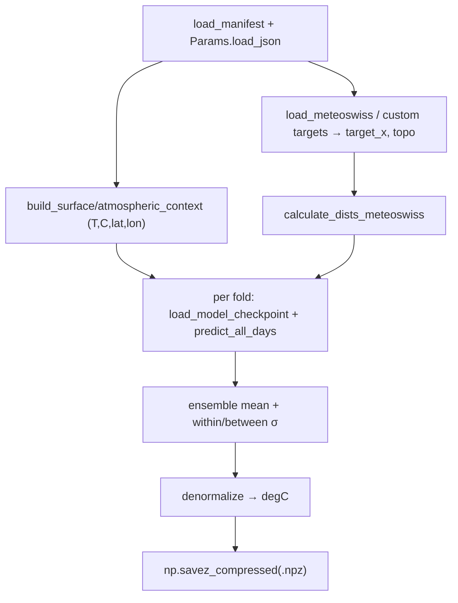
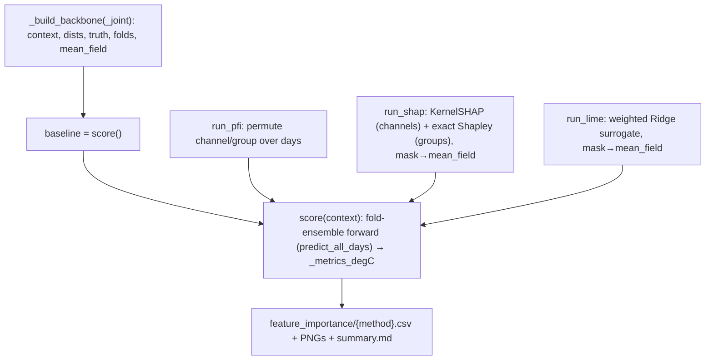

# convNPClimate — Data & Model Pipelines (code-exact)

Reference for **every** pipeline in the repo, traced against the code with
`file.py:LINE` anchors so each step can be verified. Covers the training data/model
flows (§0–§3) and the downstream flows (§4–§7).

**How to read.** Every *training* config shares one **backbone** (§0). Configs differ
only in (a) how the **input context** is assembled (§1 surface, §2 atmospheric) and
(b) the **model head / loss / target normalization** (§3 precip). Downstream tools
(evaluate, eval_precip, predict, feature_importance) rebuild the same context from the
saved manifest and are documented in §4–§7.

**Grid facts (2020–2023 runs).** ERA5-Land surface grid = **29 lat × 61 lon** (0.1°,
~11 km); pressure-level grid = **0.25°** (coarse); MeteoSwiss target = **88,800 points**
(240 N × 370 E, 2.2 km); time axis = **1461 days**. With default atmospheric settings
there are **90** pressure-level channels (3 vars × 6 levels × 5 hours) and **10**
surface-anchor channels (2 × 5).
 
**Distribution registry.** `model_factory.LIKELIHOODS` maps a distribution key →
`LikelihoodSpec(model_class, n_params, loss_fn, get_value_fn)`. `resolve_distribution(p)`
= `p.DISTRIBUTION or VARIABLE_TO_DISTRIBUTION[p.VARIABLE]` (`model_factory.py:108-118`);
`tmax→gaussian`, `precip→bernoulli_gamma`.

---

## §0. Shared training backbone (all configs)

Entry `train.py:main` → `TmaxTrainer.run` (`train.py:440`). Context built once in
`DataBundle.__init__` (`train.py:250`); the rest runs in `run()`.

1. **Build input context** — `train.py:250–360` — `self.context (1461,C,H,W)` float32,
   `self.channel_names`, `self.dists_metadata` (`Era5Metadata`), `self.seasonal_features
   (1461,2)`, `self.grid_elevation`, hi-res topo. Branches by config (§1/§2).
   `IN_CHANNELS` set from `context.shape[1]` (`train.py:338`; guard at `:339–344`
   replaces names with generic `chN` on a count mismatch).
2. **Persist manifest** — `run()` `train.py:449–461` — writes `params.json`,
   `metadata.json`, `manifest.json` (`normalization_manifest` `train.py:361`: channel
   names/groups, norm stats, `dists_grid` coords, distribution, target spec).
3. **Prepare targets** — `prepare_meteoswiss_targets` `datasets.py:728` —
   `open_mfdataset(...data_vars='all')` `:761`; time-slice; `.stack(point=("N","E"))`
   `:776` → 88,800 points.
   - **x** `(88800,2)`: point lat/lon min–max→[0,1] with **ERA5 bounds** `:819–830`.
   - **y** `(1461,88800)`: tmax → +273.15 K then z-score with ERA5 `data_mean/std`
     `:838–854`; **precip: raw mm** (`normalize_targets=False`, §3).
   - **e** `(88800,3)` = `[true_elev, elev_diff, mTPI]` `:856–923`: hi-res DEM & TPI
     interpolated at targets via **WGS84→LV95** (`wgs84_to_lv95` `:869`);
     `elev_diff = true_elev − grid_elev` `:890`.
4. **Distance matrix** — `calculate_dists_meteoswiss` `datasets.py:932` — ERA5 mesh from
   `dists_metadata.lat_coords/lon_coords` `:952`, de-normalize targets to degrees `:963`,
   `get_dists` (`convCNP/validation/utils.py:12`, per-point loop) → **squared Euclidean
   distance in degrees**, `(88800, H, W)` `:970`. Computed once, reused every forward.
5. **Per-fold split + batching (each epoch)** — `train_elev` `training_elev.py:298–303`:
   `get_fold_holdout_indices` (contiguous block, last fold takes remainder,
   `training_elev.py:31–57`) + `get_fold_data` (`training/utils.py:26`): holdout = the
   slice; training = complement, **shuffled along time** `:63`, `torch.split(...,8)`
   `:71–74` → task dicts `{y_context (8,C,H,W), y_target (8,88800), seasonal (8,2)}`.
6. **Model build (per fold)** — `train.py:502–512` — `set_seed(SEED+fold)`,
   `model_factory.build_model(p, channel_groups)`, `.to(device)`, optional
   `ConvCNPDataParallel`, `Adam(lr=p.LR)`.
7. **Train batch** — `train_batch_elev` `training_elev.py:60` — **all-ones mask**
   (`generate_context_mask` `training/utils.py:127`), `v = model(y_context, mask, dists,
   elev, seasonal)` `:85`, `obj = -ll(y_target, v)` `:88`, `backward`, optional
   `clip_grad_norm_(…, grad_clip)` `:90`, `opt.step()`.
8. **Per-epoch eval** — `eval_epoch_elev` `training_elev.py:97` — forward on the
   contiguous holdout under `no_grad`; test `-ll`, per-point median MAE/Pearson/Spearman
   (`get_value`), optional CRPS diagnostic (`crps_fn`, precip only). Early-stop on
   `patience`; rows → `stats_fold{k}.csv`.

### tmax model forward — `TmaxBiasConvCNPElev.forward` `elev_models.py:54`
1. **Encoder (SetConv)** `encoder.py` — depthwise abs-conv of `x*mask` and `mask`,
   `h = num/clamp(denom,1e-5)` (density norm), concat density confidence
   (`ProbabilityConverter`), `Linear→128`. `(8,C,H,W)→(8,H,W,128)`.
2. `relu` → **CNN decoder** `cnn.py:CNN` — 6× `ResConvBlock` (depth-sep convs,
   `Normalization=Identity`, residual, width 128).
3. `relu` → **grid MLP** `mlp.py:MLP` (4 hidden×64) → 2 grid params.
4. **Grid→point** `GaussianFinalLayer` `final_layers.py:94`: per param a `ParamLayer`
   `final_layers.py:6` builds RBF kernel `exp(-0.5·dists/ls²)` (`ls` learnable, chunked +
   grad-checkpointed) and contracts `wt_flat @ kernel` → `(8,88800)`. `mu` raw;
   `sigma = _force_positive(...)` `:112`.
5. **Elevation+seasonal MLP** `elev_models.py:80–95`: concat `[mu,sigma,e(3),seasonal(2)]`
   → `elev_mlp` (7→2) → `(8,88800,2)`; `out[...,1]=force_positive` (σ>0); `mu` free.
   Loss `gll` `loss_functions.py:10`: `Normal(v[:,0],v[:,1])`, mean `-log_prob` over
   non-NaN targets.

---

## §1. Surface tmax  (`--use-surface`, ±`--no-geopotential`)

`load_era5_data` `datasets.py:184` used directly as context (surface branch
`train.py:296–336`, `grid_mode="fine surface"` `:333`).

1. **Open + snap** `datasets.py:232` — `open_mfdataset('.../max_temperature/*.nc',
   combine='by_coords', preprocess=_era5_mf_preprocess)`. Preprocess (`_era5_mf_preprocess`
   `:64` → `_drop_stray_era5_coords` + `_snap_era5_coords` `:46`) rounds lat/lon to **5
   decimals per file before merge**, collapsing float drift so all years share one clean
   **29×61** grid. *(This is the phantom-30×62-NaN-border fix — see Appendix A.)*
2. **Time filter + stats** `:236–241` — slice years; `mean/std` of `t2m_max`
   (NaN-skipping) and lat/lon bounds → `Era5Metadata`.
3. **Channels** `:343–372` (broadcast to `(time,H,W)`): `data` = z-scored t2m_max
   (`include_data_channel=USE_SURFACE`); `lat,lon` = min–max→[0,1];
   `cos_time,sin_time` = `cos/sin(2π(doy−1)/365)`; `elevation` = geopotential channel
   (step 4), present iff geopotential glob **AND** `USE_ELEVATION_CHANNEL`.
4. **Geopotential→elevation** `:296–341` — same snapping preprocess; axes de-swapped
   (`rename latitude↔longitude` `:307`, file stores them transposed); nearest-select onto
   ERA5 grid `:336`; `altitude = z/9.80665`; relabel to exact ERA5 coords `:364`
   (prevents outer-join doubling); z-score → `elevation`. **`altitude` returned
   regardless** so the elevation-bias MLP's `elev_diff` still works under
   `--no-geopotential`.
5. **Output** `:415` — `tensor_Z (1461, C, 29, 61)` float32, C=6 (baseline) / 5 (no-geo);
   `dists_metadata = era5_metadata` (29×61). → §0.

`--no-geopotential` (config #4): `USE_ELEVATION_CHANNEL=False` →
`channel_names=['data','lat','lon','cos_time','sin_time']`, `in_channels=5`; elevation
MLP still trains.

---

## §2. Atmospheric tmax  (`--use-atmospheric`)

Shared preamble (`train.py:255–272`): `load_era5_data` runs with
`include_data_channel=USE_SURFACE=False` (invariant `params.py:125`), so `fine_context`
carries **no** surface `data` channel. Coord-snapping preprocess is applied to **every**
`open_mfdataset` in `load_era5_pressure_levels` (`datasets.py:491`) and
`load_era5_surface_levels` (`datasets.py:628`). Defaults (`params.py:47–71`):
`ATMOS_VARIABLES=['z','t','q']`, `ATMOS_LEVELS=[1000,925,850,700,500,300]`,
`ATMOS_HOURS=['00','06','12','15','18']`, `ATMOS_SFC_VARIABLES=['t2m','tp']`,
`ATMOS_NATIVE_GRID=True`, `USE_SFC_ATMOS=False`. Channel naming: pressure = `f"{var}{level}_{hour}"`
(e.g. `t850_12`); surface anchor = `f"{var}_{hour}"` (e.g. `t2m_12`). All atmos/surface
channels are **z-scored per channel** (stats captured in `channel_normalization`); lat/lon
are min–max with **fine** `era5_metadata` bounds even on the coarse grid; seasonal is
deterministic; elevation z-scored with its own mean/std.

### 2a. Native grid  (`--atmos-native-grid`, default)
Branch `train.py:277` → `build_atmospheric_native_context` (`datasets.py:1059–1200`).

1. **PL native** `datasets.py:1109–1120` → `load_era5_pressure_levels(native_grid=True)`
   (`datasets.py:487–573`): loop var×hour, glob `{var}_pl-*-{hour}.nc`, rename dims
   (`valid_time→time`, `level|plev|isobaricInhPa→pressure_level`), floor to day + strict
   missing-date check `:508–514`, `sel(time=target_dates)`. Native branch `:517–532` pins
   every file to the **first file's** `native_lat/native_lon` via `assign_coords`. Inner
   loop `sel(pressure_level=level,'nearest')` `:547`, **per-channel z-score** `:550–557`
   (raises on zero std), name `f"{var}{level}_{hour}"`, stats → `atmos_stats`. Returns
   `(time,90,lat_native,lon_native)` + names + native coords. (`era5_metadata` coords used
   **only** for date alignment here.)
2. **Coarse scaffold** `:1125–1165`: `lat,lon` (min–max with fine bounds), seasonal
   (`cos_time,sin_time`, deterministic), `elevation` (interp `grid_elevation` → z-score),
   each broadcast to `(time,n_lat,n_lon)`.
3. **Concat** `:1167–1194`: `context = cat([atmos, scaffold])` (**atmos channels first**,
   deliberate `:1078–1079`); `coarse_metadata = dataclasses.replace(era5_metadata,
   lat_coords=coarse_lat, lon_coords=coarse_lon)`.
4. **Bind** `train.py:278`, `grid_mode="native coarse atmospheric"` `:294`. **Result:**
   `(1461,95,coarse)`; `channel_names=[z1000_00,…,q300_18, lat,lon,cos_time,sin_time,elevation]`;
   **`dists_metadata = coarse_metadata`.**

### 2b. Native + surface anchors  (`--atmos-native-grid --use-sfc-atmos`)
Identical to 2a except `train.py:289` passes `surface_dir`, so `datasets.py:1172–1187`
runs `load_era5_surface_levels` **on the coarse grid** (`datasets.py:624–680`: regrid via
clamp→`interp(linear)`→relabel — effectively identity on-grid, per-channel z-score, names
`t2m_12`…). Anchors appended **after** scaffold. **Result:** `(1461,105,coarse)`;
`dists_metadata = coarse_metadata`.

### 2c. Regridded to fine surface  (`--use-atmospheric` without `--atmos-native-grid`)
Branch `train.py:295` (else). `build_atmospheric_native_context` **not** used.
1. Scaffold names via `_surface_scaffold_names` `train.py:397–416` (no `data` channel;
   default `['lat','lon','cos_time','sin_time','elevation']`); `context = fine_context`.
2. `load_era5_pressure_levels(native_grid=False)` `train.py:300–312`: regrid branch
   `datasets.py:533–544` clamps fine coords into the coarse extent, `interp(linear)` **up
   to the fine grid**, relabels; per-channel z-score. `context = cat([fine_context, atmos])`
   `:313` (**scaffold first, atmos after**).
3. Optional `load_era5_surface_levels` on fine grid `:315–327` if `USE_SFC_ATMOS`.
4. `grid_mode="atmospheric regridded to fine surface"`; **`dists_metadata =
   era5_metadata` (fine)** `:336`. **Result:** `(1461,95,fine)` (105 with sfc).

**Cross-variant summary**

| | 2a native | 2b native+sfc | 2c regridded |
|---|---|---|---|
| Assembler | `build_atmospheric_native_context` | same, `surface_dir` set | inline else (`train.py:295–336`) |
| `native_grid` to PL loader | True | True | False |
| Context grid | coarse 0.25° | coarse 0.25° | fine ERA5 surface |
| Channel order | atmos → scaffold | atmos → scaffold → sfc | scaffold → atmos (→ sfc) |
| Default `in_channels` | 95 | 105 | 95 (105 w/ sfc) |
| `dists_metadata` | coarse | coarse | fine `era5_metadata` |

> ⚠ **Channel-0 is not fixed across variants**: atmos-first (2a/2b) vs scaffold-first (2c).
> Any code assuming a fixed channel 0 must resolve via `channel_names`. (`evaluate.py` and
> `predict.py` handle this — see §4/§6.)

---

## §3. Precip  (Bernoulli-Gamma; NLL default, CRPS opt-in)

`resolve_distribution` → `bernoulli_gamma` (default) or `bernoulli_gamma_crps`
(`--distribution`). `LIKELIHOODS["bernoulli_gamma"] = (GammaBiasConvCNPElev, 3, gamma_ll,
_get_value_precip)` (`model_factory.py:63`). Same model/params/sampler/value-fn for both
precip keys — **only the training loss differs**.

1. **Dispatch** `model_factory.py:63,158–205` — `build_model` builds shared CNN decoder
   then `GammaBiasConvCNPElev(decoder, in_channels=IN_CHANNELS, ls=LENGTH_SCALE, ...)`.
   For `bernoulli_gamma_crps`, `loss_fn = partial(gamma_bernoulli_crps,
   n_samples=CRPS_N_SAMPLES)` (default **25**, `params.py:91`); NLL uses `gamma_ll` as-is.
2. **Model init** `elev_models.py:110–141` — `mlp=MLP(128→3)`,
   `out_layer=GammaFinalLayer(ls, 3)`, `elev_mlp=MLP(8→3)` (seasonal) / `6→3`.
3. **Backbone** `elev_models.py:143–160` — `relu(encoder)→relu(decoder)→mlp` → `(B,3,lat,lon)`.
4. **GammaFinalLayer** `final_layers.py:130–145` — 3 `ParamLayer`s RBF-interpolate each
   param to points; then `rho=sigmoid(·)`, `alpha=_force_positive(·)`,
   `beta=_force_positive(·)`; **clamps** `rho∈[1e-5,1-1e-5]`, `alpha,beta∈[1e-5,1e5]`.
   `_force_positive(x)=0.01+0.9·log(1+exp(x))` (overflow-guarded `_log_exp` `:76–83`).
5. **Elev+seasonal MLP** `elev_models.py:162–185` — `cat([rho,alpha,beta])→(B,88800,3)`,
   concat `elev(3)`+`seasonal(2)` → `elev_mlp` → `(B,88800,3)`; then
   `out[...,0]=clamp(sigmoid(·),1e-5,1-1e-5)` (rho **re-squashed**, comment `:181–183`),
   `out[...,1:]=force_positive(·)` (α,β>0). Order `[rho,alpha,beta]`.
6. **Targets raw mm** `datasets.py:844–854`, `train.py:83` —
   `VariableSpec("precip","METEO_SWISS_PRECIP_GLOB","RhiresD", convert_to_kelvin=False,
   normalize_targets=False, grad_clip=1.0)`. `y_norm = data_flat` (no z-score, no Kelvin;
   z-scoring would push zeros negative and break the Gamma log-prob). Exact zeros preserved.
7. **NLL `gamma_ll`** `loss_functions.py:26–53` — drop NaN; `r,target = make_r_mask(target)`
   (`utils.py:103–116`: `r[target==0]=0` wet-indicator, `target[target==0]=0.01` dummy);
   `Gamma(concentration=alpha, rate=beta)`; `total = r·(log rho + log_prob) +
   (1−r)·log(1−rho)`; returns `mean(total)` (a log-likelihood; training does `-ll`).
8. **CRPS `gamma_bernoulli_crps`** `loss_functions.py:56–110` — `rho,alpha,beta=v[:,0..2]`,
   `y=target` (raw, **no r-mask**); two reparameterized draws `xs,xs2 =
   gamma.rsample((n_samples,))`; energy form:
   `term_xy=(1−rho)|y|+rho·mean_s|xs−y|`, `term_xx=2rho(1−rho)·(α/β)+rho²·mean_s|xs−xs2|`,
   `crps=term_xy−0.5·term_xx`; returns `-mean(crps)` (drop-in for `gamma_ll`).
9. **Value extractor `_get_value_precip`** `model_factory.py:36–40` — `mean=alpha/beta`
   (Gamma mean); `mean[rho ≤ 0.5]=0` (`DRY_PROBABILITY_THRESHOLD=0.5`, `:33`).
10. **CRPS diagnostic** `model_factory.py:84–105`, `training_elev.py:141–142` —
    `build_crps_diagnostic` returns `partial(gamma_bernoulli_crps, n_samples=CRPS_N_SAMPLES)`
    for **both** precip keys (None for gaussian); reported per epoch as `test CRPS` (8th
    `stats.csv` column).
11. **grad clip** — precip `grad_clip=1.0` (stabilizes Gamma NLL); tmax `None`.

**tmax vs precip**

| Aspect | tmax (Gaussian) | precip (Bernoulli-Gamma) |
|---|---|---|
| Model | `TmaxBiasConvCNPElev` | `GammaBiasConvCNPElev` |
| Final layer / n_params | `GaussianFinalLayer` / 2 (`mu,sigma`) | `GammaFinalLayer` / 3 (`rho,alpha,beta`) |
| elev_mlp | 7→2 | 8→3 |
| Output activations | `mu` raw; `sigma=force_positive` | `rho=clamp(σ,1e-5,1-1e-5)`; `α,β=force_positive`∈[1e-5,1e5] |
| Loss | `gll` | `gamma_ll` (default) / `gamma_bernoulli_crps` (opt-in) |
| Targets | z-scored + Kelvin | raw mm |
| Value extractor | `get_value_tmax`=`p[:,:,0]` (mu) | `_get_value_precip`=`α/β`, 0 where `rho≤0.5` |
| grad_clip | None | 1.0 |

> ⚠ For a **CRPS run**, the `stats.csv` "test NLL" column is actually **mean −CRPS**:
> `eval_ll = -ll(...)` and `ll = gamma_bernoulli_crps` returns `-mean(CRPS)`, so early
> stopping selects on CRPS.

---

## §4. evaluate.py  (tmax holdout evaluation)

`main → evaluate_year` per year. Rebuilds the context from the **manifest** and scores
against MeteoSwiss truth.

1. **CLI** `evaluate.py:225–244` — `--model-dir|--trial-dir`, `--years` (`"2020-2022"`
   range or `"2020,2022"` list, `:48–52`), `--device`, `--output-root`. Per-year try/except
   `:247–256`.
2. **Config** `:118–121` — `load_manifest`; `Params.load_json`;
   `dists_meta = manifest_to_dists_metadata(manifest)` (`predict.py:80–97`, from
   `manifest["dists_grid"]` + `normalization`).
3. **Context** `:123–131` — `_date_range(year)`; `build_atmospheric_context` if
   `USE_ATMOSPHERIC and ATMOS_NATIVE_GRID` else `build_surface_context`; normalized with
   **stored** stats. `(T,C,lat,lon)`.
4. **Targets+truth** `:55–86,134` — `_targets_with_truth` →
   `prepare_meteoswiss_targets(data_var="TmaxD", convert_to_kelvin=True,
   normalize_targets=True)`; returns `target_x`, normalized `target_y_all (time,point)`,
   `target_topo`, degrees `lat_arr/lon_arr`.
5. **dists + seasonal** `:136–138`.
6. **Truth align** `:141–151` — `sel` year; intersect on normalized day if count≠T;
   `truth_norm (T,P)`.
7. **ERA5 reference (degC)** `:89–107,154` — `_era5_reference_degC`. Surface model:
   `interpolate_era5_to_targets(context, target_x, dists_meta)` bilinearly samples
   **context channel 0** to targets via `grid_sample` (`datasets.py:1392–1446`), then
   `denormalize − KELVIN_OFFSET`. Atmospheric model: channel 0 is a pressure field, so it
   reloads `load_era5_data(var_name="t2m_max", year_start=year)` and interps with that
   data's own `ref_meta`. → `era5_ref (T,P)` degC.
8. **Per-fold inference** `:157–172` — `channel_groups` if `ENCODER!="flat"`;
   `ckpts=sorted(glob("model_fold_*"))`; per ckpt `load_model_checkpoint` (rebuilds arch,
   strips `module.`, guards `IN_CHANNELS`), `predict_all_days` → normalized `(T,P)`.
9. **Ensemble (law of total variance)** `:174–177` — `preds_mean=mean(preds)`;
   `within_var=mean(sig²)`; `between_var=var(preds)`; `sigma_total=√(within+between)`.
   **Every fold predicts every day** → `prediction_mode="ensemble"` (in-sample for the
   training year; 2020–2022 are the truly unseen years).
10. **Denormalize** `:179–183` — `preds_c/truths_c = arr·std + mean − 273.15`;
    `sigmas_c = sigma_total·std` (**scale only, no offset**); `errors_c = preds_c−truths_c`.
11. **Metrics** `metrics.py:26–89` — `MAE=nanmean|err|`, `RMSE=√nanmean(err²)`,
    `bias=nanmean(err)`, **CRPS**=`properscoring.crps_gaussian(truth, mu, sig)`
    (closed-form Gaussian) `:61`; reference CRPS = `|era5_ref − truth|` `:66`;
    **skill** = `1 − crps_model/crps_ref` `:69,92–111`.
12. **Calibration (PIT)** `visualization.py:705–832` — `pit = norm.cdf(truth, preds,
    sigmas)`; `coverage_50/90`, `z_std=std((truth−pred)/sigma)` (ideal 1), `pit_mean`
    (ideal 0.5), `ks_p`; reliability → `mace`, `rmsce`, `coverage_at_{50,90,95}`.
13. **Outputs** `report.py:366–404` — `eval_<year>/report_metrics.json`
    (`overall{mae,rmse,bias,crps,skill}`, correlations, calibration, reliability),
    `report.md`, PNG maps.

> ⚠ **Skill is grid-sensitive** (baseline rebuilt from the model's own manifest grid) —
> only comparable across runs sharing the same ERA5 grid + norm stats. MAE/RMSE/CRPS (vs
> fixed MeteoSwiss truth) stay comparable. Reference CRPS collapses to `|error|` because
> ERA5 is deterministic.

---

## §5. eval_precip.py  (precip physical metrics)

Rebuilds the training pipeline via `DataBundle`, predicts each fold's **contiguous
holdout**, and computes physical metrics + PIT + a bilinear-ERA5 skill baseline.

1. **CLI** `eval_precip.py:621–644` — `--model-dir|--trial-dir`, `--folds`, `--device`,
   `--output` (default `<dir>/eval_precip_metrics.json`), `--baseline-glob`.
2. **Distribution guard** `:207–214` — `resolve_distribution` must be in `_SAMPLERS`
   (`bernoulli_gamma`/`bernoulli_gamma_crps`) else `ValueError`.
3. **Spec (raw mm)** `:216–218` — `VARIABLE_SPECS["precip"]` (RhiresD,
   `convert_to_kelvin=False`, `normalize_targets=False`).
4. **Rebuild pipeline** `:220–239` — `train.DataBundle(...)` → context/seasonal/metadata;
   `prepare_meteoswiss_targets(...normalize_targets=False)` → raw-mm `target_y`;
   `calculate_dists_meteoswiss` → `(n_points,lat,lon)`.
5. **Per-fold predict** `:241–296` — `get_value_fn=_get_value_precip`, `n_params=3`.
   `params_full=full((T,P,3),nan)`, `day_mask=zeros(T,bool)`. Per fold:
   `load_model_checkpoint`, `start,end=get_fold_holdout_indices(fold,n_folds,T)`,
   `predict_params_fold` (per-day loop, **all-ones mask**, → `(D,P,3)`), write
   `params_full[start:end]`, `day_mask[start:end]=True`.
6. **Sampler** `_sample_bernoulli_gamma` `:98–104` — `wet=(rand < rho)`,
   `gamma=Gamma(alpha,beta)`, `sample = wet · gamma.sample()` → `(N,n_samples)`.
   `_SAMPLERS` maps both precip keys to this.
7. **Physical metrics** `compute_precip_metrics` `:118–171` — constants
   `WET_THRESHOLD_MM=1.0`, `R10_THRESHOLD_MM=10.0`, `DRY_OBS_THRESHOLD_MM=0.05`,
   `N_SAMPLES=20`:
   - **Wet-day freq / R01** `:132–136,156` — predicted wet = `rho ≥ 0.5` (probability rule),
     observed wet = `obs ≥ 1.0 mm`; `R01_rel = wetfreq_pred/wetfreq_obs`. *(asymmetric defs.)*
   - **SDII** `:137–138,157–159` — mean accumulation on wet days (obs: ≥1 mm; pred: `α/β`
     mean over `rho≥0.5` points).
   - **R10** `:141–145,160–161` — freq `> 10 mm`; obs strict `>`, model from 20 samples.
   - **P98** `:146–148,162–164` — 98th pct of wet-day accumulation (≥1 mm).
   - **MAE/bias** `:150,165–166`; pooled Spearman/Pearson `:151,169–170` (subsampled to
     2e6).
8. **Per-point** `per_point_metrics`/`per_point_summary` `:381–449` — valid point = finite
   on every day; per-column stats reduced to median/q25/q75.
9. **Randomized PIT** `compute_pit` `:455–500` — `dry = obs ≤ 0.05 mm`:
   `pit=U·(1−rho)`; `wet`: `pit=(1−rho)+rho·Gamma.cdf(obs; a=alpha, scale=1/beta)`; 20-bin
   histogram; `mean_pit` (ideal 0.5), tail fractions.
10. **Baseline skill** `compute_baseline_skill` `:506–547` —
    `precip_baseline.bilinear_era5_precip` interpolates coarse ERA5 `tp` to points;
    `skill_mae = 1 − model_mae/base_mae`.
11. **Output** `:646–649` — `eval_precip_metrics.json` + `print_report`.

> ⚠ Three precip thresholds coexist: **1.0 mm** (wet/SDII/P98), **10.0 mm** (R10),
> **0.05 mm** (PIT dry atom). Predicted-wet uses `rho≥0.5`, observed-wet uses `≥1 mm`.

---

## §6. predict.py  (inference over a date range)

`main → run`; `predict_all_days` (`predict.py:485`) is the reusable forward loop (also
used by §4/§7).

1. **CLI** `predict.py:758–820` — `--model-dir`, `--date-start/--date-end`, `--fold`|`--all-folds`,
   `--targets` CSV, `--ensemble-var`, `--output` (default `<dir>/predictions_<start>_<end>.npz`).
2. **Config** `:535–551` — `load_manifest`, `Params.load_json` (all arch/feature flags,
   incl. `IN_CHANNELS`); optional `--data-dir` rebuilds globs.
3. **Context** `:557–560` — `build_atmospheric_context` if native-atmos else
   `build_surface_context`. **Re-loads raw ERA5 and normalizes with stored manifest stats**
   (does *not* reuse training loaders). Honors `USE_ELEVATION_CHANNEL` (`getattr(...,True)`
   `:180`) — skips the elevation channel under `--no-geopotential`. `_stack_channels`
   orders by `manifest["channel_names"]` (RuntimeError on missing channel).
4. **dists metadata** `:564` — `manifest_to_dists_metadata`.
5. **Targets** `:566–575` — `load_custom_targets` (`--targets`) or
   `load_meteoswiss_targets` (`prepare_meteoswiss_targets(data_var="TmaxD",
   convert_to_kelvin=True, normalize_targets=True)`); topo gated on `USE_ELEVATION`/`USE_MTPI`.
6. **dists** `:577`; **seasonal MLP features** `:581–585` (distinct from seasonal *context
   channels*).
7. **Folds** `:588–620` — `--all-folds` globs `model_fold_*`; per fold
   `load_model_checkpoint` + `predict_all_days`.
8. **predict_all_days** `:485–510` — signature `(model, context, dists, target_topo,
   seasonal, device, day_batch=1)`; loops days in steps of `day_batch` (run() uses 1),
   `predict_day_range` (`inference.py:73–103`): mask from **NaN in channel 0**
   (`~isnan(ctx[:,0:1])`, `nan_to_num`), `output=model(...)`,
   `pred=get_value_tmax=output[:,:,0]`, `sigma=get_sigma_tmax=output[:,:,1]` → `(B,P)`
   normalized. **Tmax-hardcoded (indices 0/1)** — predict.py is Gaussian-only.
9. **Ensemble** `:622–645` — `preds_mean=mean(μ_k)`; `within=mean(σ_k²)`,
   `between=var(μ_k)`; `sigma_within=√within`, `sigma_total=√(within+between)`;
   `pred_sigma = sigma_total if (--ensemble-var and ensemble) else sigma_within`.
10. **Denormalize** `:639–645` — means `·std+mean−273.15` → °C; sigmas `·std` only.
11. **Save** `:647–663` — `np.savez_compressed`: `dates(T,)`, `lat(P,)`, `lon(P,)`,
    `pred_mean(T,P)`, `pred_sigma(T,P)`; ensemble adds `pred_sigma_within`,
    `pred_sigma_ensemble`, `pred_sigma_between`.

> ⚠ `USE_ELEVATION_CHANNEL` (context channel) and `USE_ELEVATION` (target topo features)
> are **two different switches** (`predict.py:180` vs `:386–388`). Strict date-alignment:
> both context builders raise `ValueError` on any missing ERA5 date.

---

## §7. feature_importance.py  (PFI / SHAP / LIME)

Self-implemented channel-attribution for the **atmospheric native-grid** tmax model
(standalone) or a joint two-stage tmax+precip model (`joint_meta.json`). Everything routes
through one scoring black box `Backbone.score(context)`.

1. **CLI** `:986–1047` — `--model-dir|--trial-dir`, `--method {pfi,shap,lime,all}`,
   `--year` (standalone), `--day-stride`, `--n-days`, `--folds`, `--n-repeats` (PFI, 5),
   `--shap-nsamples` (2000), `--lime-nsamples` (1000), `--lime-days` (4), `--workers`,
   `--day-batch`, `--seed`.
2. **Model-type detect** `:1033` — `joint_meta.json` → joint else standalone. **Both
   require `USE_ATMOSPHERIC and ATMOS_NATIVE_GRID`** (`:243–244,323–324`) else `ValueError`
   — surface/regridded/tmax-only models unsupported.
3. **Backbone** `:237–302` — context via `predict.build_atmospheric_context` (stored
   stats); truth from `evaluate._targets_with_truth`; day subsample
   `arange(0,T,day_stride)[:n_days]`; folds via `load_model_checkpoint`;
   `mean_field=context.mean(dim=0,keepdim=True)`; `baseline=score()` once.
4. **score(context)** `:164–207` — per fold `predict.predict_all_days` → normalized `(T,P)`;
   ensemble `preds_mean`, `sigma_total=√(within+between)`; `_metrics_degC`.
5. **Importance metric** `_metrics_degC` `:80–97` (`METRICS=("mae","nll","crps")`) —
   denormalize to degC; `mae=nanmean|μ−truth|`; Gaussian `nll`; `crps=crps_gaussian`.
   **importance = perturbed_metric − baseline_metric** (larger = more important).
6. **Perturbations** `:210–234` — **PFI** `permuted_with(channels,perm)`: scramble the
   channel's values across days (`ctx[:,c]=context[perm][:,c]`). **SHAP/LIME**
   `masked(present)`: replace absent channels with `mean_field` (temporal mean).
7. **PFI** `run_pfi` `:427–458` — units = each channel + each group (variable/level/hour);
   per unit × `n_repeats` a day-permutation is drawn **in the parent**; importance =
   `mean_repeats(score − baseline)` ± std.
8. **SHAP** — grouped exact Shapley `run_shap_grouped` `:614–644` (`2**G` coalitions,
   `phi_i` weighted marginal); per-channel KernelSHAP `run_shap_channels` `:670–701`
   (weighted-LS via KKT, kernel weight `(M-1)/(k(M-k))`); reports `importance = −phi`.
9. **LIME** `run_lime` `:752–810` — per representative day, `n_samples` binary masks,
   predict masked day-means, weight `w=exp(−dist²/0.25²)` with `dist=1−√(k/M)`, fit
   `Ridge(alpha=1.0)`; importance = per-day coef mean±std (group = sum of members).
10. **Parallelism** `_parallel_eval` `:505–551` — fork pool only on **CPU**; **serial on
    CUDA** (fork-after-CUDA unsafe). All RNG draws happen in the parent → deterministic.
11. **Output** `:1060–1083` — `<model_dir>/feature_importance/`: `baseline.json`,
    `{method}.csv`, `{method}_{grouping}.png`, `{method}_heatmap_{metric}.png`,
    `summary.md`. Joint model → `tmax/` and `precip/` subdirs.

> ⚠ Sign convention is unified (PFI `perturbed−baseline`; SHAP `−phi`; larger = more
> important); LIME coefficients are signed local effects. PFI **permutes across days**;
> SHAP/LIME **mask to the per-channel temporal mean**.

---

## Appendix A — the coordinate-snapping fix (why §1/§2 loaders snap)

Per-year ERA5 NetCDF files store identical nominal boundary grid lines (e.g. `lat=45.4`,
`lon=11.0`) with float64 drift (~1e-13) between files. `open_mfdataset(combine='by_coords')`
aligns by *exact* value, so drift made it treat the boundary as a distinct grid line and
OUTER-JOIN the files into a phantom **30×62** grid, NaN-filling the extra row+column (91
NaN cells/day). Those NaN entered the surface `data` channel and produced an all-NaN model
output on the first forward. Fix: `_snap_era5_coords`/`_era5_mf_preprocess`
(`datasets.py:46–71`) round lat/lon to 5 decimals **per file before the merge**, applied as
`preprocess=` on all four ERA5 loaders (`datasets.py:232,300,491,628`). Only the surface
configs crashed (they feed `fine_context` directly); atmospheric-native builds context on
the pressure grid and discards the fine scaffold.

## Appendix B — cross-cutting invariants

- Exactly one of `USE_SURFACE`/`USE_ATMOSPHERIC` (`params.py:125`); `USE_SFC_ATMOS` ⇒
  `USE_ATMOSPHERIC` (`:128`).
- `dists` is always **squared Euclidean distance in degrees** on the *context* grid
  (`get_dists`, `convCNP/validation/utils.py:12`); the RBF final layer turns it into the
  grid→point kernel.
- Training uses an **all-ones context mask**; `predict.py` derives the mask from NaN in
  channel 0.
- Two `force_positive`/`log_exp` implementations exist — `final_layers.FinalLayer`
  (internal to the RBF layer) and `convCNP/models/utils.force_positive` (elevation MLP);
  same `0.01+0.9·log(1+exp(x))` form — keep them in sync if editing.
