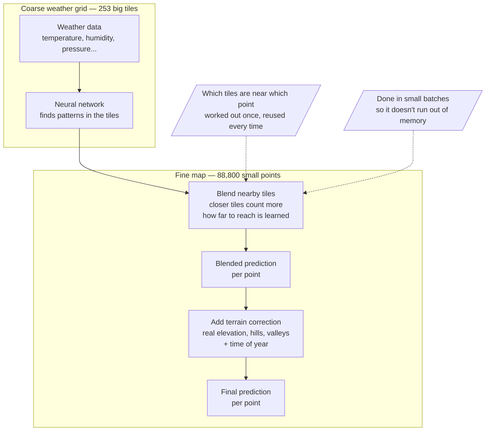

# Coarse Context → Fine Targets (Resolution)

How the model bridges the coarse ERA5 input grid (11 × 23 = 253 cells) to the fine
MeteoSwiss target lattice (88,800 points, ~1-2 km) — a ~351× jump in point density.

## In plain words

The weather model (ERA5) only gives us data on a **coarse, blocky grid** — 253 big
tiles covering Switzerland. But we want predictions at **88,800 tiny points** — a
much finer map, ~350x more detail than the input has.

We get there in two steps:

1. **Smart interpolation, not a simple zoom-in.** For each of the 88,800 fine
   points, the model looks at the nearby coarse tiles and blends their values,
   giving more weight to closer tiles (a distance-weighted average). How far
   "nearby" reaches is *learned* during training, not fixed by us.
2. **Add local terrain knowledge.** The coarse weather grid has no idea about
   small hills, valleys, or exact elevation — it's too blocky for that. So
   afterward, the model looks up a high-resolution elevation map (real terrain
   height, how much that differs from what the coarse grid assumed, and the
   local terrain shape) at each fine point, and uses that to correct the
   prediction. This is how the model knows a mountain village is colder than a
   nearby valley floor, even though the coarse weather data alone couldn't tell
   them apart.

So: coarse weather data → smart distance-weighted blending → correction using
real terrain detail → final fine-grained prediction. Two practical notes: the
"which coarse tiles are near which fine points" lookup table is built once and
reused (not recomputed every batch), and the blending step is done in small
chunks so it doesn't run out of memory.

## Diagram

The heavy work — the neural network — only ever looks at the 253 coarse tiles;
it never touches the fine map directly. Going from coarse tiles to 88,800 fine
points happens afterward, in two simple steps: first blend the nearby tiles
together (favoring closer ones), then correct that blend using real terrain
detail the coarse data couldn't see.

## Where this lives in code

| Stage | File |
|---|---|
| SetConv encoder | `convCNP/models/encoder.py` |
| CNN decoder | `convCNP/models/cnn.py` |
| RBF final layer (grid → target) | `convCNP/models/final_layers.py` (`ParamLayer`, `GaussianFinalLayer`, `GammaFinalLayer`) |
| `dists` distance matrix | `datasets.calculate_dists_meteoswiss()` |
| Elevation MLP + bias correction | `convCNP/models/elev_models.py` |
