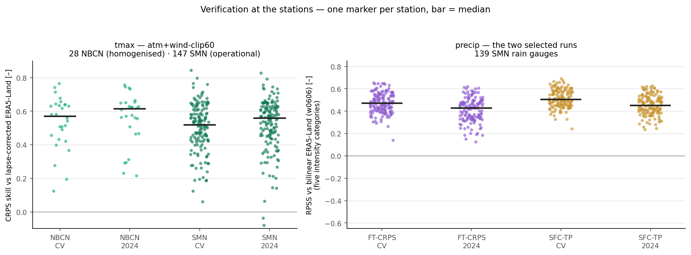
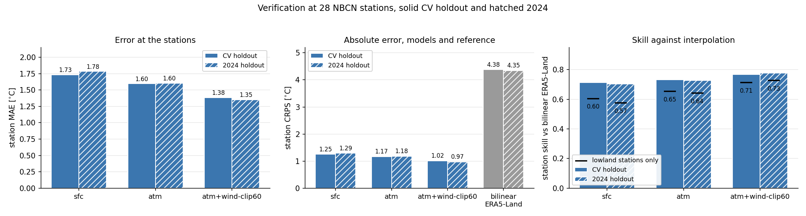
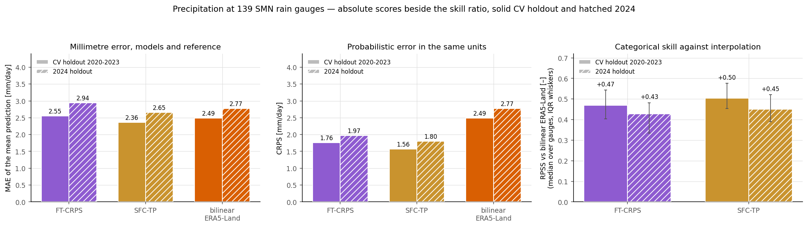

# Draft A — Verification at Independent Stations

*Candidate for the main report: one short cross-variable chapter, three figures. The
temperature verdict, the first station verification of precipitation, and the honest
reference, in a page.*

---

Every result so far is scored against gridded MeteoSwiss analyses, which are themselves
interpolated from station observations. This chapter repeats the comparison against the
measurements directly, for the three selected models: the temperature model at the 28 NBCN
stations whose homogenised daily maxima entered no training or analysis step of this work
(and, for breadth, at the full cohort of 147 SwissMetNet stations reporting the operational
daily maximum), and the two precipitation runs at 139 SwissMetNet rain gauges. The gauge series is the
06–06 UTC daily total, the accumulation window RhiresD itself uses, and its day labelling
was verified rather than assumed: every gauge correlates best with its nearest RhiresD cell
at lag 0, with a median correlation of 0.98. That correlation is also the honest limit of
what this comparison can claim for precipitation — RhiresD is interpolated from these very
gauges, so the gauges are an independent check on what interpolation costs, not an
independent data source.

*Verification at the stations, one marker per station and the bar at the median. Left: the
selected temperature model's per-station CRPS skill against a lapse-corrected ERA5-Land
reference, for the homogenised NBCN cohort and the wider operational SMN cohort, both
regimes. Right: per-gauge ranked probability skill of the two selected precipitation runs over the
five intensity categories, against bilinear ERA5-Land, both regimes.*

For temperature the station comparison returns the gridded verdict, with one correction to
how it has been scored. The model reaches a station MAE of $1.38\,^{\circ}$C on the CV
holdout and improves to $1.35\,^{\circ}$C on the unseen year, roughly $0.3\,^{\circ}$C
above its gridded counterparts — the expected price of comparing a point measurement with a
kilometre-scale cell. The pooled skill of $0.77$ reported against raw bilinear ERA5-Land is
however a property of the reference, not the model: the raw reference carries no lapse-rate
correction from its cell down to the station elevation and manages a station MAE of
$4.38\,^{\circ}$C. Correcting it at $6.5\,\mathrm{K\,km^{-1}}$ — with cell elevations taken
from the 25 m DEM aggregated to the ERA5-Land grid, not from the smoothed model orography —
nearly halves the reference error to $2.30\,^{\circ}$C, and against that fair baseline the
skill is $0.56$ on the CV holdout and $0.58$ on 2024. It remains positive at all 28
stations in both regimes, which is the claim the chapter rests on. Widening the cohort
to the 147 SwissMetNet stations that report the operational daily maximum changes
nothing: MAE $1.41$/$1.39\,^{\circ}$C, corrected-reference skill $0.52$/$0.54$, and
$99\,\%$ of stations above zero — at the 28 sites the two cohorts share, the operational
and homogenised series give per-station MAEs identical to a median of
$0.00\,^{\circ}$C over this span.

*The three temperature configurations that carry the verification argument, at the same 28
NBCN stations, solid bars for the CV holdout and hatched for 2024. Left: station MAE.
Middle: the same comparison in physical units, the station CRPS of each run next to the raw
bilinear ERA5-Land reference it is scored against. Right: the resulting skill ratio, with
the black marker giving the value over the stations below $1000\,$m.*

That verdict is a comparison rather than an absolute, so it is worth seeing the three
configurations that carry it side by side at the same stations. The surface baseline
reaches a station MAE of $1.73$/$1.78\,^{\circ}$C across the two regimes and the plain
atmospheric run $1.60$/$1.60\,^{\circ}$C, against the selected model's
$1.38$/$1.35\,^{\circ}$C. The atmospheric inputs are worth $0.13$ to $0.18\,^{\circ}$C and
the wind channels with the clipped training window a further $0.22$ to
$0.25\,^{\circ}$C. The middle panel repeats that comparison in physical units, because a
skill of $0.77$ says nothing about how large the remaining error is. The three models sit
between $1.29$ and $0.97\,^{\circ}$C of CRPS while the raw bilinear reference sits at
$4.38$/$4.35\,^{\circ}$C, so the entire spread between the weakest and the strongest
configuration is under a tenth of the gap that separates any of them from plain
interpolation. The panel also makes plain how much of the headline ratio is a property of
that reference: correcting it for lapse rate as described above pulls it down to
$2.30\,^{\circ}$C, and the selected model's skill with it, to the $0.56$/$0.58$ already
quoted.

For precipitation this is the first verification against point measurements in this work,
and it sharpens the gridded conclusions rather than overturning them. The wet-day problem
of the input is stark at the gauges: bilinear ERA5-Land rains on half of all days
($0.50$ frequency against an observed $0.33$), while both models sit near the observed
frequency ($0.35$–$0.42$). Scored categorically — the ranked probability skill over
the five intensity categories, the same construction as the gridded study — both runs beat
plain interpolation at every one of the $139$ gauges, in both regimes: median RPSS $+0.50$
and $+0.45$ for \texttt{precip-SFC-TP}, $+0.47$ and $+0.43$ for \texttt{precip-FT-CRPS}.
The per-category Brier skills stay positive up to $40$–$80\,\mathrm{mm}$, with roughly
nothing left at $\geq 80\,\mathrm{mm}$. The millimetre picture is unchanged from the
gridded chapter and is the honest counterpoint: in plain MAE, \texttt{precip-SFC-TP} sits
marginally ahead of interpolation and \texttt{precip-FT-CRPS} marginally behind it.

That comparison is worth making in millimetres too, since a ranked probability skill of
$+0.50$ says nothing about the size of the errors underneath it.

*The two selected precipitation runs at the 139 gauges, solid bars for the CV holdout and
hatched for 2024, with \texttt{precip-FT-CRPS} and \texttt{precip-SFC-TP} abbreviated to
FT-CRPS and SFC-TP. Left: MAE of the mean of the predicted distribution. Middle: CRPS of the
full distribution, in the same units. The reference carries no distribution, so its CRPS is
its MAE and the same bar serves both panels. Right: the median per-gauge ranked probability
skill of the left-hand figure, with interquartile whiskers.*

Scored as a point forecast, through the mean of its predicted distribution,
\texttt{precip-SFC-TP} reaches an MAE of $2.36$ and $2.65\,\mathrm{mm\,day^{-1}}$ across the
two regimes against the reference's $2.49$ and $2.77$, and \texttt{precip-FT-CRPS} reaches
$2.55$ and $2.94$. That is the near-tie of the gridded chapter, one run on either side of
interpolation. The tie is an artefact of collapsing a distribution to its mean. Scored as
the distributions they are, both runs are clearly ahead: CRPS $1.56$ and
$1.80\,\mathrm{mm\,day^{-1}}$ for \texttt{precip-SFC-TP} and $1.76$ and $1.97$ for
\texttt{precip-FT-CRPS}, between $29$ and $37\,\%$ below the reference in every case. The
whole panel shifts upward from the CV holdout to 2024, the reference included, so the
deterioration on the unseen year belongs at least partly to the year rather than to the
models.

One caveat is owed for the observations themselves: the SMN daily totals are operational,
not homogenised, and 19 of the 158 stations carry no rain gauge at all; the 139 used here
are those reporting on at least $95\,\%$ of days in 2020–2024.

---

**Appendix material this draft leaves out:** `tmax_honest_skill.png` (the per-station
dumbbell version of the reference correction), `tmax_station_skill_map.png` (the 147-station
corrected skill on the map), `tmax_station_pit.png` (station-level PIT: the pooled warm
drift is an elevation-dependent bias gradient), `precip_gauge_skill_map.png` (where the
models beat interpolation — a clear north-east/south split), `precip_wetday_scatter.png`,
`precip_category_bss.png`, `tmax_seasonal_cycle.png`, `tmax_warm_tail.png`,
`tmax_calibration_split.png`, `precip_seasonal_cycle.png`, `precip_pit.png`.
