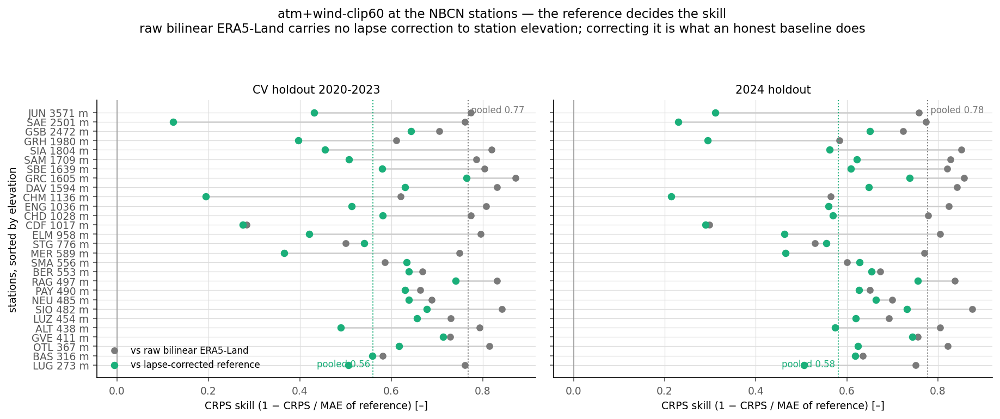
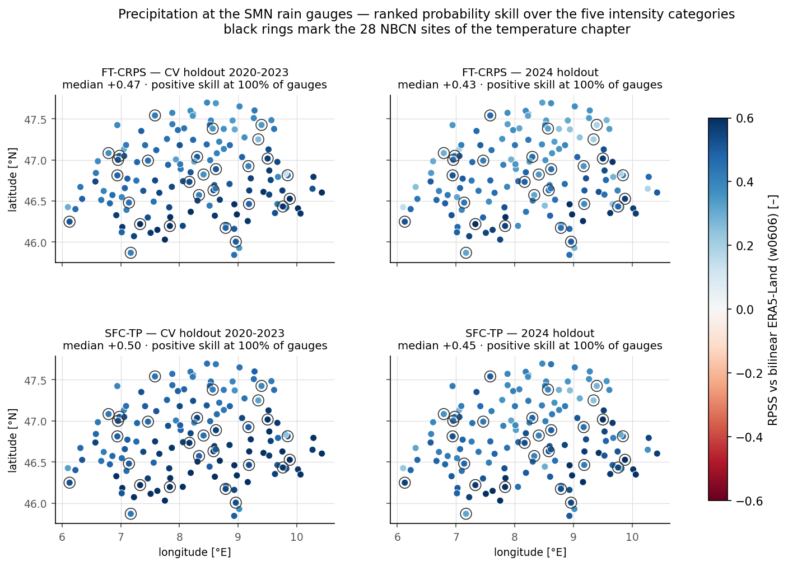

# Draft B — What the Stations Are Worth: the Reference Decides

*Candidate for the main report: the honest-baseline angle. Two figures. Leads with the
methodological finding (the inflated skill and its correction), then lets the
precipitation map say where interpolation is actually beaten.*

---

A skill score is a statement about two forecasts, and at the stations the weaker of the
two has so far been handicapped. This chapter re-scores the three selected models at
independent stations — the temperature model at 28 NBCN stations, the two precipitation
runs at 139 SwissMetNet gauges — with the reference given the correction it deserves,
and reports what survives.

The temperature reference at a station is bilinear ERA5-Land, which interpolates the
value of a $0.1^{\circ}$ cell to the station's coordinates but not to its elevation. At
the Säntis the cell mean sits $1.25\,\mathrm{km}$ below the summit station, and the raw
reference accordingly reaches a pooled station MAE of $4.38\,^{\circ}$C, roughly half of
which any lapse rate would have removed. Applying $6.5\,\mathrm{K\,km^{-1}}$ over the gap
between station elevation and the reference's own effective elevation (the 25 m DEM
aggregated to cell means on the ERA5-Land grid, then interpolated exactly as the
temperature is) brings the reference to $2.30\,^{\circ}$C. The model's pooled skill,
$0.77$ against the raw reference, is $0.56$ on the CV holdout and $0.58$ on 2024 against
the corrected one. The point of the exercise is not that the number got smaller; it is
that the smaller number is load-bearing. Skill remains positive at all 28 stations under
both regimes — the weakest station still reads $+0.12$ (the Säntis, CV holdout) and
$+0.22$ (Chaumont, 2024). The claim survives breadth as well as quality: at the full
cohort of $147$ SwissMetNet stations reporting the operational daily maximum, the
corrected-reference skill is positive at $99\,\%$ of stations in both regimes (pooled
$0.52$ and $0.54$), so the model beats interpolation plus the standard physical
correction at essentially every real measurement point it was tested on.

*Per-station CRPS skill of \texttt{atm+wind-clip60}, against the raw bilinear reference
(grey) and the lapse-corrected one (green), stations sorted by elevation. The correction
moves every station left — the raw skill was partly the reference's failure, not the
model's success — but nowhere below zero.*

A remark on tooling is owed here, because it changed a number in this thesis: the ERA5
geopotential file used as the models' elevation input is a heavily smoothed orography
(its Jungfraujoch cell reads $648\,\mathrm{m}$; its Alpine maximum is
$2010\,\mathrm{m}$). As a normalised input channel this is harmless — training and
inference use the same field — but a lapse correction built on it over-corrects by
kilometres and makes the reference *worse* ($5.97\,^{\circ}$C). The DEM-derived cell
elevations above are what make the correction honest.

For precipitation no elevation correction is available to give the reference, but the
categorical score asks the fairer question of both forecasts: which intensity class the
day lands in, rather than a millimetre distance a deterministic field can fluke. On the
ranked probability skill over the five intensity categories, both runs beat bilinear
interpolation at every one of the $139$ gauges in both regimes — median $+0.50$/$+0.45$
for \texttt{precip-SFC-TP}, $+0.47$/$+0.43$ for \texttt{precip-FT-CRPS}. What remains
geographical is the margin, not the sign: it is thinnest along the north-eastern
pre-Alps — the same strip where, in plain millimetre MAE, the models fall behind
interpolation — and widest across the Plateau and the southern valleys.

*Per-gauge ranked probability skill over the five intensity categories, against bilinear
ERA5-Land (06–06 rebuild), the 28 NBCN sites ringed. Every gauge is blue; the
north-east/south structure survives as a gradient of margin rather than of sign, stable
across models and regimes.*

Both comparisons carry the same structural caveat: the gauges feed RhiresD, so they are
independent of the model but not of the gridded truth, and the SMN daily totals are
operational rather than homogenised. The day-labelling of the 06–06 UTC gauge window was
verified against RhiresD at lag 0 (median correlation $0.98$) before any score was
computed.

---

**Appendix material this draft leaves out:** `stations_summary.png`,
`tmax_station_skill_map.png` (the 147-station corrected skill on the map, the spatial
companion to the dumbbell figure), `tmax_station_pit.png` (the pooled warm drift
resolved per station: an elevation gradient, lowland too cold and high-alpine too warm —
the point-observation counterpart of the representativeness argument this draft makes),
`precip_wetday_scatter.png`, `precip_category_bss.png`, the seasonal-cycle and
calibration figures of draft C.
