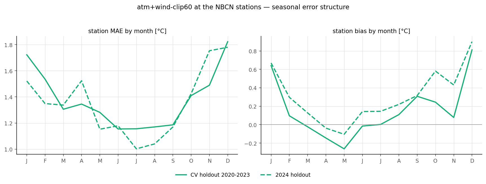
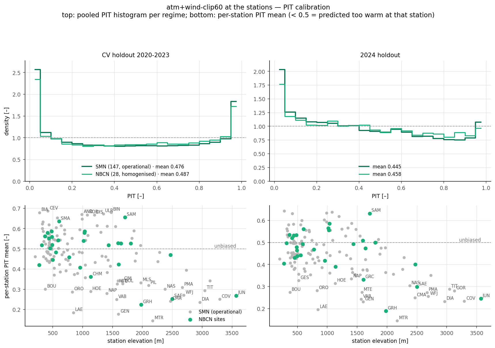
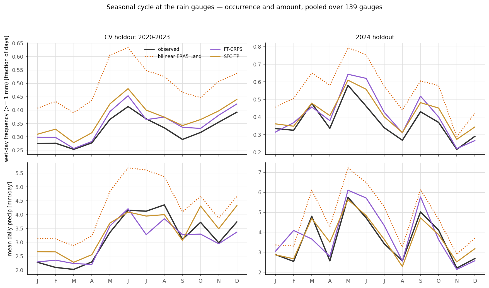

# Draft C — When the Errors Happen: Structure the Pooled Numbers Hide

*Candidate for the main report: the temporal/calibration angle. Two figures. Assumes the
headline station verdict is stated elsewhere (draft A or B, or a table); spends its page
on when and how the models fail at real measurement points.*

---

A pooled station MAE says nothing about when it is earned. This chapter reads the three
selected models at independent stations — temperature at the 28 NBCN stations and the
147-station operational SwissMetNet cohort, precipitation at 139 SwissMetNet gauges —
along the axes the pooled numbers integrate out: the season, the tail, and the predicted
spread.

The temperature error has a pronounced seasonal shape, and it is a winter phenomenon.
Station MAE runs near $1.15\,^{\circ}$C from June to September and climbs to
$1.8\,^{\circ}$C in December, with the December bias reaching $+0.8\,^{\circ}$C on the
CV holdout and $+0.9\,^{\circ}$C on 2024 — the model predicts winter days too warm,
consistent with the inversion and cold-pool failures the gridded error analysis locates
in the same months. The warm end behaves differently, and better: on each station's
hottest decile of days the MAE is *lower* than its all-day value (ratio $0.83$ on the CV
holdout, $0.73$ on 2024 at the NBCN sites; $0.85$ and $0.76$ across the full 147-station
cohort), so the days a heat-focused application cares about are the days the model is
most accurate on. The price appears in the spread rather than the mean: the $90\,\%$
interval covers only $77\,\%$ of tail days under the CV regime's single-fold σ,
recovering to $89\,\%$ under the 2024 ensemble σ ($74\,\%$ and $85\,\%$ across the full
cohort).

*Monthly station MAE and bias of \texttt{atm+wind-clip60} at the 28 NBCN stations. The
error is a winter phenomenon; the summer floor sits near $1.15\,^{\circ}$C. The December
bias is the largest systematic signal at the stations in either regime.*

Calibration at the stations separates into a spread story and a bias story, and they
split along different axes. The spread splits by regime: under the CV regime the
station-level PIT histogram is U-shaped — the single-fold σ is too narrow in the tails
at essentially every station (median z-std $1.20$; worst at the foehn and basin
stations, Meiringen $2.15$, Altdorf and Sion $1.9$) — while under the 2024 ensemble the
histogram is nearly flat (median z-std $1.04$ in both cohorts), so the between-fold
variance the ensemble adds is roughly the missing spread; the Säntis alone stays clearly
over-confident in both regimes ($1.80$, then $1.61$). The bias splits by terrain: the
pooled PIT mean of $0.48$ (CV) and $0.45$ (2024) reads as the mild warm drift of
\fref{fig:single-tmax-biasdrift}, but per station it is an elevation gradient, not an
offset — lowland stations sit at PIT means of $0.55$–$0.65$ (predicted too cold),
high-alpine ones at $0.25$–$0.35$ (predicted too warm: Jungfraujoch, Grimsel, Säntis,
Matro). The domain mean averages two opposing biases away, and only the point
observations resolve that.

*Station-level PIT of \texttt{atm+wind-clip60}. Top: the pooled histogram per regime,
for the homogenised NBCN and operational SMN cohorts (near-identical curves) — U-shaped
under the CV regime's single-fold σ, nearly flat under the 2024 ensemble. Bottom:
per-station PIT mean against elevation; values below $0.5$ mean the model predicts too
warm at that station. The warm drift the pooled numbers report is an
elevation-dependent bias gradient.*

For precipitation the seasonal cycle is where the input's failure and the models'
correction of it are most visible. Bilinear ERA5-Land rains on up to $63\,\%$ of June
days at the gauges where $41\,\%$ are observed wet, and overshoots summer amounts by
roughly $40\,\%$; both selected runs track the observed cycle in occurrence and amount
to within a few points, with a residual wet bias of $0.02$–$0.05$ in frequency.
The randomised PIT pooled over gauges slopes gently downward for both runs —
accumulation slightly over-predicted — and \texttt{precip-FT-CRPS} adds a spike in the
last decile: the observations land above its predictive distribution more often than
they should, the gauge-level signature of the under-dispersed tail already visible in
the gridded study.

*Monthly wet-day frequency and mean daily accumulation pooled over the 139 gauges:
observed (black), bilinear ERA5-Land (dotted orange), and the two selected runs. The
input's summer drizzle and amount surplus is the dominant error either model has to
undo; both do, to within a few percentage points.*

---

**Appendix material this draft leaves out:** `tmax_warm_tail.png` and
`tmax_calibration_split.png` (the per-station versions of the tail and z-std claims),
`precip_pit.png`, plus the headline figures of drafts A and B
(`stations_summary.png`, `tmax_honest_skill.png`, `precip_gauge_skill_map.png`,
`precip_wetday_scatter.png`, `precip_category_bss.png`).
